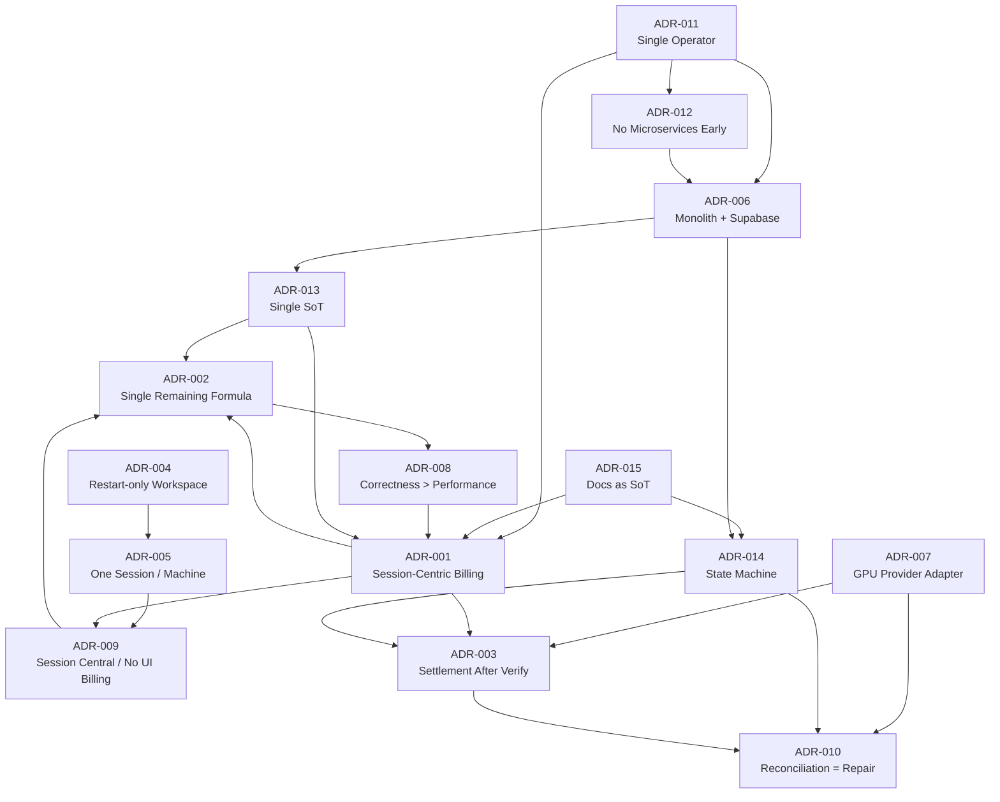

# ARCHITECTURE_DECISIONS

**Architecture Decision Records (ADR) — GPUVietnam**

| | |
|---|---|
| **Phiên bản** | 1.0 |
| **Ngày** | 2026-06-28 |
| **Trạng thái** | Official |
| **Phạm vi** | Ghi nhận quyết định kiến trúc — **không** mô tả implementation hay code |

**Liên quan:** [ARCHITECTURE_PRINCIPLES.md](./ARCHITECTURE_PRINCIPLES.md) · [SESSION_CENTRIC_BILLING_ARCHITECTURE.md](./SESSION_CENTRIC_BILLING_ARCHITECTURE.md) · [OPERATIONAL_STATE_MACHINE.md](./OPERATIONAL_STATE_MACHINE.md) · [IMPLEMENTATION_PLAN_SCB.md](./IMPLEMENTATION_PLAN_SCB.md) · [CODING_RULES.md](./CODING_RULES.md)

---

## Mục đích

Tài liệu này là **sổ quyết định kiến trúc chính thức** của GPUVietnam. Mỗi ADR ghi lại:

- **Vì sao** lựa chọn phương án hiện tại.
- **Phương án đã cân nhắc** và lý do loại bỏ.
- **Hệ quả** và **trade-off** khi áp dụng.

Dùng ADR khi phát triển tính năng mới, review PR ảnh hưởng kiến trúc, hoặc đánh giá thay đổi dài hạn.

---

## ADR-001 — Session-Centric Billing là mô hình billing chính thức

| | |
|---|---|
| **Status** | Accepted |
| **Date** | 2026-06-28 |

### Context

Billing hiện tại dùng **per-minute tick** (`deductPerMinute`) ghi entitlement trong lúc session `running`. Phân tích `BILLING_SAFETY.md` xác nhận: đa SoT (`duration_seconds`, `billing_started_at`, `hours_used`), race condition khi concurrent tick, và destroy pipeline gọi billing **trước** provider verify — không đảm bảo correctness.

Kiến trúc cần phục vụ **một operator** (Principle 15), giảm moving parts, và align Principle 8 (billing gắn thời gian sử dụng thực) mà không chấp nhận rủi ro double-charge.

### Decision

GPUVietnam áp dụng **Session-Centric Billing (SCB)** làm mô hình billing **chính thức**:

- **Session** (`gpu_sessions`) là đơn vị nghiệp vụ trung tâm cho thời gian GPU.
- **Không** `deductPerMinute`, heartbeat billing, Usage Ledger, hay Event Sourcing.
- Trong lúc session chạy: billing **chỉ đọc** (Remaining Time).
- **Settlement** (commit entitlement) **một lần** sau provider verify destroy.

SCB **cập nhật có chủ đích** hiểu lại Principle §8 và §13 — chi tiết tại `SESSION_CENTRIC_BILLING_ARCHITECTURE.md`.

### Alternatives Considered

| Phương án | Lý do loại bỏ |
|-----------|---------------|
| **Giữ per-minute tick** | Race UNSAFE (`BILLING_SAFETY.md` §4–§5); đa SoT khó vận hành |
| **Session-Ledger Hybrid (SLHB)** | Rejected trong `SESSION_BASED_BILLING_REVIEW.md` — phức tạp vượt nhu cầu một operator |
| **Billing ledger append-only + tick** | `TARGET_ARCHITECTURE_DRAFT.md` đề xuất audit — không thay model tick; vẫn giữ race |
| **Prepaid block một lần/phiên** | Không phản ánh thời gian thực; khó idle/auto-stop chính xác |

### Consequences

- Loại bỏ toàn bộ billing write mid-session (M5 IMPLEMENTATION_PLAN_SCB).
- Cần schema session mở rộng: `settlement_status`, verify timestamps.
- Principle §8 trong `ARCHITECTURE_PRINCIPLES.md` v1.1 cần cập nhật v1.2 để phản ánh SCB.
- `TARGET_ARCHITECTURE_DRAFT.md` §4.7 (per-minute canonical) **lỗi thời** so với SCB — tham chiếu ADR này thay thế.

### Trade-offs

| Lợi | Giá |
|-----|-----|
| Một lần ghi entitlement — dễ audit | Remaining “nhảy” theo thời gian thực — user thấy giờ giảm trước khi trừ DB |
| Không race tick | Over-run ngắn trước destroy — cap tại settlement |
| Ít module, dễ giải thích operator | Không có ledger chi tiết từng phút (chấp nhận) |

### Related Documents

- [SESSION_CENTRIC_BILLING_ARCHITECTURE.md](./SESSION_CENTRIC_BILLING_ARCHITECTURE.md)
- [BILLING_SAFETY.md](./BILLING_SAFETY.md)
- [BILLING_LOGIC_REVIEW.md](./BILLING_LOGIC_REVIEW.md)
- [SESSION_BASED_BILLING_REVIEW.md](./SESSION_BASED_BILLING_REVIEW.md)
- [IMPLEMENTATION_PLAN_SCB.md](./IMPLEMENTATION_PLAN_SCB.md)
- [ARCHITECTURE_PRINCIPLES.md](./ARCHITECTURE_PRINCIPLES.md) §8, §13

---

## ADR-002 — Một công thức Remaining Time duy nhất cho toàn hệ thống

| | |
|---|---|
| **Status** | Accepted |
| **Date** | 2026-06-28 |

### Context

Hiện trạng có nhiều cách suy giờ còn lại: `hours_total − hours_used`, `effectiveHoursRemaining` từ `summarizeAvailableCredit`, client-side countdown trong Dashboard, localStorage anchor — dẫn đến số khác nhau giữa UI, Auto Stop, và Renew (`BILLING_LOGIC_REVIEW.md`, `CODING_RULES.md` Rule 2–3).

SCB yêu cầu projection read-only thống nhất trong lúc session chạy.

### Decision

Mọi consumer — **Dashboard, Auto Stop, Renew, Admin** — **bắt buộc** dùng **một công thức duy nhất** qua **một domain service** (Remaining Time module):

```
RemainingHours = TotalEntitlementHours
               − SettledSessionUsageHours
               − CurrentSessionBillableElapsedHours
```

- `RemainingHours` là **derived** — không lưu SoT DB.
- `CurrentSessionBillableElapsed` chỉ > 0 khi session `running` **và** provider verify instance running (gate R4).
- `isOutOfCredit` derive từ Remaining — không có nguồn riêng.

### Alternatives Considered

| Phương án | Lý do loại bỏ |
|-----------|---------------|
| **`hours_total − hours_used`** | Bỏ qua elapsed session đang chạy — under-estimate usage |
| **Client-side countdown** | localStorage drift; vi phạm Principle 20 |
| **Per-consumer formula tối ưu UX** | Duplicate logic; Auto Stop và Dashboard lệch nhau |
| **Lưu `remaining_hours` column DB** | Stale khi session chạy; thêm SoT phải sync |

### Consequences

- Module `remaining-time` (M2) là dependency bắt buộc cho M8, M9, M11.
- Xóa mọi reimplementation trong API handlers và UI (`CODING_RULES.md` Rule 3).
- Operational Rule **OP-8** trong `OPERATIONAL_STATE_MACHINE.md`.

### Trade-offs

| Lợi | Giá |
|-----|-----|
| Một con số — user, admin, auto-stop nhất quán | Poll API thường xuyên hơn nếu UI cần refresh chính xác |
| Dễ test — một hàm domain | Công thức phức tạp hơn `hours_used` đơn giản |

### Related Documents

- [SESSION_CENTRIC_BILLING_ARCHITECTURE.md](./SESSION_CENTRIC_BILLING_ARCHITECTURE.md) §3
- [OPERATIONAL_STATE_MACHINE.md](./OPERATIONAL_STATE_MACHINE.md) OP-8
- [CODING_RULES.md](./CODING_RULES.md) Rule 2, Rule 3
- [IMPLEMENTATION_PLAN_SCB.md](./IMPLEMENTATION_PLAN_SCB.md) M2

---

## ADR-003 — Settlement chỉ được phép sau khi Provider Verify Destroy thành công

| | |
|---|---|
| **Status** | Accepted |
| **Date** | 2026-06-28 |

### Context

Code hiện tại gọi `stopBilling()` **trước** `destroyInstance()` — trừ entitlement khi instance có thể vẫn chạy trên Vast. `BILLING_SAFETY.md` và SCB review xác định: billing trước verify có thể under-charge (destroy fail) hoặc charge khi GPU vẫn tồn tại.

Principle §13 (destroy unified) được hiểu lại: settlement sau verify, không trước.

### Decision

**Settlement** (trừ gift → combo → hourly, ghi `settlement_status`) **chỉ** được phép sau khi:

1. Unified destroy pipeline đã gọi provider destroy.
2. **Provider Verification** xác nhận instance **DESTROYED** (404 / terminated equivalent).
3. `gpu_sessions.ended_at` được set.

Thứ tự destroy pipeline: backup (nếu có) → `closing` → provider destroy → **verify DESTROYED** → `ended_at` → **settlement** → machine `destroyed` → session `closed`.

### Alternatives Considered

| Phương án | Lý do loại bỏ |
|-----------|---------------|
| **Settlement trước destroy** (legacy `stopBilling`) | Charge khi instance còn sống; không idempotent với provider failure |
| **Settlement khi user bấm Stop** | User có thể đóng tab trước destroy hoàn tất |
| **Tin `machines.status = destroyed` DB alone** | DB có thể lệch provider — vi phạm OP-6 |
| **Reconciliation trigger settlement** | Tách domain — xem ADR-010 |

### Consequences

- Module `provider-verify` (M4) và `settlement` (M6) là gate bắt buộc trong destroy pipeline (M7).
- Verify fail → session rollback `running`; **không** settlement.
- Operational Rules **OP-1**, **OP-6**, **OP-14** trong `OPERATIONAL_STATE_MACHINE.md`.
- `CODING_RULES.md` Rule 12, Rule 13.

### Trade-offs

| Lợi | Giá |
|-----|-----|
| Không charge khi GPU vẫn chạy | Destroy pipeline dài hơn — user chờ lâu hơn |
| Align billing với thực tế hạ tầng | Phụ thuộc provider API availability |
| Idempotent settlement an toàn hơn | Cần retry/repair path khi verify timeout |

### Related Documents

- [SESSION_CENTRIC_BILLING_ARCHITECTURE.md](./SESSION_CENTRIC_BILLING_ARCHITECTURE.md) §6, §7
- [OPERATIONAL_STATE_MACHINE.md](./OPERATIONAL_STATE_MACHINE.md) OP-1, OP-6, OP-14
- [BILLING_SAFETY.md](./BILLING_SAFETY.md)
- [IMPLEMENTATION_PLAN_SCB.md](./IMPLEMENTATION_PLAN_SCB.md) M4, M6, M7
- [CODING_RULES.md](./CODING_RULES.md) Rule 12, Rule 13

---

## ADR-004 — Restart-only Workspace

| | |
|---|---|
| **Status** | Accepted |
| **Date** | 2026-06-28 (triết lý sản phẩm từ giai đoạn đầu) |

### Context

Workspace (ComfyUI env, container template) được set lúc provision instance. Container boot gắn workflow bundle và env vars — không thể đổi runtime mà không recreate instance.

Principle §1–§2 và `EXTENSION_POINTS.md` Workspace Registry mô tả mô hình này.

### Decision

Workspace áp dụng mô hình **restart-only**:

- Một phiên chỉ có **một** workspace tại một thời điểm.
- Đổi workspace chỉ có hiệu lực sau **kết thúc phiên hiện tại** và **bắt đầu phiên mới**.
- **Không** hot-swap workspace khi machine đang `running`.
- `subscriptions.env_name` = lựa chọn cho phiên **tiếp theo**; `machines.template` = workspace đã áp dụng phiên **hiện tại/đã chạy**.

### Alternatives Considered

| Phương án | Lý do loại bỏ |
|-----------|---------------|
| **Hot-swap workspace live** | Cần recreate container/env — phức tạp, dễ lỗi billing/session boundary |
| **Multi-workspace đồng thời** | Vi phạm Principle §1; nhân đôi billing/backup complexity |
| **Workspace per machine persistent** | Vi phạm Principle §4, §7 — machine ephemeral |

### Consequences

- `change-environment.js` chỉ cập nhật subscription — không recreate instance khi online.
- UI phải communicate “cần stop + start” khi đổi workspace.
- Thêm workspace mới = thêm container template — không đổi session model.

### Trade-offs

| Lợi | Giá |
|-----|-----|
| Container boot đơn giản, reproducible | UX friction khi đổi env |
| Billing/session boundary rõ | User phải chờ destroy + start lại |
| Align ComfyUI workflow bundle | Không linh hoạt như desktop IDE |

### Related Documents

- [ARCHITECTURE_PRINCIPLES.md](./ARCHITECTURE_PRINCIPLES.md) §1, §2, §26
- [EXTENSION_POINTS.md](./EXTENSION_POINTS.md) — Workspace Registry
- [TARGET_ARCHITECTURE_DRAFT.md](./TARGET_ARCHITECTURE_DRAFT.md) §4.4, §7
- [TECH_DEBT.md](./TECH_DEBT.md) — Workspace Catalog Static

---

## ADR-005 — Một Active Session chỉ gắn với một Machine

| | |
|---|---|
| **Status** | Accepted |
| **Date** | 2026-06-28 (triết lý sản phẩm từ giai đoạn đầu) |

### Context

GPUVietnam bán **phiên GPU** theo gói giờ — không multi-tenant compute farm. Principle §5: một user chỉ một phiên GPU active. Machine là ephemeral representation của phiên (Principle §4).

Race double-provision có thể tạo hai instance Vast / double billing (`TARGET_ARCHITECTURE_DRAFT.md` §4.5.2).

### Decision

- **Một user** chỉ có **một** phiên GPU active tại một thời điểm.
- **Một machine** chỉ gắn **một active session** (`running` hoặc `closing`) — Operational Rule **OP-5**.
- Start machine phải idempotent — không provision thứ hai khi đã có active machine/session.

Machine mô tả lifecycle provision → destroy của **một phiên cụ thể**, không phải tài sản lâu dài.

### Alternatives Considered

| Phương án | Lý do loại bỏ |
|-----------|---------------|
| **Multi-machine per user** | Nhân billing, backup, support cost; vi phạm Principle §5 |
| **Machine persistent, nhiều session** | Machine không còn ephemeral; destroy semantics mơ hồ |
| **Session không gắn machine** | Mất traceability provision/billing |

### Consequences

- DB constraint / advisory lock cho `(user_id) WHERE status IN (active)` (TARGET_ARCHITECTURE Phase 0).
- Unified destroy áp dụng mọi lý do kết thúc.
- SCB: một session `running` → một `CurrentSessionBillableElapsed` term.

### Trade-offs

| Lợi | Giá |
|-----|-----|
| Billing và support đơn giản | Power user không chạy song song 2 workflow |
| Idempotent start dễ reason | Phải stop trước khi đổi GPU line lớn |

### Related Documents

- [ARCHITECTURE_PRINCIPLES.md](./ARCHITECTURE_PRINCIPLES.md) §4, §5
- [OPERATIONAL_STATE_MACHINE.md](./OPERATIONAL_STATE_MACHINE.md) OP-5, §5 Machine
- [BILLING_SAFETY.md](./BILLING_SAFETY.md) — start idempotency
- [TARGET_ARCHITECTURE_DRAFT.md](./TARGET_ARCHITECTURE_DRAFT.md) §4.5.2

---

## ADR-006 — Monolith Next.js + Supabase là kiến trúc chính thức giai đoạn hiện tại

| | |
|---|---|
| **Status** | Accepted |
| **Date** | 2026-06-28 |

### Context

GPUVietnam giai đoạn pre-production / early adopters, vận hành **một operator**. Cần stack deploy đơn giản, chi phí thấp, debug trực tiếp — không đội platform.

Principle §16, §17 và `TARGET_ARCHITECTURE_DRAFT.md` §2 xác nhận hướng monolith.

### Decision

Kiến trúc triển khai **chính thức giai đoạn hiện tại**:

- **Next.js monolith** — Pages + API routes + React client cùng deploy.
- **Supabase PostgreSQL** — persistence, auth, RLS.
- **Domain modules** trong `src/lib/**` — cấu trúc module rõ, không tách service.
- **Vercel Cron** (hoặc tương đương) cho background jobs — job layer mỏng, incremental.

Không tách microservice cho đến khi có nhu cầu thực tế (xem ADR-012).

### Alternatives Considered

| Phương án | Lý do loại bỏ |
|-----------|---------------|
| **Microservices sớm** | Overhead vận hành; vi phạm Principle §15, §16 |
| **Tách billing service riêng** | Network boundary + distributed transaction — chưa cần |
| **Thay Supabase bằng self-hosted PG sớm** | Tăng ops burden không tương xứng quy mô |
| **Serverless-only không monolith** | Domain logic cần cohesion; monolith module hóa đủ |

### Consequences

- Mọi domain (billing, payment, machine) share DB transaction context khi cần.
- Single deploy pipeline — PR nhỏ, rollback đơn giản (Principle §18).
- `IMPLEMENTATION_PLAN_SCB.md` giả định monolith hiện tại (~24–35 ngày 1 developer).

### Trade-offs

| Lợi | Giá |
|-----|-----|
| Chi phí và ops thấp | Scale vertical trước; refactor lớn nếu tách sau |
| Debug end-to-end nhanh | Blast radius deploy toàn app |
| Supabase auth + PG tích hợp sẵn | Vendor dependency (mitigated ADR-007, Principle §32) |

### Related Documents

- [ARCHITECTURE_PRINCIPLES.md](./ARCHITECTURE_PRINCIPLES.md) §16, §17, §18
- [TARGET_ARCHITECTURE_DRAFT.md](./TARGET_ARCHITECTURE_DRAFT.md) §2, §7
- [TECH_DEBT.md](./TECH_DEBT.md) — Accepted Debt philosophy
- [IMPLEMENTATION_PLAN_SCB.md](./IMPLEMENTATION_PLAN_SCB.md)

---

## ADR-007 — GPU Provider phải đi qua Adapter Layer

| | |
|---|---|
| **Status** | Accepted |
| **Date** | 2026-06-28 (abstraction từ giai đoạn đầu; verify gate bổ sung 2026-06-28) |

### Context

Production rent GPU qua Vast.ai. Domain core (billing, session, destroy) không được phụ thuộc API Vast trực tiếp — Principle §6, §30. SCB thêm **Provider Verification** gate trước settlement.

`EXTENSION_POINTS.md` đánh giá GPU Provider **Ready** cho mở rộng.

### Decision

Mọi tích hợp GPU Provider qua **Adapter Layer**:

- Contract: provision, poll status, destroy, health/endpoint mapping.
- Domain modules (`session-lifecycle`, `settlement`, `remaining-time`, `provider-verify`) gọi abstraction — **không** import Vast client.
- Provider Verification (`verifyInstanceRunning`, `verifyInstanceDestroyed`, `verifyProviderState`) là phần contract adapter.
- `TECH_DEBT.md`: single provider Vast là **Growth Debt** — abstraction vẫn bắt buộc.

### Alternatives Considered

| Phương án | Lý do loại bỏ |
|-----------|---------------|
| **Gọi Vast trực tiếp từ billing/API** | Vendor lock-in; không test được domain |
| **Tin DB status không verify live** | Drift provider vs DB — OP-6 |
| **Provider logic trong UI** | Vi phạm Principle §20 |

### Consequences

- `src/lib/gpu/index.js` + `vast-provider.js` là integration layer duy nhất cho Vast HTTP.
- Provider thứ hai chỉ cần adapter mới + backup adapter (`EXTENSION_POINTS.md`).
- M4 định nghĩa Future Reconciliation Interface contract cho M13.

### Trade-offs

| Lợi | Giá |
|-----|-----|
| Thay provider không đụng billing core | Adapter maintenance; lowest-common-denominator API |
| Test domain với mock provider | Mapping status Vast → normalized state cần maintain |

### Related Documents

- [ARCHITECTURE_PRINCIPLES.md](./ARCHITECTURE_PRINCIPLES.md) §6, §30, §32
- [EXTENSION_POINTS.md](./EXTENSION_POINTS.md) — GPU Provider
- [SESSION_CENTRIC_BILLING_ARCHITECTURE.md](./SESSION_CENTRIC_BILLING_ARCHITECTURE.md) §7
- [CODING_RULES.md](./CODING_RULES.md) Rule 4
- [TECH_DEBT.md](./TECH_DEBT.md) — Single GPU Provider
- [IMPLEMENTATION_PLAN_SCB.md](./IMPLEMENTATION_PLAN_SCB.md) M4

---

## ADR-008 — Billing ưu tiên Correctness hơn Performance

| | |
|---|---|
| **Status** | Accepted |
| **Date** | 2026-06-28 |

### Context

Per-minute tick tối ưu “cập nhật nhanh” `hours_used` nhưng `BILLING_SAFETY.md` chứng minh **UNSAFE** under concurrency và đa SoT. Client poll + cron dual path tăng throughput nhưng tăng race surface.

Sản phẩm GPU rental — sai billing gây tranh chấp, mất trust, ops cost cao hơn latency vài giây.

### Decision

Billing **ưu tiên Correctness** trước Performance:

- **Một lần settlement** idempotent thay tick liên tục.
- **Verify provider** trước commit entitlement.
- **Không** optimize bằng client-side billing math hoặc localStorage cache SoT.
- **Không** parallel billing writes — settlement sequential per session.
- Accept thêm latency destroy pipeline và poll Remaining thay vì tick mỗi phút.

Performance optimization (cron primary, cache read) chỉ được phép nếu **không** thay đổi correctness guarantees.

### Alternatives Considered

| Phương án | Lý do loại bỏ |
|-----------|---------------|
| **Cron billing-tick primary** (`TARGET_ARCHITECTURE_DRAFT.md`) | Vẫn tick write — không giải quyết race/đa SoT |
| **Optimistic UI billing** | Drift client vs server; vi phạm ADR-002 |
| **Skip verify để destroy nhanh** | Charge khi instance sống — ADR-003 |
| **Ledger + eventual consistency** | Phức tạp; rejected SLHB |

### Consequences

- Loại bỏ `deductPerMinute` hoàn toàn (M5).
- Settlement phải idempotent (Principle §29, OP-4, OP-7).
- Status poll **read-only** — không side-effect billing (M9).

### Trade-offs

| Lợi | Giá |
|-----|-----|
| Không double-charge / under-charge do race | Remaining update phụ thuộc API poll interval |
| Dễ audit một session một kết quả | Destroy + verify mất thời gian hơn stop ngay |
| Operator giải thích được cho user | Không “real-time deduct” trên DB mid-session |

### Related Documents

- [BILLING_SAFETY.md](./BILLING_SAFETY.md)
- [SESSION_CENTRIC_BILLING_ARCHITECTURE.md](./SESSION_CENTRIC_BILLING_ARCHITECTURE.md)
- [ARCHITECTURE_PRINCIPLES.md](./ARCHITECTURE_PRINCIPLES.md) §29
- [CODING_RULES.md](./CODING_RULES.md) Rule 12
- [OPERATIONAL_STATE_MACHINE.md](./OPERATIONAL_STATE_MACHINE.md) OP-4, OP-7, OP-9

---

## ADR-009 — Session là đơn vị nghiệp vụ trung tâm; Billing không phụ thuộc UI

| | |
|---|---|
| **Status** | Accepted |
| **Date** | 2026-06-28 |

### Context

Principle §3 tách Subscription và phiên làm việc. Code hiện tại có billing logic trong status poll, Dashboard client countdown, và `localStorage` anchor — billing phụ thuộc UI mở tab (`BILLING_LOGIC_REVIEW.md`).

SCB đặt `gpu_sessions` làm trung tâm; entitlement commit tại settlement gắn `session_id`.

### Decision

- **Session** là đơn vị nghiệp vụ **duy nhất** của billing runtime.
- Billable time = `session.started_at` … `session.ended_at` — không machine counter SoT.
- **Billing không phụ thuộc UI**: Auto Stop, settlement, Remaining chạy server-side (API, cron) — không cần client mở dashboard.
- UI **chỉ hiển thị** dữ liệu từ API — không business rules, không billing math (Principle §20, `CODING_RULES.md` Rule 5–6).
- `subscriptions.server_status`, `machines.billing_started_at`, `duration_seconds` — **không** SoT billing math.

### Alternatives Considered

| Phương án | Lý do loại bỏ |
|-----------|---------------|
| **Billing trên machine row** | Machine ephemeral; session mất khi re-link |
| **Client-driven billing tick** | Tab đóng → under-charge; OP-13 vi phạm |
| **Subscription hours_used tick mid-session** | Đa SoT; ADR-001 rejected |

### Consequences

- `CODING_RULES.md` Rule 11; M3 Session Lifecycle domain.
- Dashboard refactor (M11) — xóa localStorage billing SoT.
- Auto Stop read-only Remaining (M8).

### Trade-offs

| Lợi | Giá |
|-----|-----|
| Billing đúng khi user đóng tab | UI countdown phụ thuộc poll — có thể “giật” |
| Domain testable không cần browser | Thêm API endpoints aggregate session state |
| Admin và user cùng session truth | Frontend đơn giản hơn về logic, phức tạp hơn về sync |

### Related Documents

- [ARCHITECTURE_PRINCIPLES.md](./ARCHITECTURE_PRINCIPLES.md) §3, §20
- [SESSION_CENTRIC_BILLING_ARCHITECTURE.md](./SESSION_CENTRIC_BILLING_ARCHITECTURE.md) §2, §4
- [CODING_RULES.md](./CODING_RULES.md) Rule 5, Rule 6, Rule 9, Rule 11
- [OPERATIONAL_STATE_MACHINE.md](./OPERATIONAL_STATE_MACHINE.md) OP-9, OP-13
- [IMPLEMENTATION_PLAN_SCB.md](./IMPLEMENTATION_PLAN_SCB.md) M3, M8, M11

---

## ADR-010 — Infrastructure Reconciliation là Repair Flow, không nằm trong Happy Path

| | |
|---|---|
| **Status** | Accepted |
| **Date** | 2026-06-28 |

### Context

Provider drift (DB `destroyed` nhưng Vast còn instance, hoặc ngược lại) xảy ra khi timeout, manual ops, hoặc bug. Cần cơ chế phát hiện — nhưng **không** được nhầm với billing path.

SCB §8 tách Infrastructure Reconciliation khỏi billing. Happy path destroy đã có Provider Verification (ADR-003).

### Decision

**Infrastructure Reconciliation** là **Repair Flow** — **ngoài** happy path:

- Domain riêng: scan drift provider vs DB, operator alerts, repair hooks.
- **Không** tính Remaining; **không** trigger Settlement; **không** trừ wallet.
- Reconciliation **có thể retry** nhiều lần — không idempotency billing concern (OP-7, OP-10).
- Contract functions (`verifyProviderState`, `reconcileMachine`, `reconcileSession`, `reconcileSettlement`) — interface M4, **triển khai đầy đủ M13**.
- Settlement drift chỉ alert operator — repair qua unified destroy pipeline chuẩn.

### Alternatives Considered

| Phương án | Lý do loại bỏ |
|-----------|---------------|
| **Reconciliation auto-settle drift sessions** | Double-charge risk; vi phạm ADR-003 |
| **Gộp reconciliation vào status poll** | God endpoint; vi phạm CODING_RULES Rule 7 |
| **Tin reconciliation thay verify destroy** | Happy path phải deterministic — reconciliation là async scan |
| **Không có reconciliation** | Drift tích lũy — ops không phát hiện orphan instances |

### Consequences

- Module `src/lib/infrastructure/reconciliation.js` (M13).
- Cron + admin panel drift (M13).
- Tách KPI: Provider Drift Count ≠ Billing Dispute Count.

### Trade-offs

| Lợi | Giá |
|-----|-----|
| Billing path sạch, predictable | Drift repair thủ công / semi-manual |
| Không accidental charge từ scan | Cần operator attention khi drift |
| Retry reconciliation an toàn | Thêm cron và admin UI maintain |

### Related Documents

- [SESSION_CENTRIC_BILLING_ARCHITECTURE.md](./SESSION_CENTRIC_BILLING_ARCHITECTURE.md) §8
- [OPERATIONAL_STATE_MACHINE.md](./OPERATIONAL_STATE_MACHINE.md) OP-7, OP-10
- [IMPLEMENTATION_PLAN_SCB.md](./IMPLEMENTATION_PLAN_SCB.md) M4 (contract), M13 (implementation)
- [EXTENSION_POINTS.md](./EXTENSION_POINTS.md) — Monitoring
- [CODING_RULES.md](./CODING_RULES.md) Rule 14

---

## ADR-011 — Một người vận hành là ràng buộc kiến trúc của hệ thống

| | |
|---|---|
| **Status** | Accepted |
| **Date** | 2026-06-28 (Architecture Philosophy từ giai đoạn đầu) |

### Context

GPUVietnam thiết kế cho giai đoạn startup: admin duyệt chuyển khoản, troubleshoot billing, quản lý Vast — **một người** làm tất cả. Principle §15 và Architecture Philosophy: *“Kiến trúc phải phục vụ khả năng vận hành của một người.”*

### Decision

**Single operator** là **ràng buộc kiến trúc**, không chỉ giai đoạn tạm:

- Không thiết kế multi-admin RBAC, approval chain, SRE team tooling sớm.
- Observability phục vụ **một người** trả lời: ai chạy gì, vì sao tắt, billing bao nhiêu (Principle §24).
- Admin duyệt CK là **first-class** (Principle §23) — không workaround.
- Kiến trúc ưu tiên **đơn giản debug** hơn scale phức tạp (Principle §17).
- Reject patterns vượt cognitive load một operator: SLHB, event sourcing, microservices (ADR-001, ADR-012).

### Alternatives Considered

| Phương án | Lý do loại bỏ |
|-----------|---------------|
| **Multi-admin RBAC sớm** | `TECH_DEBT.md` — Minimal Admin; không cần đến 500+ users |
| **Full observability stack (Datadog/SRE)** | Principle §24 — không thiết kế cho đội lớn trước |
| **Auto-approve payment sớm** | Mất kiểm soát gian lận giai đoạn VN MVP |
| **Complex billing audit ledger** | Chấp nhận session settlement đơn giản thay vì ledger |

### Consequences

- `TECH_DEBT.md` phần lớn debt là **Accepted** — không fix sớm.
- Admin panels aggregate pending — không enterprise workflow.
- AI Assistant, Integration webhook deferred 2000 users (`EXTENSION_POINTS.md`).

### Trade-offs

| Lợi | Giá |
|-----|-----|
| Ops cost thấp | Operator là SPOF |
| Quyết định kiến trúc nhanh | Scale ops cần redesign khi thêm nhân sự |
| Tooling vừa đủ | Manual bottleneck khi volume cao |

### Related Documents

- [ARCHITECTURE_PRINCIPLES.md](./ARCHITECTURE_PRINCIPLES.md) §15, §17, §23, §24
- [TECH_DEBT.md](./TECH_DEBT.md) — Philosophy, Manual Payment Approval
- [TARGET_ARCHITECTURE_DRAFT.md](./TARGET_ARCHITECTURE_DRAFT.md) §3, §4.10
- [EXTENSION_POINTS.md](./EXTENSION_POINTS.md) — Admin Capability

---

## ADR-012 — Không triển khai Microservices trước khi có nhu cầu thực tế

| | |
|---|---|
| **Status** | Accepted |
| **Date** | 2026-06-28 |

### Context

Principle §16: *“Không thiết kế cho microservice.”* `TARGET_ARCHITECTURE_DRAFT.md` giữ monolith đến >2000 active users **và** thêm nhân sự. Premature decomposition tăng deploy complexity, distributed failure modes — trái ADR-011.

### Decision

**Không triển khai microservices** cho đến khi **đồng thời**:

- Quy mô người dùng / traffic thực tế vượt khả năng monolith vertical scale, **và**
- Có **nhân sự vận hành bổ sung** (ít nhất thêm operator hoặc engineer), **và**
- Có **bounded context** rõ ràng cần deploy độc lập — không tách “cho đẹp”.

Giai đoạn hiện tại: monolith module hóa (`src/lib/**`) là đủ. Job layer mỏng (cron) không đồng nghĩa microservice.

### Alternatives Considered

| Phương án | Lý do loại bỏ |
|-----------|---------------|
| **Tách Billing Service** | Distributed settlement transaction; chưa cần |
| **Tách GPU Orchestrator** | Provider adapter đã tách logic trong monolith |
| **Kubernetes sớm** | Ops burden >> benefit giai đoạn hiện tại |
| **Event-driven microservices** | Rejected cùng SLHB — ADR-001 |

### Consequences

- ADR-006 giữ nguyên làm platform decision.
- Extension Points thêm provider qua adapter — không tách service.
- Review định kỳ trigger: >2000 users + ops pain documented.

### Trade-offs

| Lợi | Giá |
|-----|-----|
| Deploy và debug đơn giản | Monolith có thể phình to — cần module discipline |
| Transaction local trong PG | Scale ceiling — chấp nhận redesign muộn |
| Phù hợp 1 developer | Extract service sau tốn migration cost |

### Related Documents

- [ARCHITECTURE_PRINCIPLES.md](./ARCHITECTURE_PRINCIPLES.md) §16, §18
- [TARGET_ARCHITECTURE_DRAFT.md](./TARGET_ARCHITECTURE_DRAFT.md) §2.1, §7
- [ADR-006](#adr-006--monolith-nextjs--supabase-là-kiến-trúc-chính-thức-giai-đoạn-hiện-tại) (nội bộ)
- [TECH_DEBT.md](./TECH_DEBT.md) — Growth Debt philosophy

---

## ADR-013 — Source of Truth chỉ tồn tại một nơi cho mỗi loại dữ liệu quan trọng

| | |
|---|---|
| **Status** | Accepted |
| **Date** | 2026-06-28 |

### Context

Legacy billing có **đa SoT**: `billing_started_at`, `duration_seconds`, `hours_used`, wallet — cập nhật không atomic (`BILLING_SAFETY.md` §2). Frontend localStorage thêm SoT ảo. `TARGET_ARCHITECTURE_DRAFT.md` đề xuất billing ledger nhưng vẫn dual-write — không giải quyết gốc.

SCB §2 định nghĩa SoT mới per concern.

### Decision

Mỗi loại dữ liệu quan trọng có **đúng một SoT**:

| Concern | SoT |
|---------|-----|
| Billable session time | `gpu_sessions.started_at` / `ended_at` |
| Entitlement committed | Settlement writes only |
| Remaining Time | **Derived** — không column SoT |
| Provider instance exists | Provider Adapter live query |
| Drift | Reconciliation records |
| User entitlement total | Entitlement Domain snapshot |
| Persistence shared state | **Supabase** — không in-memory singleton (CODING_RULES Rule 8) |

**Cấm** parallel SoT: `duration_seconds` tick counter, client localStorage billing anchor, duplicate Remaining formula.

### Alternatives Considered

| Phương án | Lý do loại bỏ |
|-----------|---------------|
| **Dual-write ledger + hours_used** | Vẫn hai SoT — reconcile phức tạp |
| **Machine billing fields SoT** | Machine ephemeral; session là billing unit (ADR-009) |
| **Cache Remaining in Redis** | Thêm SoT ngoài Supabase — Rule 8 |
| **Event sourcing usage** | Rejected SLHB — ADR-001 |

### Consequences

- Schema migration M1 deprecate billing SoT fields.
- `CODING_RULES.md` Rule 8, Rule 9, Rule 13.
- Code review checklist: “SoT này đã tồn tại chưa?”

### Trade-offs

| Lợi | Giá |
|-----|-----|
| Giảm drift và tranh chấp | Derived Remaining tính mỗi request — CPU nhẹ |
| Debug: một nơi tra cứu | Migration từ legacy fields cần cleanup |
| Align Principle §25 doc vs code | Phải discipline khi thêm field mới |

### Related Documents

- [SESSION_CENTRIC_BILLING_ARCHITECTURE.md](./SESSION_CENTRIC_BILLING_ARCHITECTURE.md) §2
- [BILLING_SAFETY.md](./BILLING_SAFETY.md) §2
- [CODING_RULES.md](./CODING_RULES.md) Rule 8, Rule 9, Rule 13
- [OPERATIONAL_STATE_MACHINE.md](./OPERATIONAL_STATE_MACHINE.md) — SoT per domain
- [IMPLEMENTATION_PLAN_SCB.md](./IMPLEMENTATION_PLAN_SCB.md) M1

---

## ADR-014 — State Machine là chuẩn vận hành chính thức; không được bypass

| | |
|---|---|
| **Status** | Accepted |
| **Date** | 2026-06-28 |

### Context

State transitions hiện rải rác trong code — `machines.js`, `billing.js`, API handlers. Legacy destroy gọi `stopBilling` trước verify — vi phạm thứ tự SCB. Cần **chuẩn mục tiêu** cho 10 domain + cross-domain rules.

`OPERATIONAL_STATE_MACHINE.md` là official reference; code pre-SCB có Legacy notes.

### Decision

**Operational State Machine** là chuẩn vận hành **bắt buộc**:

- Mọi domain có **closed set states** và **allowed transitions** có điều kiện.
- **Không bypass**: nhảy state, admin SQL ad-hoc (trừ emergency có audit), reconciliation settle.
- Unified Destroy Pipeline cho **mọi** lý do destroy (user, idle, out_of_credit, admin, error).
- Cross-domain Operational Rules **OP-1** … **OP-15** là invariant.
- `CODING_RULES.md` Rule 14 — vi phạm = defect kiến trúc.

Implementation theo `IMPLEMENTATION_PLAN_SCB.md` M3, M7 — không big-bang (Principle §18).

### Alternatives Considered

| Phương án | Lý do loại bỏ |
|-----------|---------------|
| **Implicit state trong code only** | Không review được; onboarding khó |
| **Flexible status strings** | Invalid states; subscription CHECK debt |
| **Bypass destroy cho admin** | Double standard — drift billing |
| **State machine per service (microservice)** | ADR-012 — monolith single state doc |

### Consequences

- Session states: `pending` → `running` → `closing` → `closed` | `interrupted`.
- Machine thêm `closing` before `destroyed`.
- Settlement composite: `awaiting_verify` → `pending` → `settled` | `skipped` | `failed`.
- PR review đối chiếu OPERATIONAL_STATE_MACHINE transition tables.

### Trade-offs

| Lợi | Giá |
|-----|-----|
| Predictable ops — operator biết state hợp lệ | Strict hơn — “fix nhanh” khó hơn |
| Test cases theo transition | Migration legacy code tốn effort (M1–M14) |
| Cross-domain rules tài liệu hóa | Emergency repair cần documented exception path |

### Related Documents

- [OPERATIONAL_STATE_MACHINE.md](./OPERATIONAL_STATE_MACHINE.md)
- [SESSION_CENTRIC_BILLING_ARCHITECTURE.md](./SESSION_CENTRIC_BILLING_ARCHITECTURE.md) §4–§7
- [CODING_RULES.md](./CODING_RULES.md) Rule 14
- [IMPLEMENTATION_PLAN_SCB.md](./IMPLEMENTATION_PLAN_SCB.md) M3, M7
- [ARCHITECTURE_PRINCIPLES.md](./ARCHITECTURE_PRINCIPLES.md) §13, §29

---

## ADR-015 — Architecture Documents là nguồn sự thật cao nhất cho các quyết định kỹ thuật

| | |
|---|---|
| **Status** | Accepted |
| **Date** | 2026-06-28 |

### Context

Principle §25: khi code và tài liệu mâu thuẫn, **nguyên tắc tài liệu** là chuẩn — sau thảo luận có chủ đích. GPUVietnam có bộ tài liệu kiến trúc đầy đủ (Principles, SCB, State Machine, Coding Rules, ADR). Code legacy (per-minute, localStorage billing) lệch docs — SCB migration khắc phục.

### Decision

**Architecture Documents** là **nguồn sự thật cao nhất** cho quyết định kỹ thuật:

| Thứ tự | Nguồn |
|--------|-------|
| 1 | `ARCHITECTURE_PRINCIPLES.md` — triết lý |
| 2 | Domain architecture (`SESSION_CENTRIC_BILLING_ARCHITECTURE.md`, `OPERATIONAL_STATE_MACHINE.md`) |
| 3 | `ARCHITECTURE_DECISIONS.md` (ADR) — rationale quyết định |
| 4 | `CODING_RULES.md` — quy tắc lập trình |
| 5 | `IMPLEMENTATION_PLAN_SCB.md` — thứ tự triển khai |
| 6 | Code — phải tuân docs; legacy ghi Legacy note |

Mọi thay đổi domain ảnh hưởng kiến trúc → **cập nhật tài liệu cùng PR** (`CODING_RULES.md` Rule 15). ADR mới khi thay đổi quyết định — không sửa ADR Accepted (xem Rules for Future ADRs).

### Alternatives Considered

| Phương án | Lý do loại bỏ |
|-----------|---------------|
| **Code là source of truth** | Legacy drift; onboarding phụ thuộc người viết code |
| **Comments trong code thay doc** | Không searchable; mất khi refactor |
| **Wiki ngoài repo** | Lệch version với PR |
| **Chỉ oral tradition / chat** | Không audit được quyết định |

### Consequences

- SCB supersede per-minute references trong `TARGET_ARCHITECTURE_DRAFT.md` §4.7 — đọc kèm ADR-001.
- Review PR kiến trúc: doc diff bắt buộc.
- ADR registry (tài liệu này) là index quyết định.

### Trade-offs

| Lợi | Giá |
|-----|-----|
| Consistency dài hạn | Doc maintenance overhead |
| Onboarding không phụ thuộc tribal knowledge | Doc có thể lỗi thời nếu không enforce Rule 15 |
| ADR traceability | Thêm bước khi thay đổi kiến trúc |

### Related Documents

- [ARCHITECTURE_PRINCIPLES.md](./ARCHITECTURE_PRINCIPLES.md) §25
- [CODING_RULES.md](./CODING_RULES.md) Rule 15
- [IMPLEMENTATION_PLAN_SCB.md](./IMPLEMENTATION_PLAN_SCB.md) M14
- [TECH_DEBT.md](./TECH_DEBT.md) — Architectural Debt triggers

---

## Decision Timeline

Thứ tự thời gian **logic** — từ triết lý nền → platform → product constraints → billing (SCB) → governance.

| Thứ tự | ADR | Title | Giai đoạn |
|--------|-----|-------|-----------|
| 1 | ADR-011 | Một người vận hành là ràng buộc kiến trúc | Triết lý nền (Architecture Philosophy) |
| 2 | ADR-015 | Architecture Documents là nguồn sự thật cao nhất | Governance nền |
| 3 | ADR-006 | Monolith Next.js + Supabase | Platform |
| 4 | ADR-012 | Không microservices sớm | Platform |
| 5 | ADR-007 | GPU Provider qua Adapter Layer | Integration |
| 6 | ADR-004 | Restart-only Workspace | Product constraint |
| 7 | ADR-005 | Một Active Session / một Machine | Product constraint |
| 8 | ADR-013 | Single SoT per data type | Data model |
| 9 | ADR-014 | State Machine — không bypass | Operational model |
| 10 | ADR-008 | Billing ưu tiên Correctness | Billing philosophy |
| 11 | ADR-001 | Session-Centric Billing chính thức | Billing model (2026-06-28) |
| 12 | ADR-009 | Session trung tâm; Billing không phụ thuộc UI | Billing boundary |
| 13 | ADR-002 | Một công thức Remaining Time | Billing projection |
| 14 | ADR-003 | Settlement sau Provider Verify Destroy | Billing commit |
| 15 | ADR-010 | Infrastructure Reconciliation = Repair Flow | Ops repair (2026-06-28) |

**Ghi chú:** ADR-001–003, ADR-008–010, ADR-013–014 được **formalize 2026-06-28** cùng bộ tài liệu SCB. ADR-004–007, ADR-011–012, ADR-015 phản ánh quyết định **từ giai đoạn thiết kế sản phẩm** — ADR ghi nhận và làm ràng buộc chính thức.

---

## Decision Dependency Graph



**Đọc đồ thị:** Mũi tên = phụ thuộc / được inform bởi. Ví dụ ADR-003 (Settlement after verify) phụ thuộc ADR-007 (Adapter) và inform ADR-010 (Reconciliation không thay settlement path).

---

## Rules for Future ADRs

### Khi nào tạo ADR mới

- Mọi thay đổi **làm thay đổi kiến trúc** (domain boundary, billing model, state machine, SoT, platform) **phải** tạo ADR mới.
- Bugfix thuần kỹ thuật không đổi behavior nghiệp vụ — **không** cần ADR.
- Thêm provider/adapter theo Extension Point có sẵn — ADR **tùy chọn** trừ khi đổi contract core.

### Immutability

- **Không sửa lịch sử** ADR đã **Accepted**.
- Nếu quyết định thay đổi: tạo ADR mới **supersede** ADR cũ — ghi `Supersedes: ADR-XXX` và cập nhật ADR cũ status → `Superseded by ADR-YYY` (chỉ đổi status + link, không sửa nội dung quyết định cũ).

### Format bắt buộc

Mỗi ADR phải có đủ:

- Decision ID
- Title
- Status (`Proposed` | `Accepted` | `Deprecated` | `Superseded`)
- Context
- Decision
- Alternatives Considered
- Consequences
- Trade-offs
- Related Documents

### Liên kết tài liệu

- Mỗi ADR **phải** liên kết tới tài liệu kiến trúc liên quan (Principles, SCB, State Machine, Extension Points, …).
- Cập nhật `ARCHITECTURE_PRINCIPLES.md` hoặc domain doc khi ADR thay triết lý (ADR-015).

### Phạm vi nội dung

- **Không** ghi implementation, code, file path chi tiết, hay SQL vào ADR.
- Implementation thuộc `IMPLEMENTATION_PLAN_SCB.md` và `CODING_RULES.md`.
- ADR trả lời **why** — plan trả lời **how/when**.

### Review

- ADR mới review cùng PR thay đổi kiến trúc liên quan.
- ADR `Proposed` → `Accepted` khi merge doc và có đồng thuận operator/architect.

---

*GPUVietnam Architecture Decision Records v1.0 — Official.*
