# GPUVietnam — Architecture Review

> Tài liệu khảo sát hiện trạng kiến trúc. Không bao gồm đề xuất refactor hay đánh giá đúng/sai.
>
> Ngày khảo sát: 2026-06-28

---

## Table of Contents

1. [Executive Summary](#1-executive-summary)
2. [Overall Architecture](#2-overall-architecture)
3. [User Flow](#3-user-flow)
4. [Database Model](#4-database-model)
5. [Business Modules](#5-business-modules)
6. [Payment Architecture](#6-payment-architecture)
7. [Subscription Lifecycle](#7-subscription-lifecycle)
8. [Workspace Architecture](#8-workspace-architecture)
9. [Machine Lifecycle](#9-machine-lifecycle)
10. [Billing Architecture](#10-billing-architecture)
11. [Background Jobs](#11-background-jobs)
12. [Public APIs](#12-public-apis)
13. [External Services](#13-external-services)
14. [Folder Structure](#14-folder-structure)
15. [Sequence Diagrams](#15-sequence-diagrams)
16. [Dependency Graph](#16-dependency-graph)
17. [Design Assessment](#17-design-assessment)
18. [Appendix](#18-appendix)

---

## 1. Executive Summary

GPUVietnam là nền tảng thuê GPU cloud cho người dùng Việt Nam, tập trung vào môi trường ComfyUI và các workstation AI/ML. Ứng dụng được xây dựng trên **Next.js 14 (Pages Router)**, backend API nằm trong `src/pages/api/`, frontend React trong `src/pages/` và `src/components/`.

**Stack chính** (theo `package.json`, `.env.local.example`):

| Thành phần | Công nghệ | File tham chiếu |
|---|---|---|
| Web framework | Next.js 14.2.35 | `package.json` |
| Auth & DB | Supabase (Auth + PostgreSQL) | `src/lib/supabase-admin.js`, `supabase/*.sql` |
| GPU provider | Vast.ai | `src/lib/gpu/providers/vast/vast-client.js`, `vast-provider.js` |
| Container image | Docker Hub `dieuhaukieuhanh/gpuvietnam-comfyui:v1` | `src/lib/gpu/gpu-config.js` → `DEFAULT_GPU_IMAGE` |
| Backup storage | Cloudflare R2 (S3-compatible) | `src/lib/r2-client.js` |
| SMS OTP | SpeedSMS | `src/lib/speedsms.js` |
| SSH backup | `ssh2` | `src/lib/machine-ssh.js` |
| Hosting cron | Vercel Cron (5 phút) | `vercel.json` → `/api/cron/check-idle` |

**Luồng nghiệp vụ cốt lõi:**

1. Người dùng đăng ký / đăng nhập qua Supabase Auth (`src/pages/api/register.js`, `src/pages/api/auth/login.js`).
2. Mua gói GPU qua chuyển khoản (admin duyệt) hoặc ví nội bộ (`src/lib/gpu-subscription-purchase.js`).
3. Bật máy GPU qua Vast.ai (`src/pages/api/user/start-machine.js` → `provisionGpuInstance()` trong `src/lib/gpu/provision-instance.js`).
4. Billing theo phút khi máy `running` (`src/lib/gpu/billing.js` → `startBilling`, `deductPerMinute`, `stopBilling`).
5. Tự động tắt máy khi idle 60 phút hoặc hết credit (`src/lib/gpu/auto-stop.js` → `checkAutoStop`).
6. Backup trước destroy qua SSH + R2 (`src/lib/machine-backup.js` → `backupBeforeStop`).

**Quy mô codebase (khảo sát tĩnh):**

- 72 API route handlers trong `src/pages/api/`
- 32 file SQL migration/schema trong `supabase/`
- ~89 module thư viện trong `src/lib/`
- ~78 component React trong `src/components/`

---

## 2. Overall Architecture

### 2.1 Kiến trúc phân lớp

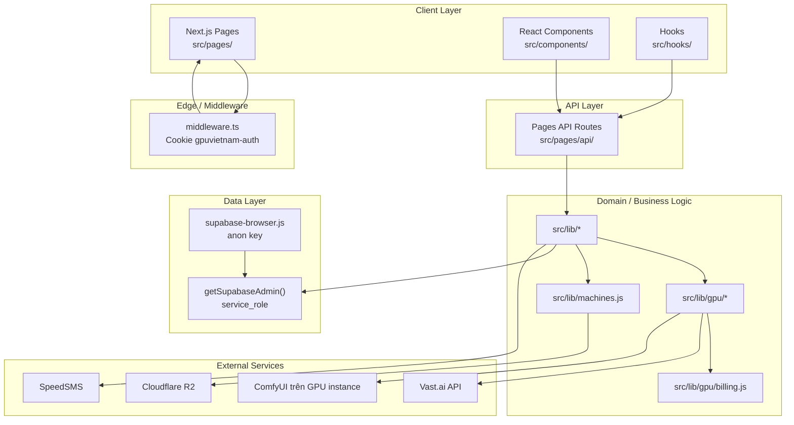

### 2.2 Auth model

| Lớp | Cơ chế | File / function |
|---|---|---|
| Dashboard UI | Cookie `gpuvietnam-auth=1` (client-side set sau login) | `src/middleware.ts` |
| API user | Bearer token Supabase JWT | `getAuthUserFromRequest()` — `src/lib/api-auth.js` |
| API admin | JWT + `users.role = 'admin'` hoặc header `x-admin-secret` | `requireAdmin()`, `getAdminUserFromRequest()` — `src/lib/admin-auth.js` |
| Cron | Header `x-vercel-cron` hoặc `Authorization: Bearer CRON_SECRET` | `isAuthorizedCron()` — `src/pages/api/cron/check-idle.js` |

### 2.3 GPU abstraction

`GPUService` (`src/lib/gpu/gpu-service.js`) bọc một `GPUProvider` interface (`src/lib/gpu/providers/gpu-provider.interface.ts`). Production singleton dùng `VastProvider` (`src/lib/gpu/index.js` → `getGpuService()`).

---

## 3. User Flow

### 3.1 Đăng ký

```text
User → POST /api/register
  → validate email/phone (src/lib/phone.js)
  → Supabase Auth signUp + upsert public.users (register.js)
  → createOtpRecord() (src/lib/otp.js)
  → sendOtpSms() (src/lib/speedsms.js)
  → User → POST /api/otp/verify → phone_verified = true
```

Checkout context (plan, billing, env) có thể được truyền trong body đăng ký; chi tiết xử lý sau OTP: **Unknown** (cần đọc phần còn lại của `register.js`).

### 3.2 Đăng nhập

```text
User → POST /api/auth/login
  → Supabase signInWithPassword (login.js)
  → syncUserRoleOnLogin() (src/lib/user-role.js)
  → createUserSession() (src/lib/otp.js)
  → Client set cookie gpuvietnam-auth
  → Redirect dashboard (post-login logic: src/lib/post-login-redirect.ts)
```

### 3.3 Mua gói

Hai kênh thanh toán — xem [§6 Payment Architecture](#6-payment-architecture).

### 3.4 Dashboard — phiên làm việc GPU

```text
Dashboard → GET /api/dashboard/me (aggregate profile, subscription, plans)
         → POST /api/user/start-machine (provision Vast)
         → Poll GET /api/machines/status (live status + billing tick)
         → User làm việc trên ComfyUI (URL từ machine endpoint)
         → POST /api/user/stop-machine (destroy + backup)
```

UI chính: `src/components/dashboard/DashboardOverview.tsx`, hook `src/hooks/useDashboard.ts`.

### 3.5 Admin

Trang admin: `src/pages/admin*.tsx`, panel components trong `src/components/admin/`. Auth gate: `src/components/admin/AdminAuthGate.tsx`.

---

## 4. Database Model

Schema phân tán qua nhiều file SQL trong `supabase/`. Bảng dưới đây mô tả theo các file đã khảo sát.

### 4.1 Entity Relationship (tóm tắt)

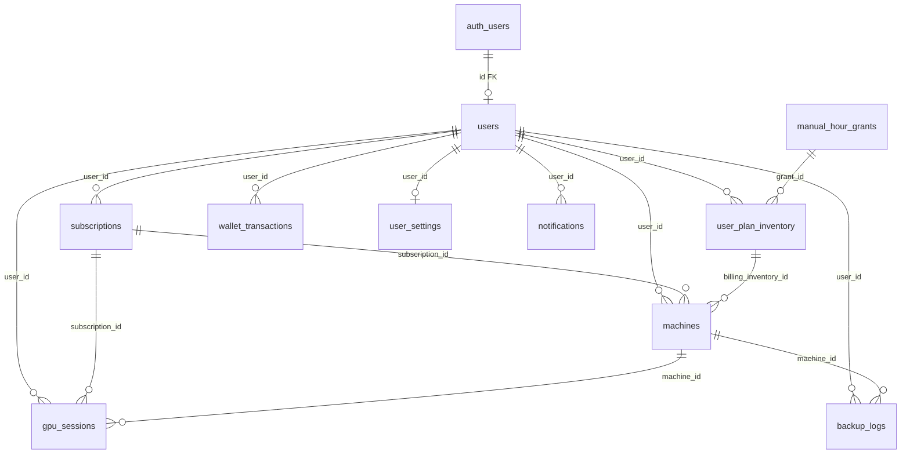

### 4.2 Bảng chi tiết

| Bảng | Mục đích | File SQL | Cột / ghi chú quan trọng |
|---|---|---|---|
| `auth.users` | Supabase Auth | Supabase managed | — |
| `public.users` | Profile | `supabase/schema.sql`, `user-settings.sql`, `storage-upgrades.sql` | `email`, `phone`, `phone_verified`, `role`, `full_name`, `wallet_balance`, `ssd_plan_gb`, `backup_plan_gb` |
| `public.otp_verifications` | OTP SMS | `schema.sql` | `phone`, `otp`, `expires_at`, `verified` |
| `public.subscriptions` | Gói GPU | `subscriptions.sql` | `plan`, `billing`, `env_name`, `hours_total/used`, `status`, `server_status`, `is_trial`, `expires_at`, `activated_at` |
| `public.machines` | Instance Vast | `machines.sql`, `machines-billing.sql`, `machines-idle.sql` | `instance_id`, `provider`, `status`, `gpu_line`, `template`, `billing_started_at`, `gpu_session_id`, `idle_started_at`, `idle_warning_sent` |
| `public.gpu_sessions` | Lịch sử phiên | `gpu-sessions.sql`, `machines-billing.sql` | `status` (completed/interrupted/running), `started_at`, `ended_at`, `duration_seconds`, `machine_id` |
| `public.user_plan_inventory` | Kho gói/giờ | `user-plan-inventory.sql` | `plan_type`, `hours_remaining`, `is_active`, `source`, `subscription_id` |
| `public.manual_hour_grants` | Admin tặng giờ | `hour-grants.sql` | `hours_granted`, `hours_used`, `gpu_plan`, `status` |
| `public.hour_grant_logs` | Audit grant | `hour-grants.sql` | — |
| `public.wallet_transactions` | Lịch sử ví | `user-settings.sql` | `type` (topup/payment/refund/bonus), `amount`, `balance_after` |
| `public.user_settings` | Cài đặt user | `user-settings.sql` | `auto_renew_enabled`, `auto_topup_*`, `theme` |
| `public.user_notification_settings` | Tùy chọn thông báo | `user-settings.sql` | `zalo_enabled`, `event_*` flags |
| `public.notifications` | In-app notifications | `notifications.sql` | `type`, `title`, `is_read` |
| `public.storage_files` | Metadata file SSD/backup | `storage.sql` | `storage_type`, `category` |
| `public.storage_upgrades` | Yêu cầu nâng storage | `storage-upgrades.sql` | `payment_method`, `status` |
| `public.storage_*` pricing | Giá storage | `storage-pricing.sql`, `storage-models.sql` | **Unknown** chi tiết cột |
| `public.plan_renew_requests` | Gia hạn chuyển khoản | `plan-renew-requests.sql` | `status` pending/approved/rejected |
| `public.support_sessions` | Hỗ trợ từ xa | `support-sessions.sql` | `status` pending/active/ended |
| `public.backup_logs` | Log backup R2 | `backup-logs.sql` | `archives` JSONB, `reason`, `size_bytes` |
| `public.gpu_pricing_config` | Cấu hình giá GPU | `gpu-pricing-config.sql` | **Unknown** chi tiết cột |
| `public.workflows`, `public.models` | Catalog tài nguyên | `workflows.sql`, `models.sql` | **Unknown** chi tiết cột |
| `public.admin_machine_logs` | Log admin thao tác máy | `admin-machine-logs.sql` | **Unknown** chi tiết cột |

### 4.3 RLS

Hầu hết bảng bật RLS với policy `service_role` full access cho server-side (`getSupabaseAdmin()`). User đọc dữ liệu own qua `auth.uid()`. Chi tiết từng policy: xem từng file `.sql` tương ứng.

### 4.4 Trạng thái subscription (`subscriptions.status`)

Giá trị quan sát trong code (không có CHECK constraint trong `subscriptions.sql`):

| Status | Nguồn quan sát |
|---|---|
| `pending_payment` | `createPendingGpuSubscription()` — `src/lib/gpu-subscription-purchase.js` |
| `active` | Admin approve, wallet purchase, trial activate |
| `provisioning` | **Unknown** — không thấy set trực tiếp vào `subscriptions.status`; `provisioning` chủ yếu dùng cho `server_status` |
| `pending` | `replaceActiveSubscriptions()` — `gpu-subscription-purchase.js` |
| `replaced` | `replaceActiveSubscriptions()`, trial activate |
| `expired` | Đọc trong `dashboard/me.js` |
| `rejected` | **Unknown** — có API admin reject |

### 4.5 Trạng thái máy (`machines.status`)

| Status | Nguồn |
|---|---|
| `creating`, `starting`, `running` | `ACTIVE_MACHINE_STATUSES` — `src/lib/machines.js` |
| `error` | Sync từ Vast live status |
| `destroyed` | `destroyUserMachine()` — `machines.js` |

### 4.6 Server status (`subscriptions.server_status`)

| Value | Ý nghĩa (theo code) | Function |
|---|---|---|
| `offline` | Không có máy chạy | `updateSubscriptionServerStatus()`, `destroyUserMachine()` |
| `provisioning` | Đang rent/khởi động Vast | `start-machine.js`, `syncSubscriptionWithMachineState()` |
| `online` | Máy running | `machines/status.js`, `start-machine.js` |
| `stopping` | Kiểm tra trong `change-environment.js` | **Unknown** nơi set giá trị này |

---

## 5. Business Modules

| Module | Trách nhiệm | File chính |
|---|---|---|
| **Auth & OTP** | Login, register, OTP, session token | `api-auth.js`, `otp.js`, `auth-token.js`, `pages/api/auth/*`, `pages/api/otp/*` |
| **User profile** | Profile, settings, phone verify | `user-settings.js`, `pages/api/user/profile.js`, `settings.js` |
| **GPU pricing** | Giá gói, label GPU | `gpu-pricing.js`, `gpu-pricing-config.js`, `gpu-pricing-defaults.js`, `plan-hours.js`, `plan-pricing.js` |
| **Subscription purchase** | Tạo subscription pending/active | `gpu-subscription-purchase.js` |
| **Plan inventory** | Multi-plan, grant hours, activate plan | `user-plan-inventory.js`, `user-active-plans.js`, `plan-trial.js` |
| **Machine ops** | CRUD machine rows, sync Vast | `machines.js` |
| **Machine destroy** | Unified destroy + notify | `machine-destroy.js` |
| **Machine backup** | SSH tar + R2 upload | `machine-backup.js`, `machine-ssh.js`, `r2-client.js`, `backup-logs.js` |
| **GPU service** | Provider abstraction | `gpu/gpu-service.js`, `gpu/index.js`, `gpu/provision-instance.js` |
| **Vast provider** | Vast API + Comfy | `gpu/providers/vast/vast-client.js`, `vast-provider.js`, `comfy-client.js` |
| **Billing** | Per-minute charge, sessions | `gpu/billing.js`, `gpu-sessions.js` |
| **Auto-stop** | Idle + out of credit | `gpu/auto-stop.js` |
| **Workstations** | Static catalog + env mapping | `workstations.ts`, `workstation-env.js`, `gpu/workstation-setup.js` |
| **Wallet** | Nạp ví, duyệt deposit | `wallet-deposit.js`, `wallet-topup.js` |
| **Plan renew** | Gia hạn gói | `plan-renew-request.js`, `auto-renew.js` |
| **Storage** | SSD/backup plans, upgrades | `storage-plans.js`, `gpu/storage.js` |
| **Notifications** | In-app + event helpers | `user-notifications.js` |
| **Support sessions** | Remote support placeholder | `support-sessions.js` |
| **Admin** | Customers, pending requests, infra | `admin-customers.js`, `admin-pending-requests.js`, `admin-machine-logs.js`, `infrastructure-providers.js` |
| **Trial** | Gói dùng thử 3 giờ | `pages/api/trial/activate.js`, `plan-hours.js` → `TRIAL_HOURS` |

---

## 6. Payment Architecture

### 6.1 Kênh thanh toán

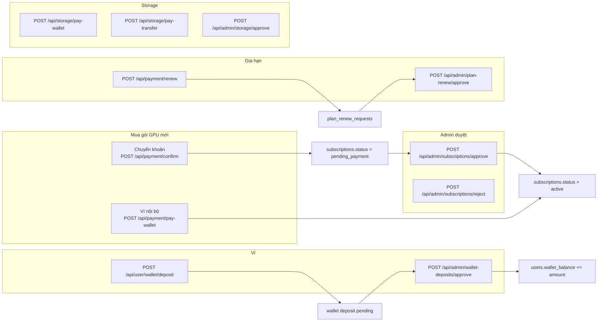

### 6.2 Logic mua gói — chuyển khoản

| Bước | Function / file |
|---|---|
| Normalize input | `normalizeGpuPurchaseInput()` — `gpu-subscription-purchase.js` |
| Chặn trùng pending | `assertNoPendingGpuPayment()` |
| Replace gói cũ | `replaceActiveSubscriptions()` → status `replaced` |
| Tạo pending | `createPendingGpuSubscription()` → status `pending_payment` |
| API entry | `src/pages/api/payment/confirm.js` |
| Admin duyệt | `src/pages/api/admin/subscriptions/approve.js` → status `active`, `notifyPaymentSuccess()` |

### 6.3 Logic mua gói — ví

| Bước | Function / file |
|---|---|
| Kiểm tra số dư | `purchaseGpuPlanWithWallet()` — đọc `users.wallet_balance` |
| Trừ ví + insert subscription active | Cùng function |
| Ghi `wallet_transactions` | type `payment` |
| API entry | `src/pages/api/payment/pay-wallet.js` |

Giá lấy từ `getPlanPrice()` — `gpu-pricing.js`, load config qua `ensureGpuPricingLoaded()` — `gpu-pricing-config.js`.

### 6.4 Billing modes

`VALID_BILLING` trong `gpu-subscription-purchase.js`: `hourly`, `combo1`, `combo2`.

Quota giờ: `getPlanQuota()` — `plan-hours.js`.

---

## 7. Subscription Lifecycle

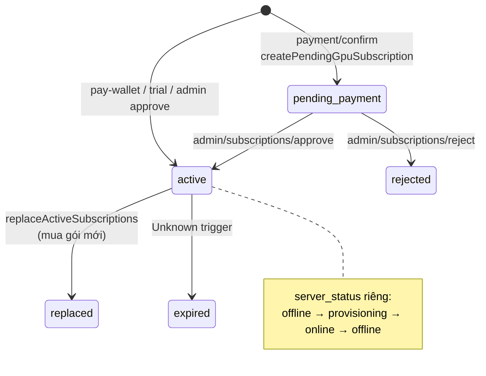

### 7.1 Kích hoạt gói

| Nguồn | File | Kết quả |
|---|---|---|
| Admin duyệt CK | `admin/subscriptions/approve.js` | `status=active`, `activated_at=now` |
| Ví | `purchaseGpuPlanWithWallet()` | `status=active` ngay |
| Trial | `trial/activate.js` | `is_trial=true`, `plan=Starter`, `billing=hourly` |
| Manual grant | `user-plan-inventory.js` → `syncUserPlanInventory()` | Inventory rows, **Unknown** liên kết subscription |

### 7.2 `server_status` vs `status`

- `subscriptions.status`: trạng thái gói (active, pending_payment, …)
- `subscriptions.server_status`: trạng thái máy ảo (`offline`, `provisioning`, `online`)

Đồng bộ: `syncSubscriptionWithMachineState()` — `src/lib/machines.js`.

### 7.3 Plan selection khi start machine

`fetchUserActivePlans()` + `findActivePlanSelection()` — `src/lib/user-active-plans.js`.

Nếu có `inventoryId`: `activateInventoryPlan()` — `src/lib/user-plan-inventory.js`.

---

## 8. Workspace Architecture

### 8.1 Catalog tĩnh

6 workstation định nghĩa trong `WORKSTATIONS` — `src/lib/workstations.ts`.

Chỉ ID 1–3 (ComfyUI) được GPU backend hỗ trợ:

- `GPU_COMFY_WORKSTATION_IDS = [1, 2, 3]` — `src/lib/workstation-env.js`
- `isGpuComfyWorkstation()` kiểm tra trước khi đổi env / start

ID 4–5 (Jupyter, Blender): hiển thị UI, **không** provision qua API (`change-environment.js` từ chối).

ID 6 (tùy chỉnh): từ chối, yêu cầu liên hệ Zalo.

### 8.2 Slug → workflows

| Slug | Workstation ID | Workflow files |
|---|---|---|
| `character-art` | 1 | `avatar-ghibli.json`, … — `WORKSTATION_WORKFLOWS` |
| `commerce-product` | 2 | `tao-anh-san-pham.json`, … |
| `video-ai` | 3 | `sinh-anh-co-ban.json` |

Mapping: `WORKSTATION_ID_TO_SLUG`, `resolveWorkstationSlug()` — `workstation-env.js`.

### 8.3 Restart-only architecture

Comment trong `workstation-env.js`:

- `machines.template` = workspace áp dụng lúc Start Machine thành công (container boot).
- `subscriptions.env_name` = workspace chọn cho lần Start Machine **tiếp theo**.

Đổi env khi máy đang chạy **không** hot-swap container:

- `change-environment.js` chỉ update `subscriptions.env_*`
- Response `requiresRestart: true` khi `server_status === 'online'`

Container env khi provision: `buildWorkstationContainerEnv(envName)` → truyền vào `provisionGpuInstance({ env })` — `start-machine.js`.

---

## 9. Machine Lifecycle

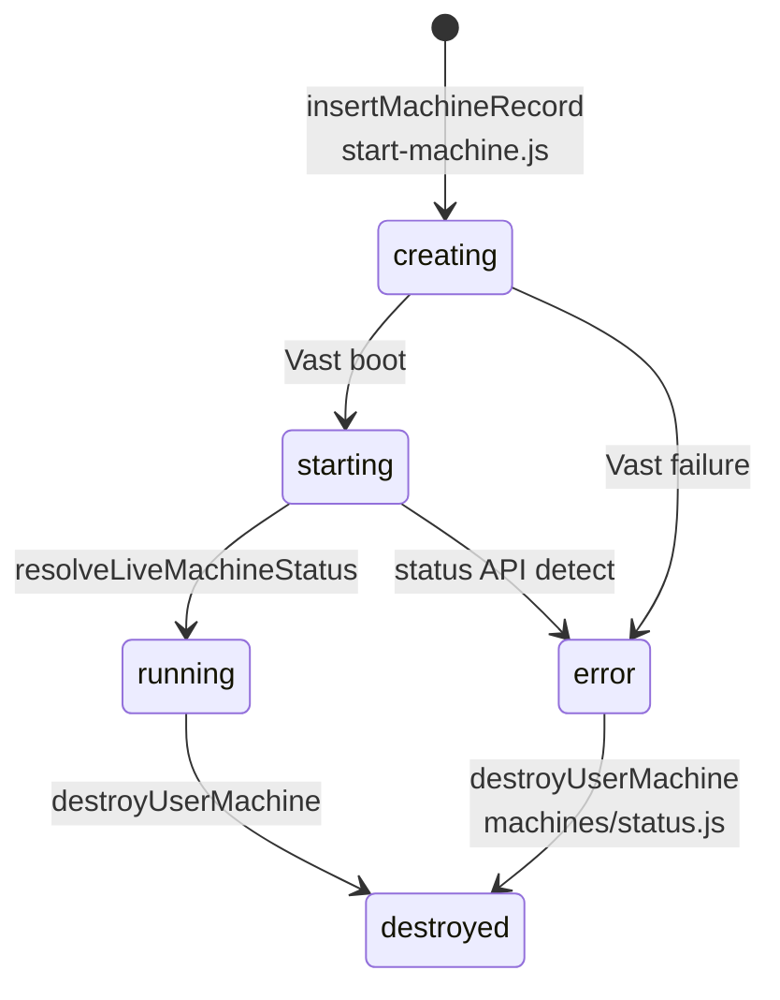

### 9.1 Provision

| Bước | Function / file |
|---|---|
| Chọn GPU line | `resolveGpuLineFromPlan()` — `gpu-config.js` |
| Rent Vast | `provisionGpuInstance()` — thử từng region trong `getDefaultGpuRegions()` |
| Chọn offer | `VastClient.findBestGPU()` — `vast-client.js` |
| Insert DB | `insertMachineRecord()` — `machines.js` |
| Map instance | `mapGpuInstanceToMachineRow()` — lưu `template=envName` |

Hard filters GPU (`GPU_STRICT_FILTERS` — `gpu-config.js`): VRAM ≥ 22GB, disk ≥ 20GB, reliability ≥ 0.995, v.v.

Region fallback (`GPU_FALLBACK_LEVELS`): `asia_preferred` → `asia_full` → `global`.

### 9.2 Live sync

| Function | Mô tả |
|---|---|
| `resolveLiveMachineStatus()` | Poll Vast + Comfy health — `machines.js` |
| `syncMachineFromLiveStatus()` | Cập nhật row `machines` |
| `syncSubscriptionWithMachineState()` | Reconcile subscription vs machine |

Polling client: `GET /api/machines/status` — cũng gọi `startBilling`, `deductPerMinute`, `syncMachineIdleState`, `checkAutoStop`.

### 9.3 Destroy

Unified flow qua `destroyUserMachine()` — `machines.js`:

1. `backupBeforeStop()` nếu `reason` set + `status=running` — `machine-backup.js`
2. `collectSessionMetrics()` — `billing.js`
3. `stopBilling()` hoặc `settleMachineBillingWithoutCharge()` — `billing.js`
4. `finalizeGpuSession()` — `billing.js`
5. `gpuService.destroyInstance()` — Vast API
6. Update `machines.status=destroyed`, `subscriptions.server_status=offline`

Wrapper: `destroyMachineWithBackup()` — `machine-destroy.js`.

Destroy reasons chuẩn (`DESTROY_REASONS`): `user_stop`, `admin_stop`, `idle_timeout`, `out_of_credit`.

Reasons khác quan sát trong code nhưng **không** nằm trong `DESTROY_REASONS`: `retry_provision` (`start-machine.js`), `provision_failed` (`machines/status.js`) — `normalizeDestroyReason()` fallback về `user_stop`.

### 9.4 Auto-stop

| Trigger | Ngưỡng | Function |
|---|---|---|
| Idle ComfyUI queue | Cảnh báo 55 phút, stop 60 phút | `IDLE_WARN_MINUTES`, `IDLE_STOP_MINUTES` — `auto-stop.js` |
| Hết giờ / hết ví (hourly) | `effectiveHoursRemaining <= 0` hoặc `walletBalance <= 0` | `isOutOfCredit()` — `auto-stop.js` |

Queue check: `fetchComfyQueueStats()` → `ComfyClient.getQueue()`.

---

## 10. Billing Architecture

### 10.1 Mô hình

Billing gắn với `machines` row khi `status=running`:

- `billing_started_at`: thời điểm bắt đầu tính phí
- `billing_inventory_id`: FK `user_plan_inventory`
- `gpu_session_id`: FK `gpu_sessions` (status `running` → `completed`/`interrupted`)

### 10.2 Functions chính

| Function | File | Vai trò |
|---|---|---|
| `startBilling()` | `billing.js` | Tạo/link `gpu_sessions`, set `billing_started_at` |
| `deductPerMinute()` | `billing.js` | Trừ giờ mỗi phút (`MINUTE_BILLING_SECONDS=60`) |
| `stopBilling()` | `billing.js` | Kết thúc session, tính duration |
| `finalizeGpuSession()` | `billing.js` | Ghi metrics, output summary |
| `getBillingStatus()` | `billing.js` | Aggregate hours/wallet cho UI + auto-stop |
| `repairUserBillingState()` | `billing.js` | Sửa orphan sessions — gọi từ `start-machine.js`, `dashboard/me.js` |
| `closeOrphanRunningSessions()` | `billing.js` | Đóng session running mồ côi |
| `settleMachineBillingWithoutCharge()` | `billing.js` | Destroy khi chưa billing đủ điều kiện charge |

### 10.3 Nơi billing tick chạy

| Trigger | File |
|---|---|
| Poll status | `machines/status.js` → `deductPerMinute` |
| Cron idle | `auto-stop.js` → `checkAutoStop` → `deductPerMinute` |
| Destroy | `destroyUserMachine` → `stopBilling` |

### 10.4 Session ↔ machine matching

`sessionBelongsToMachine()` — tolerance 5 giây giữa `session.started_at` và `machine.created_at` — `billing.js`.

`computeBillableDurationSeconds()` — cap duration theo `machine.created_at` — `billing.js`.

---

## 11. Background Jobs

### 11.1 Vercel Cron

| Schedule | Path | Function |
|---|---|---|
| `*/5 * * * *` | `/api/cron/check-idle` | `checkAutoStop()` — `vercel.json`, `cron/check-idle.js` |

Cron duyệt tất cả `machines` có `status=running`, gọi `checkAutoStop(supabaseAdmin, machineId)` cho từng row.

Auth: `x-vercel-cron` header hoặc `Bearer CRON_SECRET`.

### 11.2 Jobs khác

Không có queue/worker riêng (Redis, Bull, v.v.) trong codebase đã khảo sát.

Auto-renew: `src/lib/auto-renew.js`, API `pages/api/user/auto-renew/check.js` — trigger **Unknown** (cron riêng hay on-demand).

---

## 12. Public APIs

Tất cả route nằm dưới `src/pages/api/`. Auth mặc định: Bearer JWT trừ khi ghi chú khác.

### 12.1 Auth & Register

| Method | Path | File | Auth |
|---|---|---|---|
| POST | `/api/register` | `register.js` | Public |
| POST | `/api/auth/login` | `auth/login.js` | Public |
| GET | `/api/auth/me` | `auth/me.js` | Bearer |
| POST | `/api/auth/forgot-password` | `auth/forgot-password.js` | Public |

### 12.2 OTP

| Method | Path | File |
|---|---|---|
| POST | `/api/otp/send` | `otp/send.js` |
| POST | `/api/otp/verify` | `otp/verify.js` |

### 12.3 User

| Method | Path | File |
|---|---|---|
| GET | `/api/dashboard/me` | `dashboard/me.js` |
| POST | `/api/user/start-machine` | `user/start-machine.js` |
| POST | `/api/user/cancel-start-machine` | `user/cancel-start-machine.js` |
| POST | `/api/user/stop-machine` | `user/stop-machine.js` |
| POST | `/api/user/change-environment` | `user/change-environment.js` |
| GET | `/api/user/profile` | `user/profile.js` |
| POST | `/api/user/password` | `user/password.js` |
| GET/PUT | `/api/user/settings` | `user/settings.js` |
| POST | `/api/user/verify-phone` | `user/verify-phone.js` |
| POST | `/api/user/change-phone` | `user/change-phone.js` |
| GET | `/api/user/wallet` | `user/wallet.js` |
| POST | `/api/user/wallet/deposit` | `user/wallet/deposit.js` |
| GET | `/api/user/plans` | `user/plans.js` |
| POST | `/api/user/plans/activate` | `user/plans/activate.js` |
| GET | `/api/user/active-plans` | `user/active-plans.js` |
| GET | `/api/user/pricing-context` | `user/pricing-context.js` |
| GET | `/api/user/sessions` | `user/sessions.js` |
| GET | `/api/user/my-grants` | `user/my-grants.js` |
| GET | `/api/user/notifications` | `user/notifications.js` |
| GET | `/api/user/notifications/unread-count` | `user/notifications/unread-count.js` |
| POST | `/api/user/notifications/read` | `user/notifications/read.js` |
| GET | `/api/user/backup-logs` | `user/backup-logs.js` |
| POST | `/api/user/backup-restore` | `user/backup-restore.js` |
| POST | `/api/user/delete-backup` | `user/delete-backup.js` |
| POST | `/api/user/auto-renew` | `user/auto-renew.js` |
| POST | `/api/user/auto-renew/check` | `user/auto-renew/check.js` |

### 12.4 Payment & Trial

| Method | Path | File |
|---|---|---|
| POST | `/api/payment/confirm` | `payment/confirm.js` |
| POST | `/api/payment/pay-wallet` | `payment/pay-wallet.js` |
| POST | `/api/payment/renew` | `payment/renew.js` |
| POST | `/api/trial/activate` | `trial/activate.js` |
| GET | `/api/gpu-pricing` | `gpu-pricing.js` |

### 12.5 Machines

| Method | Path | File |
|---|---|---|
| GET | `/api/machines/status` | `machines/status.js` |
| POST | `/api/machines/destroy` | `machines/destroy.js` |
| GET | `/api/machines/recent-outputs` | `machines/recent-outputs.js` |

### 12.6 Storage

| Method | Path | File |
|---|---|---|
| GET | `/api/storage/plan` | `storage/plan.js` |
| POST | `/api/storage/upgrade` | `storage/upgrade.js` |
| POST | `/api/storage/pay-wallet` | `storage/pay-wallet.js` |
| POST | `/api/storage/pay-transfer` | `storage/pay-transfer.js` |

### 12.7 Support

| Method | Path | File |
|---|---|---|
| POST | `/api/support/request` | `support/request.js` |
| GET | `/api/support/status` | `support/status.js` |
| GET | `/api/support/sessions` | `support/sessions.js` |
| POST | `/api/support/approve` | `support/approve.js` |
| POST | `/api/support/reject` | `support/reject.js` |
| POST | `/api/support/end` | `support/end.js` |

### 12.8 Admin

| Method | Path | File | Auth |
|---|---|---|---|
| GET | `/api/admin/check` | `admin/check.js` | Admin |
| GET | `/api/admin/customers` | `admin/customers.js` | Admin |
| GET | `/api/admin/customer-stats` | `admin/customer-stats.js` | Admin |
| GET | `/api/admin/pending-requests` | `admin/pending-requests/index.js` | Admin |
| GET | `/api/admin/pending-requests/count` | `admin/pending-requests/count.js` | Admin |
| GET | `/api/admin/subscriptions/pending` | `admin/subscriptions/pending.js` | Admin |
| POST | `/api/admin/subscriptions/approve` | `admin/subscriptions/approve.js` | Admin |
| POST | `/api/admin/subscriptions/reject` | `admin/subscriptions/reject.js` | Admin |
| POST | `/api/admin/wallet-deposits/approve` | `admin/wallet-deposits/approve.js` | Admin |
| POST | `/api/admin/wallet-deposits/reject` | `admin/wallet-deposits/reject.js` | Admin |
| POST | `/api/admin/plan-renew/approve` | `admin/plan-renew/approve.js` | Admin |
| POST | `/api/admin/plan-renew/reject` | `admin/plan-renew/reject.js` | Admin |
| GET/PUT | `/api/admin/gpu-pricing` | `admin/gpu-pricing.js` | Admin |
| GET/PUT | `/api/admin/storage-pricing` | `admin/storage-pricing.js` | Admin |
| GET | `/api/admin/storage/pending` | `admin/storage/pending.js` | Admin |
| POST | `/api/admin/storage/approve` | `admin/storage/approve.js` | Admin |
| POST | `/api/admin/storage/reject` | `admin/storage/reject.js` | Admin |
| POST | `/api/admin/machines/toggle` | `admin/machines/toggle.js` | Admin |
| POST | `/api/admin/hour-grants` | `admin/hour-grants.js` | Admin |
| GET/PUT | `/api/admin/infrastructure` | `admin/infrastructure.js` | Admin |
| POST | `/api/admin/support/request` | `admin/support/request.js` | Admin |

### 12.9 Cron

| Method | Path | File | Auth |
|---|---|---|---|
| GET/POST | `/api/cron/check-idle` | `cron/check-idle.js` | Cron secret |

---

## 13. External Services

| Service | Mục đích | Integration | Env vars |
|---|---|---|---|
| **Supabase** | Auth, PostgreSQL, RLS | `@supabase/supabase-js` | `NEXT_PUBLIC_SUPABASE_URL`, `NEXT_PUBLIC_SUPABASE_ANON_KEY`, `SUPABASE_SERVICE_ROLE_KEY` |
| **Vast.ai** | Rent GPU instances | `VastClient` REST | `VAST_AI_KEY` / `VAST_API_KEY` |
| **ComfyUI** | Queue, metrics, workflow | HTTP qua `ComfyClient` | Endpoint từ Vast instance IP:port |
| **Cloudflare R2** | Backup archives | `@aws-sdk/client-s3` | `R2_*` |
| **SpeedSMS** | OTP SMS | `fetch` REST | `SPEEDSMS_ACCESS_TOKEN`, `SPEEDSMS_SENDER` |
| **SSH (Vast host)** | Backup tar folders | `ssh2` | `VAST_SSH_PRIVATE_KEY` / `VAST_SSH_PRIVATE_KEY_PATH` |
| **Vercel** | Hosting + cron | `vercel.json` | `CRON_SECRET` |
| **Docker Hub** | ComfyUI image | Vast `image` param | `GPUVIETNAM_COMFYUI_IMAGE` |
| **WebRTC (support)** | Remote support | **Unknown** — `support-sessions.sql` comment "placeholder" |

Admin secret fallback: `ADMIN_SECRET` — `admin-auth.js`.

---

## 14. Folder Structure

```text
gpuvietnam/
├── docs/                          # Tài liệu dự án
├── public/                        # Static assets
├── scripts/                       # Shell/Node scripts (start.sh, convert, db migrations)
├── supabase/                      # SQL schema & seeds (32 files)
├── src/
│   ├── components/                # React UI (~78 files)
│   │   ├── admin/                 # Admin panels
│   │   ├── auth/                  # Auth shells
│   │   ├── checkout/              # Checkout flow
│   │   ├── dashboard/             # Dashboard widgets
│   │   ├── layout/                # Header, sidebar, footer
│   │   ├── pages/                 # Page-level components
│   │   ├── pricing/               # Pricing sections
│   │   └── workstations/          # Workstation cards
│   ├── hooks/                     # React hooks (useDashboard, …)
│   ├── lib/                       # Business logic (~89 files)
│   │   ├── gpu/                   # GPU domain
│   │   │   ├── domain/            # TS types
│   │   │   └── providers/vast/    # Vast + Comfy
│   │   └── scripts/               # Static content scripts
│   ├── middleware.ts              # Dashboard cookie guard
│   ├── pages/                     # Next.js routes (~107 files)
│   │   ├── api/                   # API routes (72 handlers)
│   │   ├── admin/                 # Admin pages
│   │   ├── dashboard/             # User dashboard pages
│   │   └── …                      # Marketing, checkout, auth pages
│   └── styles/                    # CSS (Unknown path — **Unknown** nếu không tồn tại)
├── .env.local.example
├── docker-compose.yml
├── next.config.js / tsconfig.json
├── package.json
└── vercel.json
```

---

## 15. Sequence Diagrams

### 15.1 Thanh toán (chuyển khoản + admin duyệt)

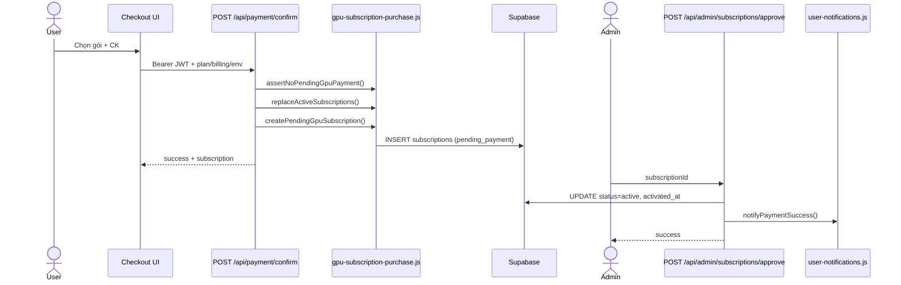

### 15.2 Thanh toán (ví nội bộ)

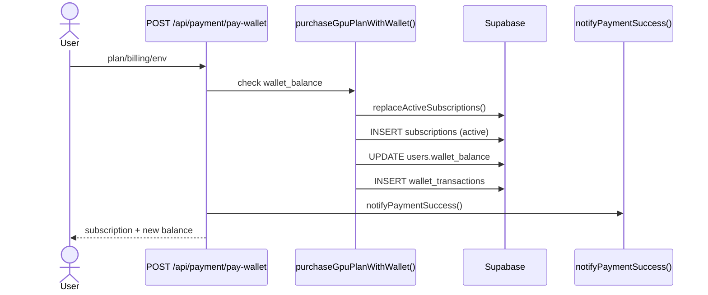

### 15.3 Mở phiên làm việc (Start Machine)

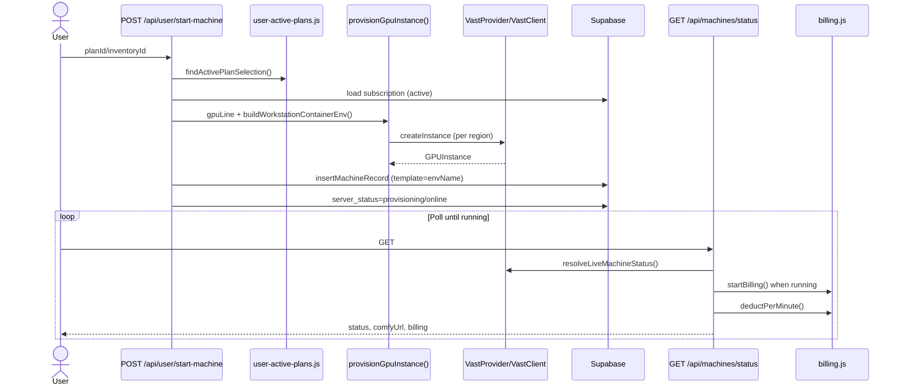

### 15.4 Đóng phiên làm việc (Stop Machine)

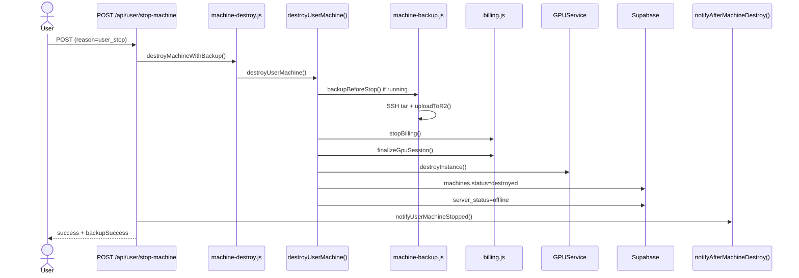

### 15.5 Đổi Workspace

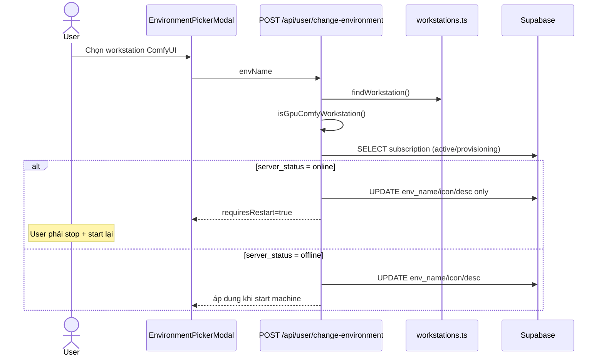

---

## 16. Dependency Graph

### 16.1 Module import (logic layer)

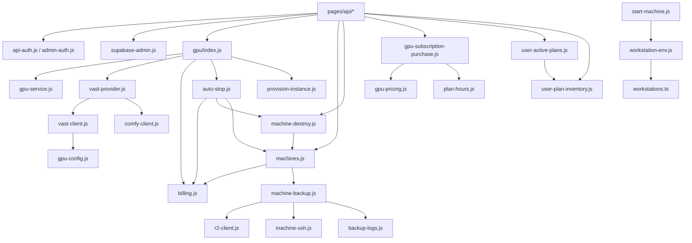

### 16.2 Singleton patterns

| Singleton | File | Function |
|---|---|---|
| GPUService + VastProvider | `gpu/index.js` | `getGpuService()` |
| GPUService (auto-stop) | `gpu/auto-stop.js` | Local `getGpuService()` (instance riêng) |
| R2 S3Client | `r2-client.js` | `getR2Client()` |

---

## 17. Design Assessment

> Mô tả hiện trạng thiết kế. Không đề xuất thay đổi.

### 17.1 Coupling

| Quan hệ | Mô tả | File |
|---|---|---|
| API ↔ Supabase admin | Mọi API route gọi trực tiếp `getSupabaseAdmin()` | `supabase-admin.js`, toàn bộ `pages/api/` |
| Machines ↔ Billing | `destroyUserMachine()` import `startBilling`/`stopBilling`/`finalizeGpuSession` | `machines.js`, `billing.js` |
| Status poll ↔ Billing + Auto-stop | Một request `/machines/status` kích billing tick và auto-stop | `machines/status.js` |
| Auto-stop ↔ Destroy | `checkAutoStop()` gọi `destroyMachineWithBackup()` | `auto-stop.js`, `machine-destroy.js` |
| GPU config ↔ Vast client | Hard filters và scoring đọc từ `gpu-config.js` | `vast-client.js` |
| Workstation UI ↔ Backend catalog | Frontend và API cùng import `workstations.ts` | `workstations.ts`, `change-environment.js` |
| Dashboard middleware ↔ Client cookie | Middleware chỉ check cookie flag, không validate JWT | `middleware.ts` |

### 17.2 Cohesion

| Module | Cohesion | Ghi chú |
|---|---|---|
| `gpu/billing.js` | Cao (single domain) | ~2000 dòng, gom session + charge + repair |
| `machines.js` | Trung bình | Machine CRUD + subscription sync + destroy orchestration |
| `gpu-subscription-purchase.js` | Cao | Purchase flows tách khỏi API handlers |
| `vast-client.js` | Cao | Offer search, filter, score, fallback |
| `user-notifications.js` | Trung bình | Nhiều event types trong một file |
| Admin APIs | Thấp–trung bình | Mỗi endpoint mỏng, logic nằm rải trong `lib/` |

### 17.3 Extension Points

| Extension point | Cơ chế | File |
|---|---|---|
| GPU provider | `GPUProvider` interface + `createGpuServiceWithProvider()` | `gpu-provider.interface.ts`, `gpu/index.js` |
| GPU regions | Env `GPU_REGIONS` | `gpu-config.js` → `getDefaultGpuRegions()` |
| Docker image | Env `GPUVIETNAM_COMFYUI_IMAGE` | `gpu-config.js` |
| Pricing | DB `gpu_pricing_config` + admin API | `gpu-pricing-config.js`, `admin/gpu-pricing.js` |
| Workstation workflows | `WORKSTATION_WORKFLOWS` map | `workstation-env.js` |
| Destroy reasons + notify | `notifyAfterMachineDestroy()` switch | `machine-destroy.js` |
| Infrastructure providers | `infrastructure-providers.js` | Admin infra panel |

### 17.4 Hardcoded Logic

| Nội dung | Giá trị / vị trí | File |
|---|---|---|
| Workstation list | 6 entries static | `workstations.ts` |
| GPU Comfy IDs | `[1, 2, 3]` | `workstation-env.js` |
| Plan → GPU line | `starter→rtx3090`, `pro→rtx4090_1x`, `studio→rtx5090_1x` (legacy `rtx4090_2x` retired) | `gpu-config.js` → `PLAN_TO_GPU` |
| Default regions | Taiwan, Japan, Singapore | `gpu-config.js` |
| VRAM minimum | 22 GB | `GPU_STRICT_FILTERS.minVramGb` |
| Idle thresholds | 55 warn / 60 stop minutes | `auto-stop.js` |
| Trial | 3 giờ (TRIAL_HOURS) | `plan-hours.js` |
| Billing tick | 60 giờ MINUTE_BILLING_SECONDS | `billing.js` |
| Score weights | price 60%, region 15%, … | `GPU_SCORE_WEIGHTS` — `gpu-config.js` |
| Bank info wallet | WALLET_BANK_INFO | `wallet-deposit.js` |
| Zalo custom WS | Workstation id 6 blocked | `change-environment.js` |
| Session-machine tolerance | 5000 ms | `billing.js` → `SESSION_MACHINE_TOLERANCE_MS` |
| Provisioning stale retry | 15 phút | `start-machine.js` → `shouldRetryProvisioning()` |

### 17.5 Current Technical Debt

| Hiện tượng | Chi tiết | File |
|---|---|---|
| Import sai module | `support/end.js` import `getAdminUserFromRequest` từ `api-auth.js`; function thực tế ở `admin-auth.js` | `pages/api/support/end.js`, `admin-auth.js` |
| Destroy reason không chuẩn | `retry_provision`, `provision_failed` không thuộc `DESTROY_REASONS`; `normalizeDestroyReason()` fallback `user_stop` | `start-machine.js`, `machines/status.js`, `machine-destroy.js` |
| Dual GPUService singleton | `gpu/index.js` và `auto-stop.js` mỗi nơi tạo singleton riêng | `gpu/index.js`, `auto-stop.js` |
| Middleware auth yếu | Cookie boolean, không bind user/session server-side | `middleware.ts` |
| Schema phân tán | 32 SQL files, không có single migration runner trong repo | `supabase/` |
| Mixed JS/TS | Domain types TS, implementation chủ yếu JS | `src/lib/gpu/domain/*.ts`, `*.js` |
| Debug logging production | `console.log` CHECKPOINT trong status API | `machines/status.js` |
| SQL pending deploy | `machines-idle.sql`, `backup-logs.sql`, `admin-machine-logs.sql` có thể chưa apply trên mọi môi trường | `supabase/` — trạng thái deploy: **Unknown** |
| `subscriptions.status=provisioning` | Dùng trong query nhưng chủ yếu `server_status` mang nghĩa provisioning | `change-environment.js`, `machines.js` |
| Support WebRTC | DB + UI modal tồn tại; implementation media: **Unknown** | `support-sessions.sql`, `AdminRemoteSupportModal.tsx` |

---

## 18. Appendix

### 18.1 File tham chiếu (core)

| Lĩnh vực | Files |
|---|---|
| Entry & config | `package.json`, `vercel.json`, `src/middleware.ts`, `.env.local.example`, `docker-compose.yml` |
| Auth | `src/lib/api-auth.js`, `src/lib/admin-auth.js`, `src/lib/auth-token.js`, `src/lib/user-role.js` |
| Subscription | `src/lib/gpu-subscription-purchase.js`, `supabase/subscriptions.sql` |
| Machine | `src/lib/machines.js`, `src/lib/machine-destroy.js`, `supabase/machines.sql` |
| GPU / Vast | `src/lib/gpu/index.js`, `src/lib/gpu/gpu-service.js`, `src/lib/gpu/provision-instance.js`, `src/lib/gpu/providers/vast/vast-client.js`, `src/lib/gpu/providers/vast/vast-provider.js`, `src/lib/gpu/gpu-config.js` |
| Billing | `src/lib/gpu/billing.js`, `supabase/gpu-sessions.sql`, `supabase/machines-billing.sql` |
| Auto-stop & backup | `src/lib/gpu/auto-stop.js`, `src/lib/machine-backup.js`, `src/lib/r2-client.js`, `supabase/backup-logs.sql`, `supabase/machines-idle.sql` |
| Workstation | `src/lib/workstations.ts`, `src/lib/workstation-env.js` |
| Wallet | `src/lib/wallet-deposit.js`, `supabase/user-settings.sql`, `supabase/storage-upgrades.sql` |
| UI dashboard | `src/components/dashboard/DashboardOverview.tsx`, `src/hooks/useDashboard.ts`, `src/pages/api/dashboard/me.js` |
| Cron | `src/pages/api/cron/check-idle.js` |

### 18.2 API tham chiếu (đầy đủ)

Xem [§12 Public APIs](#12-public-apis) — 72 handlers.

Base URL production: **Unknown** (phụ thuộc deployment Vercel/custom domain).

### 18.3 Module tham chiếu (`src/lib/`)

| File | Export / vai trò chính |
|---|---|
| `active-plan-gate.ts` | Gate UI khi không có plan active |
| `admin-auth.js` | `requireAdmin`, `getAdminUserFromRequest` |
| `admin-customers.js` | Admin customer list logic |
| `admin-customers-shared.ts` | Shared types/helpers customers |
| `admin-machine-logs.js` | Ghi log admin thao tác máy |
| `admin-nav.ts` | Admin navigation items |
| `admin-pending-requests.js` | Aggregate pending admin tasks |
| `api-auth.js` | `getAuthUserFromRequest`, `unauthorized` |
| `auth-token.js` | Parse JWT access token |
| `auto-renew.js` | Auto-renew evaluation/execution |
| `backup-logs.js` | CRUD backup_logs |
| `checkout-auth.ts` | Checkout session env defaults |
| `checkout-order.ts` | Checkout order state |
| `checkout-plans.ts` | Plan definitions checkout |
| `constants.ts` | App constants |
| `currency.js` | Format VND |
| `customer-anomalies.ts` | Customer anomaly detection |
| `customer-eligibility.js` | Trial/eligibility rules |
| `export-customers-excel.ts` | Excel export admin |
| `generate-password.js` | Random password register |
| `gpu-pricing-config.js` | Load pricing from DB |
| `gpu-pricing-defaults.js` | Default price table |
| `gpu-pricing-types.ts` | TS types pricing |
| `gpu-pricing.js` | Price lookup, labels |
| `gpu-sessions.js` | Session query helpers |
| `gpu-subscription-purchase.js` | Purchase + wallet buy |
| `infrastructure-providers.js` | Infra provider config |
| `infrastructure-shared.ts` | Shared infra types |
| `machine-backup.js` | `backupBeforeStop` |
| `machine-destroy.js` | Unified destroy wrapper |
| `machine-ssh.js` | SSH exec on Vast host |
| `machines.js` | Machine domain core |
| `navigation.ts` | Site navigation |
| `otp.js` | OTP create/verify |
| `phone.js` | VN phone normalize/validate |
| `plan-hours.js` | Quota, trial hours, expires |
| `plan-pricing.js` | Renew pricing |
| `plan-renew-request.js` | Plan renew transfer flow |
| `plan-trial.js` | Trial helpers |
| `post-login-redirect.ts` | Redirect after login |
| `r2-client.js` | R2 upload/download |
| `routes.ts` | Route path constants |
| `site-url.js` | Base URL helper |
| `speedsms.js` | SMS OTP send |
| `storage-plans.js` | Storage plan definitions |
| `supabase-admin.js` | Service role client |
| `supabase-browser.js` | Browser anon client |
| `supabase.js` | Legacy/alternate client |
| `support-sessions.js` | Support session CRUD |
| `user-active-plans.js` | Active plan aggregation |
| `user-notifications.js` | Notification insert helpers |
| `user-plan-inventory.js` | Inventory sync/activate |
| `user-role.js` | Role resolve/sync |
| `user-settings.js` | Settings CRUD defaults |
| `wallet-deposit.js` | Deposit request + approve |
| `wallet-topup.js` | Topup helpers |
| `workstation-env.js` | Env/slug/container env |
| `workstations.ts` | Static workstation catalog |
| `gpu/*` | GPU subsystem — xem §5, §9, §10 |

### 18.4 SQL tham chiếu (`supabase/`)

| File | Nội dung |
|---|---|
| `schema.sql` | users, otp_verifications |
| `subscriptions.sql` | subscriptions |
| `machines.sql` | machines |
| `machines-billing.sql` | billing columns |
| `machines-idle.sql` | idle columns |
| `gpu-sessions.sql` | gpu_sessions |
| `user-plan-inventory.sql` | user_plan_inventory |
| `hour-grants.sql` | manual_hour_grants, hour_grant_logs |
| `user-settings.sql` | settings, wallet_transactions |
| `storage-upgrades.sql` | wallet_balance, storage_upgrades |
| `storage.sql` | storage_files |
| `storage-pricing.sql` | Storage pricing |
| `storage-models.sql` | Storage models |
| `plan-renew-requests.sql` | plan_renew_requests |
| `notifications.sql` | notifications |
| `backup-logs.sql` | backup_logs |
| `support-sessions.sql` | support_sessions |
| `gpu-pricing-config.sql` | gpu_pricing_config |
| `workflows.sql`, `models.sql` | Resource catalog |
| `admin-machine-logs.sql` | Admin machine logs |
| `wallet-deposit-status.sql` | Wallet deposit status migration |
| `admin-approve-payment.sql` | Admin payment helpers |
| `add-user-role.sql`, `set-admin-role.sql` | Role migrations |
| `seed-*.sql` | Seed data |
| `fix-trigger.sql`, `drop-auth-trigger.sql`, `add-updated-at.sql` | Maintenance migrations |

---

*Tài liệu được tạo bằng khảo sát tĩnh codebase tại workspace `gpuvietnam/`. Các mục ghi **Unknown** cần xác minh thêm qua runtime hoặc cấu hình deployment.*
