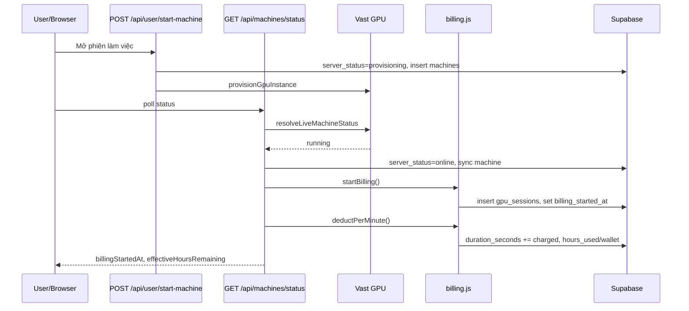
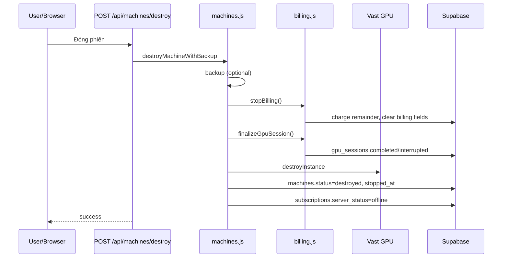
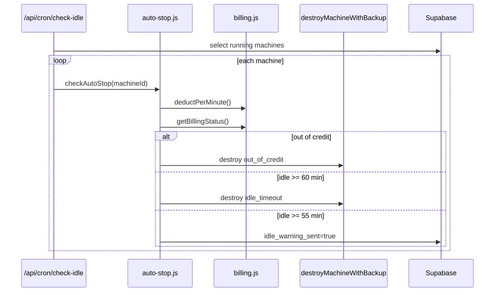

# BILLING_LOGIC_REVIEW

> **STATUS — OUTDATED (pre-SCB-3.0 model):** Tài liệu này review mô hình
> **per-minute tick billing** (`deductPerMinute`, `stopBilling`,
> `applyBillingDeduction`, `chargeWalletForHours`,
> `deductHoursFromInventoryPlan`) — các hàm này **đã bị xóa** trong quá trình
> rebuild SCB (xem `docs/IMPLEMENTATION_REPORT_M6.md`). Billing hiện tại là
> **Session-Centric Settlement** (SCB): settlement chạy một lần sau Provider
> Verify DESTROYED, và từ **SCB 3.4B** bước commit (W2–W7) thực hiện atomic
> trong RPC `settle_session_transaction()`. **Đừng dùng tài liệu này làm
> reference cho code hiện tại.** Tham chiếu chính thức:
> [`docs/scb/SCB-ARCHITECTURE.md`](./scb/SCB-ARCHITECTURE.md),
> [`docs/SESSION_CENTRIC_BILLING_ARCHITECTURE.md`](./SESSION_CENTRIC_BILLING_ARCHITECTURE.md),
> [`docs/scb/SCB_3_4B_COMPLETION_REPORT.md`](./scb/SCB_3_4B_COMPLETION_REPORT.md).
> Nội dung bên dưới giữ nguyên làm bản ghi lịch sử của review pre-SCB.

Tài liệu mô tả **logic hiện tại** của hệ thống billing / session / machine, dựa trên code trong repo `gpuvietnam` tại thời điểm review.

**Quy ước:** Không mô tả mong muốn. Không suy đoán. Phần chưa xác minh từ code ghi **UNKNOWN**.

---

## 1. Billing Philosophy

### Hệ thống đang tính phí theo gì?

| Giai đoạn | Đơn vị tính | Bằng chứng code |
|-----------|-------------|-----------------|
| **Trong phiên đang chạy** | **Theo phút (full minute chunks)** | `MINUTE_BILLING_SECONDS = 60` (`src/lib/gpu/billing.js`). `deductPerMinute()` chỉ charge khi `billSeconds = floor(unbilledSeconds / 60) * 60 >= 60`. |
| **Theo dõi nội bộ** | **Giây** | `computeBillableDurationSeconds()`, `getUnbilledSeconds()`, `gpu_sessions.duration_seconds`. |
| **Trừ credit combo/gift** | **Giờ (suy ra từ giây)** | `useHours = min(availableHours, needHours)`; `useSeconds = floor(useHours * 3600)`. |
| **Trừ wallet (hourly)** | **VND (làm tròn từ giờ)** | `walletCharge = Math.round(hours * pricePerHour)`. |
| **Khi dừng máy** | **Toàn bộ giây còn lại chưa bill** (kể cả phần lẻ < 1 phút) | `stopBilling()`: `remainderSeconds = totalDurationSeconds - alreadyBilledSeconds`. |
| **Hiển thị / credit summary** | **Giờ, 2 chữ số thập phân** | `roundHours(v) = Math.round(v * 100) / 100`. |

**Không tìm thấy trong code:** billing theo giây liên tục trong lúc chạy; billing theo cron riêng (ngoài việc cron gọi `deductPerMinute`).

### Nguồn dữ liệu chuẩn (Source of Truth)

| Concern | Source of Truth | File / bảng |
|---------|-----------------|-------------|
| **Mốc bắt đầu tính phí** | `machines.billing_started_at` | `linkMachineToBillingSession()` |
| **Giây đã charge trong phiên** | `gpu_sessions.duration_seconds` (comment: "already-billed seconds (per-minute ticks)") | `getBilledSeconds()` |
| **Liên kết machine ↔ session** | `machines.gpu_session_id` ↔ `gpu_sessions.id` | `machines-billing.sql` |
| **Plan dùng khi bắt đầu billing** | `machines.billing_inventory_id` → `user_plan_inventory.id` | `startBilling()` |
| **Combo/gift đã dùng** | `subscriptions.hours_used` hoặc `manual_hour_grants.hours_used` | `deductHoursFromInventoryPlan()` |
| **Hourly đã trừ** | `users.wallet_balance` + `wallet_transactions` | `chargeWalletForHours()` |
| **Plan khả dụng lúc runtime** | `user_plan_inventory` (status `active`, qua `isInventoryRowUsable`) | `fetchOrderedBillablePlans()` |
| **Trạng thái runtime subscription (UI/API)** | `subscriptions.server_status` | `machines.js`, API start/status |
| **Trạng thái lifecycle machine** | `machines.status` | `machines.sql`, `machines.js` |

**Derived (không phải SoT cho math billing):**
- `getBillingStatus.sessionDurationSeconds` = wall-clock từ anchor (`Date.now()` − `billing_started_at`), **không** dùng `duration_seconds`.
- `user_plan_inventory.hours_remaining` được sync từ `hours_total − hours_used` nhưng deduction đọc inventory tại thời điểm charge.

**Không tồn tại trong codebase:** `remaining_minutes`, `remaining_seconds`, `used_minutes` (grep toàn repo: 0 kết quả).

---

## 2. Session Lifecycle

Luồng thực tế từ code:

### User bấm "Mở phiên làm việc"

1. Frontend gọi `POST /api/user/start-machine` (`src/pages/api/user/start-machine.js`).
2. `repairUserBillingState()` — đóng orphan sessions, xóa billing trên machine đang `creating`/`starting`.
3. Nếu đã `online` + có machine → trả `alreadyOnline`, không provision lại.
4. Nếu `provisioning` + stale (>15 phút, `shouldRetryProvisioning`) → `destroyUserMachine()` rồi provision lại.
5. `activateInventoryPlan()` nếu có `inventoryId`.
6. Cập nhật `subscriptions`: `server_status = 'provisioning'`, `plan`, `gpu_label`.
7. `provisionGpuInstance()` (Vast).
8. `insertMachineRecord()` → `machines.status` = `creating` | `starting` | `running` (từ Vast status code).
9. `machines.created_at` = DB default; `machines.started_at` = DB default `now()` (schema).
10. Nếu live status ngay lúc đó là `running` → `subscriptions.server_status = 'online'`.
11. **Billing chưa bắt đầu tại bước này.**

### Provision → Machine Running

- Frontend poll `GET /api/machines/status` (interval: 10s boot / 30s running — `DashboardOverview.tsx`: `STATUS_POLL_BOOT_MS`, `STATUS_POLL_RUNNING_MS`).
- `syncMachineFromLiveStatus()` cập nhật `machines.status` theo Vast.
- Khi `liveStatus.status === 'running'`:
  - `subscriptions.server_status = 'online'`
  - **`startBilling()`** được gọi
  - **`deductPerMinute()`** được gọi ngay sau đó

### Billing bắt đầu lúc nào?

**Khi `GET /api/machines/status` thấy `liveStatus.status === 'running'`**, không phải lúc user bấm start.

`startBilling()` (`billing.js`):
- Chỉ chạy nếu `machine.status === 'running'`.
- Tạo hoặc reuse `gpu_sessions` (`status: 'running'`, `duration_seconds: 0`).
- Gọi `linkMachineToBillingSession()` → set `machines.billing_started_at = session.started_at`.

### Billing cập nhật lúc nào?

| Trigger | Hàm | Tần suất |
|---------|-----|----------|
| Dashboard poll status | `deductPerMinute()` | ~10s (boot) / ~30s (running) |
| Cron idle check | `deductPerMinute()` rồi `checkAutoStop()` | Mỗi 5 phút (`vercel.json`) |
| Destroy / stop | `stopBilling()` | Một lần khi destroy |

### User bấm "Đóng phiên làm việc"

- Frontend (`DashboardOverview.tsx`) gọi `POST /api/machines/destroy` (không gọi `/api/user/stop-machine` trực tiếp).
- `destroyMachineWithBackup()` → `destroyUserMachine()`.

### Billing dừng lúc nào?

Trong `destroyUserMachine()`:
- Nếu `!skipBilling && machine.status === 'running' && machine.billing_started_at` → **`stopBilling()`**.
- Ngược lại nếu còn billing fields → **`settleMachineBillingWithoutCharge()`** (không charge).

`stopBilling()`:
- Charge `remainderSeconds` (partial minute OK).
- `syncUserPlanInventory()`.
- **`clearMachineBillingFields()`** → `billing_started_at = null`, `gpu_session_id = null`, `billing_inventory_id = null`.

### Destroy Instance

1. Backup (nếu `reason` set, `status === 'running'`, không `skipBackup`).
2. `collectSessionMetrics()`.
3. Billing (như trên).
4. `finalizeGpuSession()` → `gpu_sessions.status = 'completed' | 'interrupted'`, `ended_at`, `duration_seconds`.
5. `gpuService.destroyInstance()`.
6. `machines.status = 'destroyed'`, `machines.stopped_at = now`.
7. Active subscription `server_status = 'offline'`.

### Subscription cập nhật thế nào?

| Sự kiện | `server_status` | Code |
|---------|-----------------|------|
| Start machine | `provisioning` | `start-machine.js` |
| Machine running (status poll / start response) | `online` | `status.js`, `start-machine.js` |
| Destroy / cancel / lỗi / reconcile | `offline` | `destroyUserMachine`, `resetProvisioningSubscription`, `syncSubscriptionWithMachineState` |

**UNKNOWN:** `server_status = 'stopping'` — được **đọc** ở frontend (`DashboardOverview.tsx`) và `change-environment.js`, **không tìm thấy** `.update({ server_status: 'stopping' })` trong backend.

---

## 3. Billing Timeline

```
User POST /api/user/start-machine
    ↓
subscriptions.server_status = 'provisioning'
    ↓
machines INSERT (status: creating|starting, created_at, started_at default)
    ↓
[Poll GET /api/machines/status]
    ↓
liveStatus = 'running'
    ↓
subscriptions.server_status = 'online'
    ↓
startBilling()
    ↓
gpu_sessions INSERT (status: 'running', started_at: now, duration_seconds: 0)
    ↓
machines.billing_started_at = session.started_at
machines.gpu_session_id = session.id
machines.billing_inventory_id = inventory id (optional)
    ↓
[Loop while running]
    deductPerMinute()  ← status poll (~10s/30s) + cron (5 min)
    gpu_sessions.duration_seconds += chargedSeconds (full minutes only)
    subscriptions.hours_used / manual_hour_grants.hours_used / wallet_balance updated
    ↓
User POST /api/machines/destroy  OR  checkAutoStop → destroy
    ↓
stopBilling() → charge remainderSeconds (incl. partial minute)
    ↓
clearMachineBillingFields()
    ↓
finalizeGpuSession() → gpu_sessions.status, ended_at, duration_seconds
    ↓
gpuService.destroyInstance()
    ↓
machines.status = 'destroyed', stopped_at
    ↓
subscriptions.server_status = 'offline'
```

**Lưu ý:** `machines.started_at` tồn tại trong schema nhưng logic billing dùng **`billing_started_at`**, không phải `started_at`.

---

## 4. Billing Tick

### Billing được cập nhật bằng gì?

| Cơ chế | Realtime? | Chi tiết |
|--------|-----------|----------|
| **Status poll** | Không realtime liên tục; theo interval client | `status.js` gọi `deductPerMinute` mỗi lần poll khi running |
| **Cron** | Mỗi 5 phút | `/api/cron/check-idle` → `checkAutoStop` → `deductPerMinute` |
| **Stop/destroy event** | Một lần | `stopBilling()` settle phần còn lại |
| **WebSocket / streaming billing** | **Không có** | Không tìm thấy |

### Bao lâu một lần?

- **Trong phiên:** tối thiểu **60 giây unbilled** mới charge một tick (`deductPerMinute`).
- **Poll client:** 10s (creating/starting) / 30s (running) — chỉ là tần suất *thử* deduct, không phải tần suất charge.
- **Cron:** `*/5 * * * *` (`vercel.json`).

### Có cộng dồn không?

- **Có.** `gpu_sessions.duration_seconds` cộng dồn giây đã charge qua các tick.
- `getUnbilledSeconds() = billableDuration − duration_seconds`.

### Có làm tròn không?

- **Tick running:** chỉ charge **các phút đủ** (`floor(unbilled / 60) * 60`).
- **Stop:** charge **phần lẻ còn lại** (không floor minute).
- **Giờ hiển thị:** `roundHours()` 2 decimal.
- **Wallet VND:** `Math.round(hours * pricePerHour)`.
- **Giây charge từ giờ:** `useSeconds = floor(useHours * 3600)`.

---

## 5. Time Source

| Mục đích | Nguồn thời gian | Ghi chú |
|----------|-----------------|---------|
| Billable duration | `Date.now()` (Node) vs `billing_started_at` / `machine.created_at` | `computeBillableDurationSeconds()` |
| Session duration API | `Date.now()` − `anchor.startedAt` | `getBillingStatus()` |
| `billing_started_at` value | `gpu_sessions.started_at` hoặc `new Date().toISOString()` khi tạo session | `startBilling()` |
| `gpu_sessions.started_at` / `ended_at` | `new Date().toISOString()` | insert/update |
| `machines.stopped_at`, `updated_at` | `new Date().toISOString()` | destroy/update |
| Idle minutes | `Date.now()` − `machines.idle_started_at` | `computeIdleMinutes()` |
| Stale provisioning | `Date.now()` − `machines.created_at` | 15 phút (`STALE_BOOT_MS`, `shouldRetryProvisioning`) |
| Session-machine match tolerance | 5000 ms | `SESSION_MACHINE_TOLERANCE_MS` |

**Không dùng làm billing anchor:** PostgreSQL `NOW()` trực tiếp trong billing math (logic dùng JS `Date`).

**Database timestamps:** `created_at`, `updated_at` trên rows — `machine.created_at` tham gia cap billable duration (`maxSeconds`).

---

## 6. Subscription Fields

Schema: `supabase/subscriptions.sql`

| Field | Vai trò trong billing/machine flow |
|-------|-------------------------------------|
| `id` | FK `machines.subscription_id`, `gpu_sessions.subscription_id` |
| `user_id` | Filter user |
| `plan` | Metadata session; cập nhật lúc start |
| `billing` | `combo1` / `combo2` / `hourly`; metadata session |
| `env_name`, `env_icon`, `env_desc` | Workspace template (không billing math) |
| `gpu_label` | `gpu_sessions.gpu_config` |
| **`hours_total`** | Tổng giờ gói (schema) |
| **`hours_used`** | **SoT combo usage** — tăng qua `deductHoursFromInventoryPlan()` |
| `status` | `'active'` required để start |
| **`server_status`** | Runtime UI: `offline` / `provisioning` / `online` (và `'stopping'` chỉ đọc — xem §2) |
| `is_trial`, `transfer_note` | Không dùng trong billing.js / machines.js |
| `expires_at` | Inventory sync / usability |
| `activated_at` | **UNKNOWN** cho billing; dùng display |
| `created_at` | Order subscription |

**SoT cho giờ còn lại combo:** thực tế deduction ghi **`hours_used`**; `hours_remaining` trên inventory được sync.

---

## 7. Machine Fields

Schema: `supabase/machines.sql` + `machines-billing.sql` + `machines-idle.sql`

| Field | Vai trò |
|-------|---------|
| `id` | PK; `gpu_sessions.machine_id` |
| `user_id` | Owner |
| `subscription_id` | Link subscription |
| `instance_id` | Vast instance; billing lookup |
| `provider` | Default `'vast'` |
| `ip_address`, `port` | ComfyUI endpoint, metrics, idle queue |
| **`status`** | **`creating` / `starting` / `running` / `error` / `destroyed`** — gate billing |
| `gpu_type`, `gpu_line`, `region`, `template` | Provision metadata |
| `error_message` | Provision error |
| `started_at` | Schema default `now()` on insert — **không dùng trong billing formulas** |
| **`stopped_at`** | Set khi destroy |
| **`billing_started_at`** | **SoT billing anchor** |
| **`billing_inventory_id`** | Plan inventory lúc start billing |
| **`gpu_session_id`** | Link session đang charge |
| **`idle_started_at`** | Bắt đầu đếm idle (ComfyUI queue empty) |
| **`idle_warning_sent`** | Đã gửi cảnh báo idle 55 phút |
| `created_at`, `updated_at` | Lifecycle; `created_at` cap billable seconds |

**Active machine query:** `status IN ('creating', 'starting', 'running')` — `ACTIVE_MACHINE_STATUSES`.

---

## 8. Billing Formula

Công thức **trích từ code** (`src/lib/gpu/billing.js`):

### Billable duration

```
effectiveStart = max(billing_started_at, machine.created_at)  // nếu created_at > started_at
rawSeconds = floor((endedAt - effectiveStart) / 1000)
maxSeconds = floor((endedAt - machine.created_at) / 1000) + 60   // khi có created_at
billableSeconds = min(rawSeconds, maxSeconds)
```

### Unbilled (trong phiên)

```
unbilledSeconds = max(0, billableSeconds(now) - gpu_sessions.duration_seconds)
```

### Per-minute tick (`deductPerMinute`)

```
billSeconds = floor(unbilledSeconds / 60) * 60
if billSeconds < 60 → skip (reason: 'under_one_minute')
applyBillingDeduction(userId, billSeconds)
duration_seconds += chargedSeconds
```

### Stop settlement (`stopBilling`)

```
totalDurationSeconds = computeBillableDurationSeconds(billing_started_at, now, machine)
remainderSeconds = max(0, totalDurationSeconds - duration_seconds)
applyBillingDeduction(userId, remainderSeconds)   // partial minute OK
hoursUsed = roundHours(totalDurationSeconds / 3600)
```

### Credit summary (`getBillingStatus` / `summarizeAvailableCredit`)

```
unbilledHours = unbilledSeconds / 3600
// Combo/gift:
totalHours = sum(user_plan_inventory.hours_remaining)   // non-hourly
effectiveHoursRemaining = roundHours(totalHours - unbilledHours)
hoursRemaining = totalHours

// Hourly:
walletHours = roundHours(walletBalance / pricePerHour)
effectiveHoursRemaining = roundHours(walletHours - unbilledHours)
hoursRemaining = walletHours
```

### Deduction priority (`applyBillingDeduction`)

Thứ tự plan: **gift (sớm hết hạn nhất) → combo → hourly**.

Combo/gift:
```
useHours = min(plan.hours_remaining, remainingSeconds / 3600)
useSeconds = floor(useHours * 3600)
→ subscriptions.hours_used += useHours  (hoặc manual_hour_grants.hours_used)
```

Hourly:
```
maxHoursFromWallet = walletBalance / pricePerHour
useHours = min(maxHoursFromWallet, remainingSeconds / 3600)
walletCharge = round(useHours * pricePerHour)
wallet_balance -= appliedCharge   // appliedCharge = min(balance, walletCharge)
```

### Out of credit (`auto-stop.js`)

```
effectiveHoursRemaining <= 0
OR (planType === 'hourly' AND walletBalance <= 0)
```

---

## 9. Edge Cases

| Tình huống | Logic hiện tại (verified) |
|------------|---------------------------|
| **Browser đóng** | Backend không nhận sự kiện browser. Machine + billing tiếp tục. Cron `check-idle` vẫn chạy. Frontend cache (`localStorage`) — **UNKNOWN** ảnh hưởng backend. |
| **User F5** | Frontend restore cache (`DashboardOverview.tsx`). Backend billing không đổi. |
| **User logout** | **UNKNOWN** — không tìm thấy handler logout tự destroy machine. |
| **Server restart (app)** | State trong DB giữ nguyên. Billing tiếp tục khi poll/cron chạy lại. |
| **Start thất bại (Vast)** | `start-machine.js`: `server_status = 'offline'`, 503. Không insert machine nếu fail trước insert. |
| **Provision thất bại (live error)** | `status.js`: `destroyUserMachine(skipBilling: true)`, subscription offline. |
| **Destroy thất bại** | `gpuService.destroyInstance` lỗi → log warn, vẫn set `machines.status = 'destroyed'` local. |
| **Stop timeout** | **UNKNOWN** — không có timeout riêng cho destroy API. |
| **Vast API timeout** | **UNKNOWN** — không có timeout config riêng trong code đã review; lỗi propagate theo provider. |
| **Vast instance 404** | `syncSubscriptionWithMachineState`: destroy local, offline. |
| **Cron chạy trễ** | Unbilled seconds tích lũy; tick charge nhiều phút một lúc nếu đủ `floor(unbilled/60)*60`. |
| **User hết giờ** | `checkAutoStop` → `out_of_credit` destroy; hoặc `status.js` gọi `checkAutoStop` khi `outOfHours`; frontend cũng gọi destroy khi `outOfHours` (`DashboardOverview.tsx`). |
| **User bấm Start nhiều lần** | Nếu đã online → `alreadyOnline`. Nếu provisioning không stale → trả "Đang khởi động". Stale → destroy + retry. |
| **User bấm Stop nhiều lần** | Destroy idempotent-ish: lần 2 không có active machine → 404 hoặc reset provisioning. |
| **Orphan gpu_sessions** | `closeOrphanRunningSessions`: `status = 'interrupted'`, `duration_seconds = 0`, no charge. |
| **Billing trên machine booting** | `repairUserBillingState`: clear billing trên `creating`/`starting`. |
| **Double poll + cron cùng phút** | Cùng dựa vào `duration_seconds`; **UNKNOWN** race nếu concurrent updates — không thấy lock/transaction idempotency. |
| **Cancel during provisioning** | `cancel-start-machine.js`: destroy + reset provisioning + offline. |
| **Stale boot >15 min** | `syncSubscriptionWithMachineState` / `shouldRetryProvisioning`: destroy, offline. |

---

## 10. Auto Stop

### File

- `src/lib/gpu/auto-stop.js` — logic
- `src/pages/api/cron/check-idle.js` — cron entry
- `vercel.json` — schedule

### Constants

- `IDLE_WARN_MINUTES = 55`
- `IDLE_STOP_MINUTES = 60`

### Cron

- **Schedule:** `*/5 * * * *` (mỗi 5 phút)
- **Path:** `/api/cron/check-idle`
- **Auth:** header `x-vercel-cron` HOẶC `Authorization: Bearer ${CRON_SECRET}`
- **Đọc:** `machines` WHERE `status = 'running'` (chỉ `id`)
- **Gọi:** `checkAutoStop(supabaseAdmin, machineId)` cho từng row

### `checkAutoStop` — thứ tự quyết định

1. Skip nếu không `running`.
2. Nếu có `billing_started_at` → `deductPerMinute()` (lỗi non-fatal).
3. `getBillingStatus()` → nếu `isOutOfCredit()` → **`destroyMachineWithBackup(..., 'out_of_credit')`**.
4. Fetch ComfyUI queue — skip nếu không IP; **error nếu queue unreachable (không stop)**.
5. `applyQueueIdleState()` — idle timer từ queue rỗng.
6. Nếu active jobs → return `active`.
7. Nếu `idleMinutes >= 60` → **`destroyMachineWithBackup(..., 'idle_timeout')`**.
8. Nếu `idleMinutes >= 55` && `!idle_warning_sent` → notify + set flag.
9. Else → `idle`.

### Trigger ngoài cron

- `GET /api/machines/status`: nếu `outOfHours` HOẶC `idleMinutes >= IDLE_STOP_MINUTES` → gọi `checkAutoStop()`.

### Bảng update

- `machines`: `idle_started_at`, `idle_warning_sent`
- Destroy path: `machines`, `gpu_sessions`, `subscriptions`, credit tables (qua billing)

---

## 11. Wallet / Order

### Wallet có tham gia billing không?

**Có — chỉ với plan `hourly`.**

- Runtime charge: `chargeWalletForHours()` trong `billing.js`.
- Ghi `users.wallet_balance`, insert `wallet_transactions` (`type: 'payment'`, `status: 'completed'`).
- `GET /api/user/wallet` — deposit/read balance; **không** trừ GPU runtime trực tiếp.

### Combo / gift

- Trừ qua `subscriptions.hours_used` hoặc `manual_hour_grants.hours_used`.
- Không trừ wallet.

### Billing có chỉ đọc Subscription không?

**Không.** Runtime đọc **`user_plan_inventory`** (`fetchOrderedBillablePlans`). Subscription là nguồn sync inventory và metadata session; deduction ghi **`hours_used`** trên subscription/grant.

### Order / renew

- `processPlanRenew` trong `user-plan-inventory.js` — gia hạn combo từ wallet; **tách** khỏi session billing tick.

---

## 12. Domain Owner

| Domain | Owner cuối cùng (SoT) |
|--------|------------------------|
| **Đã charge bao nhiêu giây** | `gpu_sessions.duration_seconds` + ledger `hours_used` / `wallet_balance` |
| **Mốc bắt đầu charge** | `machines.billing_started_at` |
| **Machine có đang chạy không** | `machines.status` + Vast live status (reconcile qua `syncSubscriptionWithMachineState`) |
| **UI server state** | `subscriptions.server_status` (có thể lệch — reconcile trong status API) |
| **Credit khả dụng** | `user_plan_inventory` (+ wallet cho hourly) tại thời điểm `applyBillingDeduction` |
| **Idle auto-stop** | `machines.idle_*` + ComfyUI queue + `checkAutoStop` |
| **Orchestration billing module** | **`src/lib/gpu/billing.js`** |

**Cron** không sở hữu SoT — chỉ trigger `deductPerMinute` / `checkAutoStop`.

---

## 13. Sequence Diagram

### Start → Running → Billing



### Stop → Destroy



### Cron Auto Stop



---

## 14. File Mapping

### API Routes

| Route | File | Billing role |
|-------|------|--------------|
| `POST /api/user/start-machine` | `src/pages/api/user/start-machine.js` | Provision; **không** start billing |
| `POST /api/user/stop-machine` | `src/pages/api/user/stop-machine.js` | Destroy (`user_stop`) |
| `POST /api/user/cancel-start-machine` | `src/pages/api/user/cancel-start-machine.js` | Cancel provisioning |
| `GET /api/machines/status` | `src/pages/api/machines/status.js` | `startBilling`, `deductPerMinute`, `getBillingStatus`, idle, `checkAutoStop` |
| `POST /api/machines/destroy` | `src/pages/api/machines/destroy.js` | Destroy + billing settle |
| `GET/POST /api/cron/check-idle` | `src/pages/api/cron/check-idle.js` | Cron auto-stop |
| `GET /api/dashboard/me` | `src/pages/api/dashboard/me.js` | `repairUserBillingState`, `syncUserPlanInventory` |

### Core libraries

| File | Functions |
|------|-----------|
| `src/lib/gpu/billing.js` | `startBilling`, `stopBilling`, `deductPerMinute`, `getBillingStatus`, `applyBillingDeduction`, `finalizeGpuSession`, `repairUserBillingState`, … |
| `src/lib/gpu/auto-stop.js` | `checkAutoStop`, `syncMachineIdleState`, `computeIdleMinutes` |
| `src/lib/machines.js` | `destroyUserMachine`, `syncSubscriptionWithMachineState`, `getActiveMachineForUser`, … |
| `src/lib/machine-destroy.js` | `destroyMachineWithBackup`, `notifyAfterMachineDestroy` |
| `src/lib/user-plan-inventory.js` | `syncUserPlanInventory`, `activateInventoryPlan` |
| `src/lib/gpu/index.js` | Re-exports billing + auto-stop |

### SQL / Schema

| File | Tables |
|------|--------|
| `supabase/subscriptions.sql` | `subscriptions` |
| `supabase/gpu-sessions.sql` | `gpu_sessions` |
| `supabase/machines.sql` | `machines` |
| `supabase/machines-billing.sql` | billing columns |
| `supabase/machines-idle.sql` | idle columns |
| `supabase/user-plan-inventory.sql` | `user_plan_inventory` |
| `supabase/user-settings.sql` | `wallet_transactions` (referenced) |

### Cron config

| File | Content |
|------|---------|
| `vercel.json` | `"schedule": "*/5 * * * *"` → `/api/cron/check-idle` |

### Frontend (display only — không SoT billing)

| File | Role |
|------|------|
| `src/components/dashboard/DashboardOverview.tsx` | Poll status, hiển thị giờ, destroy on outOfHours, cache anchor |

---

## 15. Overall Assessment

### Billing đang hoạt động theo mô hình nào?

**Per-minute incremental billing trong lúc chạy + remainder settlement khi dừng**, với credit deduction theo priority gift → combo → hourly (wallet). Thời gian billable gắn **`machines.billing_started_at`** và tracked đã-charge qua **`gpu_sessions.duration_seconds`**. Billing **không** bắt đầu lúc user bấm start — chỉ khi Vast báo **`running`** qua status poll (hoặc ngay sau start nếu instant running).

### Source of Truth ở đâu?

| Layer | SoT |
|-------|-----|
| Charge math | `billing.js` + `gpu_sessions.duration_seconds` + `hours_used` / `wallet_balance` |
| Billing anchor | `machines.billing_started_at` |
| Machine lifecycle | `machines.status` + Vast reconcile |
| Subscription runtime flag | `subscriptions.server_status` |
| Available credit | `user_plan_inventory` (+ wallet hourly) |

### Các điểm UNKNOWN

1. `subscriptions.server_status = 'stopping'` có bao giờ được ghi DB không.
2. Race condition giữa concurrent `deductPerMinute` (poll + cron).
3. User logout có destroy machine hay không.
4. Stop/destroy API timeout behavior.
5. Vast billing độc lập với app billing (ngoài scope repo).
6. Cron deployment ngoài Vercel (chỉ thấy `vercel.json`).
7. CHECK constraint enum thực tế của `subscriptions.server_status` trên DB production.
8. Ảnh hưởng chính xác của frontend `sessionStartHoursRemaining` cache tới backend billing (frontend chỉ display — không ghi backend).

---

*Tài liệu generated từ code review. Không đề xuất thay đổi implementation.*
