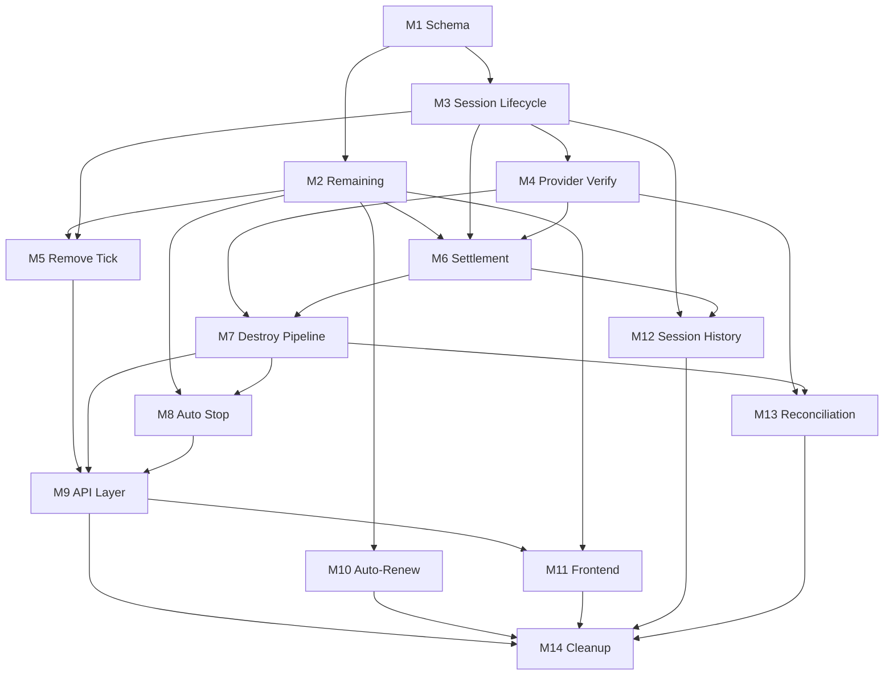

# IMPLEMENTATION_PLAN_SCB

**Kế hoạch triển khai Session-Centric Billing (SCB) — GPUVietnam**

| | |
|---|---|
| **Phiên bản** | 1.1 |
| **Ngày** | 2026-06-28 |
| **Trạng thái** | Implementation Plan |
| **Căn cứ** | [SESSION_CENTRIC_BILLING_ARCHITECTURE.md](./SESSION_CENTRIC_BILLING_ARCHITECTURE.md) · [OPERATIONAL_STATE_MACHINE.md](./OPERATIONAL_STATE_MACHINE.md) · [BILLING_LOGIC_REVIEW.md](./BILLING_LOGIC_REVIEW.md) · [IMPLEMENTATION_REPORT_M1_REVIEW.md](./IMPLEMENTATION_REPORT_M1_REVIEW.md) |

**Phạm vi:**
- Chuyển **toàn bộ** hệ thống sang SCB.
- Hệ thống **chưa Production** — **không** migration, backward compatibility, dual-write, rollback.
- Tài liệu **chỉ** implementation.
- **Không** viết code trong tài liệu này.

**Thứ tự milestone:** theo phụ thuộc kỹ thuật (schema → domain → pipeline → API → UI → ops).

---

## Tổng quan milestone

| # | Milestone | Phụ thuộc | Difficulty | Est. time |
|---|-----------|-----------|------------|-----------|
| M1 | Database Schema SCB | — | Medium | 1–2 ngày |
| M2 | Remaining Time Module | M1 | Medium | 2–3 ngày |
| M3 | Session Lifecycle Domain | M1 | Medium | 2–3 ngày |
| M4 | Provider Verification Module | M3 | Medium | 2 ngày |
| M5 | Loại bỏ Per-Minute Billing | M2, M3 | Low | 1 ngày |
| M6 | Settlement Engine | M2, M3, M4 | High | 3–4 ngày |
| M7 | Unified Destroy Pipeline | M4, M6 | High | 3–4 ngày |
| M8 | Auto Stop Read-Only | M2, M7 | Low | 1 ngày |
| M9 | API Layer Integration | M5–M8 | Medium | 2–3 ngày |
| M10 | Auto-Renew & Entitlement Consumers | M2 | Low | 1–2 ngày |
| M11 | Frontend Dashboard | M2, M9 | Medium | 2–3 ngày |
| M12 | Session History & Admin Billing View | M3, M6 | Medium | 2 ngày |
| M13 | Infrastructure Reconciliation | M4, M7 | Medium | 2–3 ngày |
| M14 | Cleanup, Tests & Documentation Sync | M1–M13 | Medium | 2–3 ngày |

**Tổng ước lượng:** ~24–35 ngày làm việc (1 developer, monolith hiện tại).

---

## M1 — Database Schema SCB

### Objective

Định nghĩa schema DB khớp [OPERATIONAL_STATE_MACHINE.md](./OPERATIONAL_STATE_MACHINE.md) và SCB §2: session lifecycle, settlement fields, provider verify metadata. Loại bỏ vai trò SoT của `duration_seconds` và `billing_started_at` (giữ column nếu cần denormalize, không dùng cho billing math).

### Files sẽ thay đổi

| File | Thay đổi |
|------|----------|
| `supabase/gpu-sessions.sql` | Mở rộng enum `status`, thêm settlement + verify columns |
| `supabase/machines.sql` | Thêm `status = closing` nếu chưa có |
| `supabase/machines-billing.sql` | Deprecate hoặc ghi chú `billing_started_at`; có thể giữ FK |
| `supabase/scb-schema.sql` | **File mới** — ALTER tập trung cho dev apply |

### Database thay đổi

**`gpu_sessions`:**

| Column | Mục đích |
|--------|----------|
| `status` | Mở rộng CHECK: `pending`, `running`, `closing`, `closed`, `interrupted`; giữ `completed` **legacy only** (M1 Review — không tạo row mới; M3 chuyển sang `closed`) |
| `settlement_status` | `not_applicable`, `awaiting_verify`, `pending`, `in_progress`, `settled`, `skipped`, `failed` |
| `settlement_at` | Timestamp settle xong |
| `settlement_breakdown` | JSONB: gift/combo/wallet/bonus/promotion allocation audit (format — xem `gpu-sessions.sql` comment) |
| `destroy_reason` | `user_stop`, `idle_timeout`, `out_of_credit`, … |
| `verified_running_at` | Provider verify RUNNING |
| `verified_destroyed_at` | Provider verify DESTROYED |

**Không có trên `gpu_sessions` (M1 Review):**

| Concern | Quyết định |
|---------|------------|
| **Provider Instance Source of Truth** | `machines.instance_id` — session resolve qua `gpu_sessions.machine_id` |
| **Billable Duration** | Derived: `ended_at − started_at` — **không persist** column |

**`machines`:**

| Column | Mục đích |
|--------|----------|
| `status` | Thêm `closing` vào CHECK |
| `closing_started_at` | Optional — KPI destroy verify time |
| `instance_id` | **Provider Instance SoT** (Machine Domain) |

**`gpu_sessions.duration_seconds`:** Giữ column, đánh dấu **derived/display only** — không dùng billing.

**CHECK constraints (M1 Review):** `closed` ⇒ `settlement_status IS NOT NULL`; không `settled` khi `running`.

**Index:** `(user_id, status)` where running; `(settlement_status)` where failed/pending.

### API thay đổi

Không (schema-only milestone).

### Frontend thay đổi

Không.

### Breaking changes

- Schema additive — **không** breaking runtime hiện tại (M1 Review).
- `completed` giữ trong CHECK cho legacy rows; code mới **không** tạo `completed` (M3).
- Code đọc `status = 'completed'` cập nhật label/query ở M3/M12.
- Seed data `supabase/seed-gpu-sessions.sql` cập nhật ở M3 (optional).

### Estimated difficulty

**Medium** — cần audit toàn repo grep `completed`, `duration_seconds` SoT.

### Estimated implementation time

**1–2 ngày**

### Test cases

| # | Case | Expected |
|---|------|----------|
| T1 | Apply schema trên DB trống | Tables + CHECK pass |
| T2 | Insert session `pending` → `running` | CHECK cho phép |
| T3 | Insert `settlement_status=settled` khi `status=closed` | OK |
| T4 | Reject `status=running` + `settlement_status=settled` | CHECK fail |
| T5 | Reject `status=closed` + `settlement_status IS NULL` | CHECK fail (M1 Review) |
| T6 | `duration_seconds` nullable / derived | Insert without duration OK |

---

## M2 — Remaining Time Module

### Objective

Một module domain duy nhất implement công thức SCB §3:

```
RemainingHours = TotalEntitlement − SettledSessionUsage − CurrentSessionBillableElapsed
```

Read-only. Không ghi DB. Dùng chung cho Dashboard, Auto Stop, Renew, Admin.

### Files sẽ thay đổi

| File | Thay đổi |
|------|----------|
| `src/lib/gpu/remaining-time.js` | **File mới** — `computeRemainingTime()`, `isOutOfCredit()` |
| `src/lib/gpu/billing.js` | Refactor `getBillingStatus()` delegate sang remaining-time; loại bỏ `unbilledHours` / tick math dần |
| `src/lib/gpu/index.js` | Export remaining-time |
| `src/lib/user-plan-inventory.js` | Helper `getTotalEntitlementHours()` nếu tách từ billing |

### Database thay đổi

Không thêm bảng. Đọc: `user_plan_inventory`, `manual_hour_grants`, `users.wallet_balance`, `gpu_sessions` (settled sum), session running.

### API thay đổi

Chưa expose endpoint riêng — consumed nội bộ. Response shape `getBillingStatus` / `dashboard/me` sẽ đổi ở M9.

### Frontend thay đổi

Không (M11).

### Breaking changes

- `getBillingStatus().effectiveHoursRemaining` semantics đổi: từ tick-based → SCB formula.
- Xóa phụ thuộc `unbilledSeconds`, `duration_seconds` trong remaining calc.

### Estimated difficulty

**Medium** — gift→combo→hourly entitlement aggregation + running gate.

### Estimated implementation time

**2–3 ngày**

### Test cases

| # | Case | Expected |
|---|------|----------|
| T1 | No session, 10h entitlement | Remaining = 10 |
| T2 | 2h settled sessions, 10h entitlement | Remaining = 8 |
| T3 | Running session 0.5h elapsed, 10h entitlement, 2h settled | Remaining = 7.5 |
| T4 | Hourly, wallet = 0 | `isOutOfCredit` true |
| T5 | Running session but provider not verified running | CurrentSessionElapsed = 0 |
| T6 | Same inputs → same output (pure function) | Deterministic |
| T7 | Admin vs API cùng gọi module | Identical Remaining |

---

## M3 — Session Lifecycle Domain

### Objective

Implement state machine Session (OPERATIONAL_STATE_MACHINE §4): `pending` → `running` → `closing` → `closed` / `interrupted`. Tách logic tạo/link session khỏi `startBilling()` cũ.

### Files sẽ thay đổi

| File | Thay đổi |
|------|----------|
| `src/lib/gpu/session-lifecycle.js` | **File mới** — create, transition, guards |
| `src/lib/gpu/billing.js` | Refactor `startBilling()` → `openBillableSession()`; `finalizeGpuSession()` → lifecycle close |
| `src/lib/gpu/billing.js` | `repairUserBillingState()` — orphan → `interrupted`, settlement `skipped` |
| `src/lib/gpu/index.js` | Export session-lifecycle |
| `src/lib/gpu-sessions.js` | `mapSessionRow()` — status `closed`, derive duration từ timestamps |

### Database thay đổi

Sử dụng schema M1. Write paths cập nhật `status`, `started_at`, `ended_at`.

### API thay đổi

Chưa — wired ở M9.

### Frontend thay đổi

Không trực tiếp.

### Breaking changes

- `startBilling()` contract đổi tên/behavior — không còn `duration_seconds: 0` tick anchor.
- `gpu_sessions.status = 'completed'` → `'closed'`.
- `buildLiveSessionFromSubscription()` heuristic deprecated — live session từ DB `running` row only.

### Estimated difficulty

**Medium**

### Estimated implementation time

**2–3 ngày**

### Test cases

| # | Case | Expected |
|---|------|----------|
| T1 | openBillableSession on provider RUNNING | `pending`→`running`, `started_at` set |
| T2 | Second open for same user | Reject / idempotent `alreadyStarted` |
| T3 | Provision fail | `interrupted`, no `started_at` |
| T4 | orphan running no machine | repair → `interrupted`, settlement skipped |
| T5 | transition to `closing` | status update, machine `closing` |
| T6 | One running session per user | INV SES-1 |

### Checklist

- [ ] **Loại bỏ việc tạo Session mới với `status='completed'`; chuyển hoàn toàn sang Session Lifecycle của SCB.**
- [ ] Mọi terminal session mới dùng `status='closed'` + `settlement_status` bắt buộc.
- [ ] Legacy rows `completed` giữ nguyên — không migrate data trong M3 trừ khi cần hiển thị.

---

## M4 — Provider Verification Module

### Objective

Gate RUNNING (session start) và DESTROYED (pre-settlement) qua GPU Provider Adapter (Principle 30). Không tin DB alone.

### Files sẽ thay đổi

| File | Thay đổi |
|------|----------|
| `src/lib/gpu/provider-verify.js` | **File mới** — `verifyInstanceRunning()`, `verifyInstanceDestroyed()` |
| `src/lib/gpu/vast-provider.js` hoặc `src/lib/gpu/index.js` | Wrapper gọi live status / 404 |
| `src/lib/machines.js` | `resolveLiveMachineStatus()` — tách verify semantics rõ |
| `src/lib/gpu/index.js` | Export provider-verify |

### Database thay đổi

Ghi `verified_running_at`, `verified_destroyed_at` trên session (M1). Provider instance resolve qua `machines.instance_id` — không denormalize lên session.

### API thay đổi

Không endpoint mới — internal destroy/start pipeline.

### Frontend thay đổi

Không.

### Breaking changes

- Session không vào `running` nếu verify RUNNING fail (stricter than today).
- Destroy không complete nếu verify DESTROYED fail — session có thể rollback `running`.

### Estimated difficulty

**Medium**

### Estimated implementation time

**2 ngày**

### Test cases

| # | Case | Expected |
|---|------|----------|
| T1 | Provider returns running | verify RUNNING pass |
| T2 | Provider 404 | verify DESTROYED pass |
| T3 | Provider running when expect destroyed | verify DESTROYED fail |
| T4 | API timeout | `unknown`, no settlement |
| T5 | Verify RUNNING fail at start | session stays `pending` or fail path |

### Future Reconciliation Interface

**Phạm vi M4:** Chỉ định nghĩa **interface/contract** — **không implement** logic reconciliation. Triển khai đầy đủ thuộc **M13 — Infrastructure Reconciliation**. Không thay đổi dependency milestone hiện tại (M4 vẫn phụ thuộc M3; M13 vẫn phụ thuộc M4, M7).

Trong `src/lib/gpu/provider-verify.js` (hoặc module contract liên quan), khai báo contract cho M13 reuse:

| Function | Contract (M4) | Triển khai (M13) |
|----------|---------------|------------------|
| `verifyProviderState()` | Đọc trạng thái live instance từ Provider Adapter; trả normalized state (`running`, `destroyed`, `unknown`, …). Không ghi DB, không settlement. | M13 gọi khi scan drift |
| `reconcileMachine()` | Signature + input/output types: đối chiếu `machines` row vs provider state; trả drift descriptor — **stub/no-op** tại M4. | M13 — full repair hooks |
| `reconcileSession()` | Signature: đối chiếu `gpu_sessions` vs machine/provider; trả drift descriptor — **stub/no-op** tại M4. | M13 — full repair hooks |
| `reconcileSettlement()` | Signature: phát hiện lệch settlement vs session closed — **stub/no-op** tại M4; **không** trigger settlement. | M13 — alert / operator action only |

**Ràng buộc contract:**
- Reconciliation domain **tách biệt** billing — contract không được gọi settlement từ destroy pipeline (SCB §8, OPERATIONAL_STATE_MACHINE).
- M4 implement **chỉ** `verifyInstanceRunning()` / `verifyInstanceDestroyed()` cho pipeline; bốn hàm trên là **placeholder contract** để M13 không phá module boundary khi triển khai scan.

---

## M5 — Loại bỏ Per-Minute Billing

### Objective

Xóa hoàn toàn `deductPerMinute()` và mọi billing write trong lúc session `running`. Xóa `getUnbilledSeconds`, tick paths.

### Files sẽ thay đổi

| File | Thay đổi |
|------|----------|
| `src/lib/gpu/billing.js` | **Xóa** `deductPerMinute()`, `updateSessionBilledSeconds`, tick helpers |
| `src/lib/gpu/auto-stop.js` | **Xóa** import/call `deductPerMinute` |
| `src/pages/api/machines/status.js` | **Xóa** `deductPerMinute()` call |
| `src/lib/gpu/index.js` | **Xóa** export `deductPerMinute` |

### Database thay đổi

Không ghi `duration_seconds` trong runtime. Column có thể set derived tại finalize only.

### API thay đổi

| Route | Thay đổi |
|-------|----------|
| `GET /api/machines/status` | Không side-effect billing write |

### Frontend thay đổi

Không (behavior thay đổi qua Remaining ở M11).

### Breaking changes

- **Toàn bộ** per-minute billing removed — hard break vs legacy.
- Poll + cron không còn mutate `hours_used` / wallet mid-session.

### Estimated difficulty

**Low** (mostly deletion) — cần đảm M6 thay thế settlement.

### Estimated implementation time

**1 ngày** (sau M2, M3; song song prep M6)

### Test cases

| # | Case | Expected |
|---|------|----------|
| T1 | Status poll 10× while running | `hours_used` unchanged |
| T2 | Cron check-idle while running | `hours_used` unchanged |
| T3 | grep repo `deductPerMinute` | 0 references |
| T4 | Session running 30 min | Remaining giảm read-only only |

---

## M6 — Settlement Engine

### Objective

Implement settlement một lần / session sau Provider Verify DESTROYED (SCB §6): tính billable duration từ `ended_at − started_at` (derived, không persist), cap entitlement, allocate gift→combo→hourly, idempotent by `session_id`.

### Files sẽ thay đổi

| File | Thay đổi |
|------|----------|
| `src/lib/gpu/settlement.js` | **File mới** — `settleSession()`, `skipSessionSettlement()` |
| `src/lib/gpu/billing.js` | **Xóa/thay** `stopBilling()` → delegate `settleSession()`; giữ `applyBillingDeduction` logic moved |
| `src/lib/gpu/billing.js` | `settleMachineBillingWithoutCharge()` → `skipSessionSettlement()` |
| `src/lib/gpu/index.js` | Export settlement |

### Database thay đổi

Write: `settlement_status`, `settlement_at`, `settlement_breakdown`, `hours_used`, `wallet_balance`, `wallet_transactions`, `manual_hour_grants.hours_used`. Billable duration **không** ghi column — derive từ timestamps.

### API thay đổi

Internal only trong destroy pipeline (M7).

### Frontend thay đổi

Không.

### Breaking changes

- `stopBilling()` removed — replaced by `settleSession()`.
- Entitlement commit **only** at settlement — không còn incremental.
- Wallet tx: một record / settled hourly session (not per minute).

### Estimated difficulty

**High** — entitlement allocation, cap, idempotency, partial failure retry.

### Estimated implementation time

**3–4 ngày**

### Test cases

| # | Case | Expected |
|---|------|----------|
| T1 | 3600s session, 10h entitlement | 1h deducted, `settled` |
| T2 | settle twice same session_id | Idempotent — no double charge |
| T3 | verify not destroyed | settle rejected |
| T4 | skipBilling path | `skipped`, no entitlement change |
| T5 | gift + combo priority | gift consumed first |
| T6 | hourly wallet partial | cap at balance |
| T7 | settle fail then retry | `failed` → `settled`, no duplicate wallet tx |
| T8 | billable 0 | `skipped` |

---

## M7 — Unified Destroy Pipeline

### Objective

Reorder destroy flow (SCB §6.2, OPERATIONAL_STATE_MACHINE):

```
Backup → Session/Machine closing → Provider destroy → Verify DESTROYED → ended_at → Settlement → Machine destroyed → subscription offline
```

Thay thế: `stopBilling` trước `destroyInstance`.

### Files sẽ thay đổi

| File | Thay đổi |
|------|----------|
| `src/lib/machines.js` | **Refactor** `destroyUserMachine()` — new order |
| `src/lib/machine-destroy.js` | Pass-through options unchanged; document new flow |
| `src/lib/gpu/billing.js` | `finalizeGpuSession()` after settlement |
| `src/lib/gpu/session-lifecycle.js` | `closeSession()`, rollback `closing`→`running` on verify fail |
| `src/lib/machine-backup.js` | Không đổi logic — vẫn step 1 |

### Database thay đổi

Transaction order: session `closing` → verify → `closed` + settlement → machine `destroyed`.

### API thay đổi

| Route | Thay đổi |
|-------|----------|
| `POST /api/machines/destroy` | Behavior: settlement after verify |
| `POST /api/user/stop-machine` | Same pipeline |
| Admin machine toggle destroy | Same pipeline |

### Frontend thay đổi

Destroy UX có thể lâu hơn (verify wait) — optional loading state (M11).

### Breaking changes

- Destroy response timing thay đổi (verify before billing).
- Response payload: thêm `settlementStatus`, `verifiedDestroyedAt`.
- Local `destroyed` before Vast gone — **fixed** (stricter).

### Estimated difficulty

**High**

### Estimated implementation time

**3–4 ngày**

### Test cases

| # | Case | Expected |
|---|------|----------|
| T1 | User destroy running session | verify → settle → destroyed |
| T2 | Vast destroy fail | session rollback or stay `closing`, no settle |
| T3 | Verify fail, instance still running | no settlement |
| T4 | Double destroy click | idempotent |
| T5 | skipBilling destroy | settled skipped |
| T6 | Backup fail | destroy continues, settlement after verify |
| T7 | auto-stop out_of_credit | same pipeline |
| T8 | Order: no settle before verify | assert call order |

---

## M8 — Auto Stop Read-Only

### Objective

`checkAutoStop()` chỉ đọc Remaining + idle; **không** billing write; trigger unified destroy (M7).

### Files sẽ thay đổi

| File | Thay đổi |
|------|----------|
| `src/lib/gpu/auto-stop.js` | Dùng `computeRemainingTime()` / `isOutOfCredit()`; remove billing writes |
| `src/pages/api/cron/check-idle.js` | Không đổi signature — behavior via auto-stop |
| `src/pages/api/machines/status.js` | `outOfHours` từ Remaining module |

### Database thay đổi

Không.

### API thay đổi

Cron JSON result unchanged structurally; billing side effects removed.

### Frontend thay đổi

`DashboardOverview` out-of-hours destroy trigger uses same Remaining (M11).

### Breaking changes

- Auto-stop có thể destroy **trễ hơn** vs tick (no mid-minute DB deduct) — by design.

### Estimated difficulty

**Low**

### Estimated implementation time

**1 ngày**

### Test cases

| # | Case | Expected |
|---|------|----------|
| T1 | Remaining ≤ 0 | destroy triggered |
| T2 | idle ≥ 60 min | destroy triggered |
| T3 | idle 55 min | warn only |
| T4 | checkAutoStop | no `hours_used` mutation |
| T5 | queue unreachable | no idle stop (existing behavior) |

---

## M9 — API Layer Integration

### Objective

Wire SCB vào tất cả API consumers: status poll, start-machine, dashboard/me, destroy, cancel.

### Files sẽ thay đổi

| File | Thay đổi |
|------|----------|
| `src/pages/api/machines/status.js` | `openBillableSession` thay `startBilling`; Remaining response; remove tick |
| `src/pages/api/user/start-machine.js` | `repairUserBillingState`; session create `pending` |
| `src/pages/api/dashboard/me.js` | Remaining từ module; repair |
| `src/pages/api/machines/destroy.js` | Response fields settlement |
| `src/pages/api/user/cancel-start-machine.js` | session `interrupted` |
| `src/pages/api/user/stop-machine.js` | pipeline M7 |

### Database thay đổi

Không thêm.

### API thay đổi

| Route | Response changes |
|-------|------------------|
| `GET /api/machines/status` | `remainingHours` (SCB), `sessionStatus`, `settlementStatus`; remove tick side effects |
| `GET /api/dashboard/me` | Same Remaining formula |
| `POST /api/machines/destroy` | `settlementStatus`, `billableSeconds` |

### Frontend thay đổi

Prepared for M11 — types/interfaces nếu có.

### Breaking changes

- API clients expecting `effectiveHoursRemaining` tick behavior — values differ.
- `billingStartedAt` vẫn có thể expose = `session.started_at`.

### Estimated difficulty

**Medium**

### Estimated implementation time

**2–3 ngày**

### Test cases

| # | Case | Expected |
|---|------|----------|
| T1 | status poll boot → running | session `running`, no billing write |
| T2 | dashboard/me with active session | Remaining matches formula |
| T3 | destroy API | settlement after verify in response |
| T4 | cancel during provisioning | interrupted, skipped |
| T5 | concurrent status polls | no duplicate session |

---

## M10 — Auto-Renew & Entitlement Consumers

### Objective

Auto-renew, settings preview, admin customer view dùng **cùng** Remaining module — không `hours_total − hours_used` thuần.

### Files sẽ thay đổi

| File | Thay đổi |
|------|----------|
| `src/lib/auto-renew.js` | `evaluateAutoRenew()` → `computeRemainingTime()` |
| `src/pages/api/user/auto-renew/check.js` | Response hoursRemaining SCB |
| `src/pages/api/user/auto-renew.js` | Threshold check SCB |
| `src/pages/api/user/settings.js` | Preview Remaining SCB |
| `src/pages/api/admin/customers.js` | Admin Remaining column (nếu có) |
| `src/components/admin/AdminCustomersPanel.tsx` | Display SCB remaining |

### Database thay đổi

Không.

### API thay đổi

| Route | Change |
|-------|--------|
| `GET /api/user/auto-renew/check` | `hoursRemaining` = SCB |
| `GET /api/user/settings` | renew preview SCB |

### Frontend thay đổi

| File | Change |
|------|--------|
| `src/components/pages/DashboardCaiDatPage.tsx` | Renew badge uses API SCB value |
| `src/hooks/useDashboard.ts` | Auto-renew check |

### Breaking changes

- Auto-renew may trigger **earlier** (includes current session elapsed).

### Estimated difficulty

**Low**

### Estimated implementation time

**1–2 ngày**

### Test cases

| # | Case | Expected |
|---|------|----------|
| T1 | 12h on paper, 3h running elapsed, threshold 10 | withinThreshold true |
| T2 | Admin customer list | same Remaining as user dashboard |
| T3 | No active session | Remaining = entitlement − settled |

---

## M11 — Frontend Dashboard

### Objective

Dashboard hiển thị Remaining và session timer từ **API only** — xóa localStorage SoT, `sessionStartHours` client math.

### Files sẽ thay đổi

| File | Thay đổi |
|------|----------|
| `src/components/dashboard/DashboardOverview.tsx` | **Major** — remove anchor cache, use API `remainingHours`, `sessionStartedAt` |
| `src/components/dashboard/DashboardCurrentSessionCard.tsx` | Timer từ `session.startedAt` API |
| `src/styles/pages/dashboard.styles.ts` | Minor if layout |
| `src/hooks/useDashboard.ts` | Types for new status fields |

### Database thay đổi

Không.

### API thay đổi

Consumed from M9 (no new routes).

### Frontend thay đổi

| Area | Change |
|------|--------|
| Giờ còn lại card | `remainingHours` từ poll — không client subtract |
| Session timer | `startedAt` from status API |
| Out-of-hours auto destroy | `remainingHours <= 0` from API |
| localStorage keys | **Remove** `BILLING_ANCHOR_CACHE_KEY`, session start hours cache |

### Breaking changes

- UI countdown có thể **nhảy** khi poll refresh (no local smoothing) — acceptable pre-prod.
- F5 không còn restore client-only hours.

### Estimated difficulty

**Medium**

### Estimated implementation time

**2–3 ngày**

### Test cases

| # | Case | Expected |
|---|------|----------|
| T1 | Running session 5 min | timer + remaining match API |
| T2 | F5 refresh | same values as API (no drift) |
| T3 | Remaining hits 0 | destroy triggered |
| T4 | offline → running transition | timer starts at API startedAt |
| T5 | no localStorage billing keys after session | grep N/A |

---

## M12 — Session History & Admin Billing View

### Objective

Session history và admin visibility khớp SCB: `closed` status, settlement breakdown, verify timestamps.

### Files sẽ thay đổi

| File | Thay đổi |
|------|----------|
| `src/pages/api/user/sessions.js` | Live session từ DB `running` only; status `closed` |
| `src/lib/gpu-sessions.js` | Duration = timestamps; settlement labels |
| `src/components/pages/DashboardLichSuPage.tsx` | Display settlement status, billable time |
| `src/pages/api/admin/customers.js` | Optional: last session settlement |
| `src/components/admin/AdminCustomersPanel.tsx` | Session/settlement drill-down link |

### Database thay đổi

Read-only.

### API thay đổi

| Route | Change |
|-------|--------|
| `GET /api/user/sessions` | Fields: `settlementStatus`, `billableSeconds`, `verifiedDestroyedAt`; remove synthetic live from subscription |

### Frontend thay đổi

Lịch sử phiên UI — settlement badge, duration from timestamps.

### Breaking changes

- Session list no synthetic `live-${subscription.id}` row.
- `completed` → `closed` label.

### Estimated difficulty

**Medium**

### Estimated implementation time

**2 ngày**

### Test cases

| # | Case | Expected |
|---|------|----------|
| T1 | Closed session in history | duration = ended − started |
| T2 | Running session | appears once from DB |
| T3 | failed settlement | badge visible admin/user |
| T4 | interrupted session | 0 billable, skipped |

---

## M13 — Infrastructure Reconciliation

### Objective

Domain riêng scan drift provider vs DB (SCB §8). **Không** settlement. Operator alerts + repair hooks.

### Files sẽ thay đổi

| File | Thay đổi |
|------|----------|
| `src/lib/infrastructure/reconciliation.js` | **File mới** — scan, drift items |
| `src/pages/api/cron/reconcile-infrastructure.js` | **File mới** — cron entry |
| `src/pages/api/admin/infrastructure/reconcile.js` | **File mới** — manual trigger |
| `src/components/admin/AdminInfrastructurePanel.tsx` | Drift list UI |
| `vercel.json` | Cron schedule reconcile |
| `supabase/infrastructure-reconciliation.sql` | **File mới** — `reconciliation_runs`, `drift_items` |

### Database thay đổi

| Table | Purpose |
|-------|---------|
| `reconciliation_runs` | run id, started_at, counts |
| `drift_items` | type, user_id, machine_id, instance_id, status, resolved_at |

### API thay đổi

| Route | Purpose |
|-------|---------|
| `GET/POST /api/admin/infrastructure/reconcile` | Manual run + list drifts |
| `GET/POST /api/cron/reconcile-infrastructure` | Scheduled scan |

### Frontend thay đổi

Admin infrastructure panel — drift table, KPI Provider Drift Count.

### Breaking changes

Không breaking user-facing — admin-only additive.

### Estimated difficulty

**Medium**

### Estimated implementation time

**2–3 ngày**

### Test cases

| # | Case | Expected |
|---|------|----------|
| T1 | DB running, provider 404 | drift zombie local flagged |
| T2 | DB destroyed, provider running | drift destroyed mismatch |
| T3 | Reconciliation run | **no** settlement triggered |
| T4 | stale closing > 30 min | drift item created |
| T5 | repair orphan | session interrupted, no settle |

---

## M14 — Cleanup, Tests & Documentation Sync

### Objective

Xóa dead code, thống nhất exports, cập nhật docs nội bộ, test coverage tối thiểu cho SCB paths.

### Files sẽ thay đổi

| File | Thay đổi |
|------|----------|
| `src/lib/gpu/billing.js` | Remove dead: `deductPerMinute`, old `stopBilling`, tick constants |
| `src/lib/gpu/index.js` | Clean exports |
| `docs/ARCHITECTURE_PRINCIPLES.md` | §8, §13 align SCB (doc only) |
| `docs/BILLING_LOGIC_REVIEW.md` | Banner: superseded by SCB or rewrite |
| `docs/EXTENSION_POINTS.md` | Billing Strategy section → SCB |
| `docs/TARGET_ARCHITECTURE_DRAFT.md` | Mark per-minute sections obsolete |
| `tests/` hoặc `src/lib/gpu/__tests__/` | **Mới** — unit tests remaining, settlement idempotency |
| `supabase/seed-gpu-sessions.sql` | SCB statuses |

### Database thay đổi

Optional: drop unused indexes on tick paths; document `duration_seconds` deprecated comment.

### API thay đổi

Final audit — OpenAPI/comments if any.

### Frontend thay đổi

Remove dead props `effectiveHoursRemaining` if duplicated.

### Breaking changes

Public export surface `deductPerMinute` removed from `@/lib/gpu`.

### Estimated difficulty

**Medium**

### Estimated implementation time

**2–3 ngày**

### Test cases

| # | Case | Expected |
|---|------|----------|
| T1 | Full E2E: start → run → destroy → settle | entitlement correct |
| T2 | grep `deductPerMinute` | 0 |
| T3 | grep `duration_seconds` billing SoT | 0 in billing math |
| T4 | Unit: remaining + settlement idempotency | pass |
| T5 | `npm run build` | pass |
| T6 | OPERATIONAL_STATE_MACHINE invariants | manual checklist |

---

## Dependency graph



---

## Critical path

Thứ tự **tối thiểu** để có SCB end-to-end chạy được:

```
M1 → M2 → M3 → M4 → M6 → M7 → M5 → M8 → M9 → M11
```

M10, M12, M13, M14 có thể song song một phần sau M9.

---

## Risk register (implementation)

| Risk | Milestone | Mitigation |
|------|-----------|------------|
| Settlement partial DB fail | M6 | `failed` status + retry idempotent |
| Destroy verify slow UX | M7, M11 | Loading state; async feedback |
| Remaining mismatch admin/user | M2, M10 | Single module enforced |
| Orphan sessions accumulate | M3, M13 | repair + reconciliation |
| Vast API flake blocks settle | M4, M7 | Retry verify; stale closing in M13 |

---

## Definition of Done (SCB complete)

Hệ thống coi là **đã chuyển SCB** khi:

- [ ] Không còn `deductPerMinute` / heartbeat billing trong repo
- [ ] Remaining Time — một module, một công thức, mọi consumer
- [ ] Settlement **chỉ** sau Provider Verify DESTROYED
- [ ] Session state machine khớp OPERATIONAL_STATE_MACHINE
- [ ] Destroy pipeline order khớp SCB §6.2
- [ ] Auto Stop read-only billing
- [ ] Infrastructure Reconciliation tách domain, không settle
- [ ] Frontend không dùng localStorage làm billing SoT
- [ ] Test cases M1–M14 critical paths pass
- [ ] `ARCHITECTURE_PRINCIPLES` §8/§13 cập nhật (doc)

---

## Phụ lục — File inventory (billing-critical)

| File | Milestones |
|------|------------|
| `src/lib/gpu/billing.js` | M2–M7, M14 |
| `src/lib/gpu/remaining-time.js` | M2 (new) |
| `src/lib/gpu/session-lifecycle.js` | M3 (new) |
| `src/lib/gpu/provider-verify.js` | M4 (new) |
| `src/lib/gpu/settlement.js` | M6 (new) |
| `src/lib/gpu/auto-stop.js` | M5, M8 |
| `src/lib/machines.js` | M4, M7 |
| `src/lib/auto-renew.js` | M10 |
| `src/pages/api/machines/status.js` | M5, M8, M9 |
| `src/components/dashboard/DashboardOverview.tsx` | M11 |
| `supabase/gpu-sessions.sql` | M1 |

---

*GPUVietnam Implementation Plan — Session-Centric Billing v1.0. Pre-production — no migration.*
