# OPERATIONAL_STATE_MACHINE

**Định nghĩa State Machine vận hành chính thức — GPUVietnam**

| | |
|---|---|
| **Phiên bản** | 1.0 |
| **Ngày** | 2026-06-28 |
| **Trạng thái** | Official Architecture |
| **Liên quan** | [ARCHITECTURE_PRINCIPLES.md](./ARCHITECTURE_PRINCIPLES.md) · [SESSION_CENTRIC_BILLING_ARCHITECTURE.md](./SESSION_CENTRIC_BILLING_ARCHITECTURE.md) · [EXTENSION_POINTS.md](./EXTENSION_POINTS.md) · [TECH_DEBT.md](./TECH_DEBT.md) · [BILLING_SAFETY.md](./BILLING_SAFETY.md) |

**Quy ước:**
- Tài liệu mô tả **trạng thái và transition hợp lệ** — không trạng thái mơ hồ.
- Mọi domain có **một danh sách state đóng** (closed set).
- Transition **bắt buộc** có điều kiện kích hoạt.
- **Không** viết code. **Không** đề xuất implementation.
- Billing theo **Session-Centric Billing (SCB)** — `SESSION_CENTRIC_BILLING_ARCHITECTURE.md`.
- Trạng thái **hiện tại trong code** có thể chưa khớp — tài liệu này là **chuẩn mục tiêu**; phần lệch ghi **Legacy note** khi cần.

---

## Mục lục

1. [Order](#1-order)
2. [Payment](#2-payment)
3. [Subscription](#3-subscription)
4. [Session](#4-session)
5. [Machine](#5-machine)
6. [GPU Provider Instance](#6-gpu-provider-instance)
7. [Settlement](#7-settlement)
8. [Backup](#8-backup)
9. [Notification](#9-notification)
10. [Admin Operation](#10-admin-operation)
11. [Cross-Domain State Relationships](#cross-domain-state-relationships)
12. [Operational Rules](#operational-rules)
13. [Operational KPIs](#operational-kpis)
14. [Overall Operational Lifecycle](#overall-operational-lifecycle)

---

## Quy ước chung

| Ký hiệu | Ý nghĩa |
|---------|---------|
| **Terminal state** | Không có transition ra (trừ admin repair / migration) |
| **Composite state** | State cha + sub-state (ví dụ Session `closed` + `settlement_status`) |
| **Gate** | Điều kiện bắt buộc trước transition (ví dụ Provider Verify) |
| **Legacy** | Hành vi code hiện tại chưa khớp SCB |

**Nguyên tắc SCB áp dụng toàn tài liệu:** Không `deductPerMinute`, không heartbeat billing, Settlement sau Provider Verify Destroy, một công thức Remaining Time.

---

# 1. Order

## Purpose

Order là **điểm khởi đầu** của mọi giao dịch có giá trị (Nguyên tắc 27): mua gói GPU, nạp ví, gia hạn, storage upgrade, gift grant (admin-initiated). Payment xử lý Order; Subscription/Entitlement là **kết quả fulfill** Order.

## Source of Truth

| Concern | SoT |
|---------|-----|
| Trạng thái Order | Order record (`status`) — **mục tiêu kiến trúc** |
| Mã tham chiếu | `order_reference` (format thống nhất — TARGET_ARCHITECTURE) |
| Loại sản phẩm | `order_type` + payload metadata |

**Legacy note:** Hiện tại Order **phân tán** — `subscriptions.pending_payment`, `plan_renew_requests`, `wallet_transactions` pending, `storage_upgrades` (`TECH_DEBT.md` — Incomplete Order Domain). Mỗi entity map vào state Order tương đương.

## State List

| State | Mô tả | Terminal? |
|-------|-------|-----------|
| `draft` | Order tạo, chưa gửi thanh toán | Không |
| `pending_payment` | Chờ user chuyển khoản / xác nhận thanh toán | Không |
| `payment_processing` | Payment đang xử lý (wallet instant hoặc gateway) | Không |
| `paid` | Thanh toán xác nhận; chờ fulfill entitlement | Không |
| `fulfilled` | Entitlement đã grant (subscription active, wallet credited, …) | **Có** |
| `cancelled` | User hoặc hệ thống hủy trước khi paid | **Có** |
| `rejected` | Admin từ chối thanh toán / đơn không hợp lệ | **Có** |
| `expired` | Hết hạn chờ thanh toán | **Có** |

## State Transition Diagram

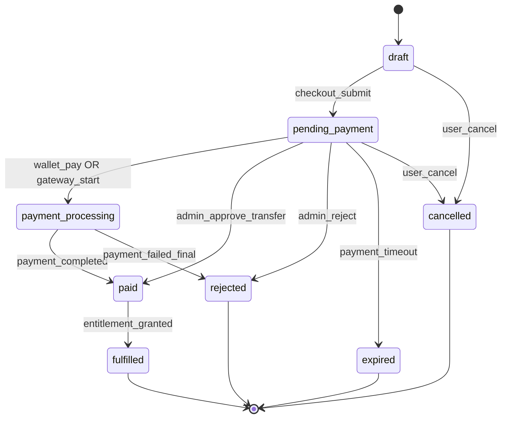

## Allowed Transitions

| From | To | Trigger Event | Điều kiện |
|------|-----|---------------|-----------|
| `draft` | `pending_payment` | User submit checkout | Order valid, pricing resolved |
| `draft` | `cancelled` | User cancel | — |
| `pending_payment` | `payment_processing` | Wallet pay / gateway redirect | Wallet đủ hoặc gateway session created |
| `pending_payment` | `paid` | Admin approve transfer | Payment Domain xác nhận CK |
| `pending_payment` | `rejected` | Admin reject | Lý do audit bắt buộc |
| `pending_payment` | `expired` | Cron timeout | Quá `payment_deadline` |
| `pending_payment` | `cancelled` | User cancel | Trước paid |
| `payment_processing` | `paid` | Payment completed | Idempotent payment callback |
| `payment_processing` | `rejected` | Payment failed (final) | Gateway/bank decline |
| `paid` | `fulfilled` | Entitlement grant success | Subscription/wallet/inventory updated |

## Forbidden Transitions

| From | To | Lý do |
|------|-----|-------|
| `fulfilled` | bất kỳ | Terminal — chỉ admin repair ngoài luồng |
| `rejected` / `cancelled` / `expired` | `paid` | Không resurrect — tạo Order mới |
| `paid` | `pending_payment` | Không rollback payment đã xác nhận qua Order (refund = Payment domain riêng) |
| `fulfilled` | `draft` | Vi phạm Order-first audit |

## Trigger Events

| Event | Nguồn |
|-------|-------|
| `checkout_submit` | User / API checkout |
| `admin_approve_transfer` | Admin Operation |
| `admin_reject` | Admin Operation |
| `wallet_pay` | Payment Domain (instant) |
| `gateway_start` / `payment_completed` | Payment Provider adapter |
| `entitlement_granted` | Subscription / Wallet / Inventory domain |
| `payment_timeout` | Cron job |

## Recovery Rules

| Sự cố | Recovery |
|-------|----------|
| `paid` nhưng fulfill fail | Order giữ `paid`; retry fulfill idempotent |
| Duplicate payment callback | Payment idempotent → Order vẫn `paid` → fulfill once |
| Admin approve nhầm | Admin Operation reverse (ngoài Order SM — tạo adjustment) |

## Failure States

| State | Ý nghĩa failure |
|-------|-----------------|
| `rejected` | Thanh toán / đơn bị từ chối |
| `expired` | User không hoàn tất thanh toán |
| Stuck `paid` | Fulfill chưa chạy — **operational failure**, không phải terminal Order |

## Retry Strategy

| Transition | Retry |
|------------|-------|
| `paid` → `fulfilled` | Idempotent retry until success |
| `payment_processing` → `paid` | Payment callback retry (Nguyên tắc 29) |
| Gateway timeout | Quay `pending_payment` hoặc `payment_processing` với poll |

## Invariants

| ID | Invariant |
|----|-----------|
| ORD-1 | Mỗi entitlement grant phải trace về một Order `fulfilled` (mục tiêu) |
| ORD-2 | Order `fulfilled` chỉ khi Payment `completed` |
| ORD-3 | Order terminal không chuyển ngược |

## Related Principles

27 (Order-first), 28 (Payment Domain), 10 (Subscription independent), 23 (Manual approval), 29 (Idempotency)

---

# 2. Payment

## Purpose

Xử lý **thanh toán** cho Order qua các kênh: manual transfer, wallet nội bộ, gateway (tương lai). Payment **không** trừ GPU usage runtime (Nguyên tắc 9).

## Source of Truth

| Concern | SoT |
|---------|-----|
| Trạng thái thanh toán | Payment record / `wallet_transactions.status` |
| Số tiền | Payment amount + currency |
| Kênh | `payment_method` (transfer / wallet / gateway) |

## State List

| State | Mô tả | Terminal? |
|-------|-------|-----------|
| `initiated` | Payment intent tạo, chưa xác nhận | Không |
| `pending_confirmation` | Chờ CK / admin / gateway | Không |
| `processing` | Đang xử lý (wallet debit, gateway) | Không |
| `completed` | Thanh toán thành công | **Có** |
| `failed` | Thanh toán thất bại kỹ thuật | **Có** |
| `rejected` | Admin/gateway từ chối | **Có** |
| `refunded` | Hoàn tiền (admin adjustment) | **Có** |

## State Transition Diagram

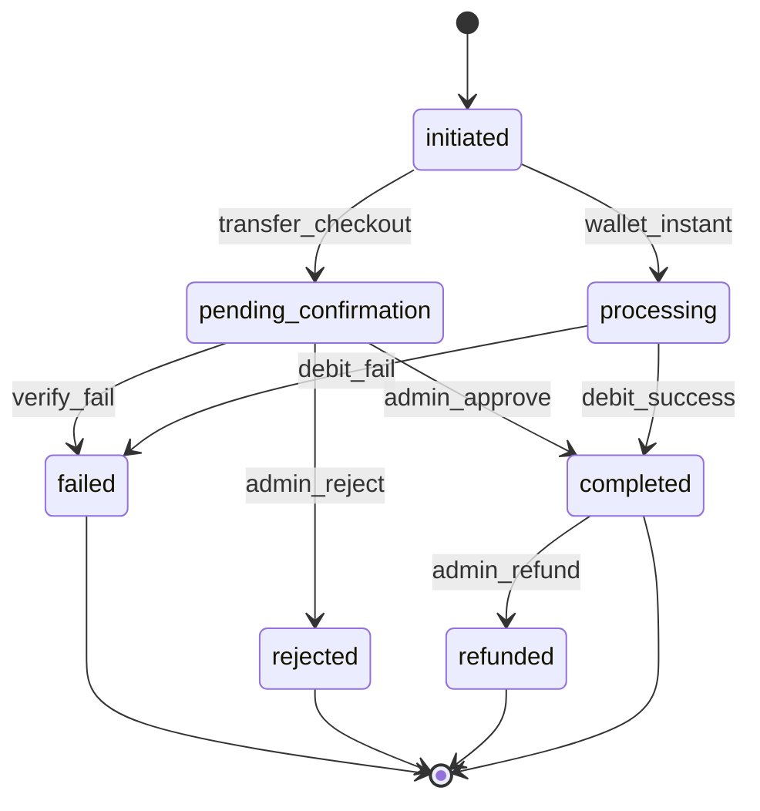

## Allowed Transitions

| From | To | Trigger | Điều kiện |
|------|-----|---------|-----------|
| `initiated` | `pending_confirmation` | Transfer checkout | Order `pending_payment` |
| `initiated` | `processing` | Wallet instant pay | Balance ≥ amount, idempotency key |
| `pending_confirmation` | `completed` | Admin approve | CK khớp reference |
| `pending_confirmation` | `rejected` | Admin reject | Audit reason |
| `processing` | `completed` | Debit success | Atomic wallet update |
| `processing` | `failed` | Debit fail | Insufficient balance / DB error |
| `completed` | `refunded` | Admin refund | Audit trail |

## Forbidden Transitions

| From | To | Lý do |
|------|-----|-------|
| `completed` | `processing` | Không un-pay |
| `rejected` / `failed` | `completed` | Tạo Payment mới |
| `refunded` | `completed` | Terminal |
| Payment `completed` | Settlement trigger | Payment **không** trigger GPU settlement |

## Trigger Events

Admin approve/reject, wallet debit, gateway webhook, user initiate checkout.

## Recovery Rules

| Sự cố | Recovery |
|-------|----------|
| Wallet debited, Order chưa `paid` | Retry Order sync idempotent |
| Duplicate admin approve | Idempotent — Payment stays `completed` once |

## Failure States

`failed`, `rejected` — terminal. Stuck `processing` — retry or manual ops.

## Retry Strategy

| Case | Strategy |
|------|----------|
| Gateway webhook duplicate | Idempotency key (Principle 29) |
| Wallet debit partial fail | Retry `processing` → `completed` or `failed` |
| Admin approve network fail | Client retry — server idempotent |

## Invariants

| ID | Invariant |
|----|-----------|
| PAY-1 | Payment `completed` ⇒ Order có thể → `paid` |
| PAY-2 | Payment không mutate Session / Settlement |
| PAY-3 | `wallet_balance` chỉ tăng qua Payment completed (deposit) — trừ runtime qua Settlement |

## Related Principles

9, 11, 28, 29, 23

---

# 3. Subscription

## Purpose

Quản lý **quyền sử dụng** (plan, giờ, thời hạn) — tách khỏi phiên GPU đang chạy (Nguyên tắc 3). Subscription **không** đồng nghĩa máy online.

## Source of Truth

| Concern | SoT |
|---------|-----|
| Entitlement lifecycle | `subscriptions.status` |
| Runtime UI flag | `subscriptions.server_status` (**orthogonal** — xem bảng dưới) |
| Giờ đã commit | `hours_used` + inventory (cập nhật tại Settlement) |

### `server_status` (runtime — không phải entitlement state)

| Value | Ý nghĩa |
|-------|---------|
| `offline` | Không có phiên GPU active |
| `provisioning` | Đang provision machine |
| `online` | Machine running + session billable |
| `stopping` | **Legacy/UX only** — destroy in progress; **UNKNOWN** nếu backend ghi DB |

## State List — `subscriptions.status`

| State | Mô tả | Terminal? |
|-------|-------|-----------|
| `pending_payment` | Chờ thanh toán gói | Không |
| `active` | Gói có hiệu lực entitlement | Không |
| `expired` | Hết `expires_at` | **Có** |
| `cancelled` | Hủy (admin/user) | **Có** |
| `rejected` | Admin từ chối đơn | **Có** |

**Lưu ý:** `provisioning` **không** phải `status` entitlement — là `server_status` runtime.

## State Transition Diagram

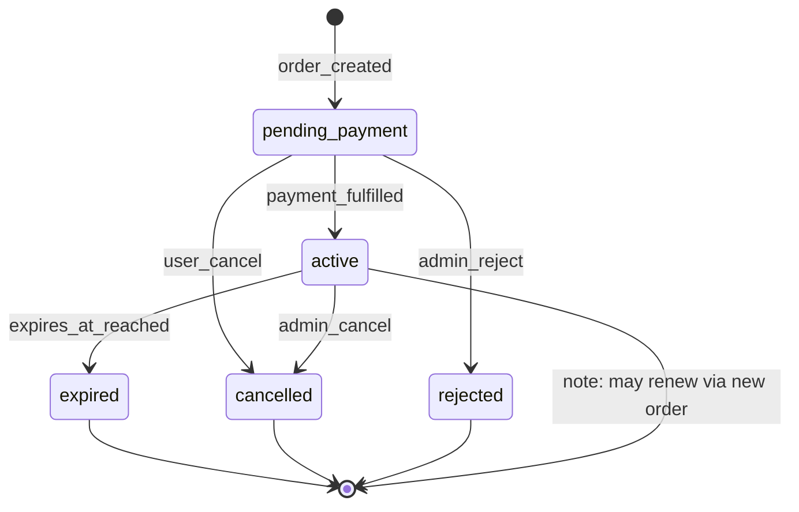

## Allowed Transitions

| From | To | Trigger | Điều kiện |
|------|-----|---------|-----------|
| `pending_payment` | `active` | Order fulfilled | Payment completed |
| `pending_payment` | `rejected` | Admin reject | — |
| `pending_payment` | `cancelled` | User cancel | — |
| `active` | `expired` | Cron / read `expires_at` | `now > expires_at` |
| `active` | `cancelled` | Admin/user cancel | Policy |

## Forbidden Transitions

| From | To | Lý do |
|------|-----|-------|
| `expired` / `cancelled` / `rejected` | `active` | Renew = Order mới hoặc admin grant — không flip trực tiếp |
| `active` | `pending_payment` | Không downgrade |
| Session `running` | Subscription `expired` mid-session | Expire cron **không** kill session trực tiếp — Auto Stop + Remaining |

## Trigger Events

Order fulfill, admin approve/reject, cron expire, renew order.

## Recovery Rules

| Sự cố | Recovery |
|-------|----------|
| `active` nhưng inventory sync lệch | `syncUserPlanInventory` repair |
| `server_status` lệch machine | `syncSubscriptionWithMachineState` |

## Failure States

`rejected`, `cancelled`. Drift: `active` + `server_status=online` nhưng không machine — reconciliation.

## Retry Strategy

Inventory sync: idempotent batch. Expire job: daily retry.

## Invariants

| ID | Invariant |
|----|-----------|
| SUB-1 | Session `running` ⇒ Subscription `active` (Operational Rule) |
| SUB-2 | `server_status=online` ⇒ có Machine `running` hoặc `closing` |
| SUB-3 | `hours_used` commit chỉ qua Settlement |

## Related Principles

3, 10, 14, 27, 29

---

# 4. Session

## Purpose

**Đơn vị nghiệp vụ trung tâm** cho billing GPU (SCB). Ghi nhận thời gian billable (`started_at`, `ended_at`) và kết quả settlement.

## Source of Truth

| Concern | SoT |
|---------|-----|
| Session lifecycle | `gpu_sessions.status` |
| Billable start | `gpu_sessions.started_at` |
| Billable end | `gpu_sessions.ended_at` (sau Provider Verify Destroy) |
| Settlement outcome | `gpu_sessions.settlement_status` |
| Destroy reason | `destroy_reason` metadata |

**Không SoT:** `duration_seconds` (derived/legacy only).

## State List

### Primary: `gpu_sessions.status`

| State | Mô tả | Terminal? |
|-------|-------|-----------|
| `pending` | Session tạo; chưa billable | Không |
| `running` | Billable; `started_at` set | Không |
| `closing` | Destroy pipeline; chưa verify destroy | Không |
| `closed` | Phiên kết thúc (`ended_at` set) | **Có** |
| `interrupted` | Orphan / cancel / repair; không charge | **Có** |

### Composite: `settlement_status` (khi `status = closed`)

| Value | Mô tả |
|-------|-------|
| `pending` | `closed` nhưng settlement chưa chạy — **invalid steady state**; phải resolve |
| `settled` | Entitlement committed |
| `skipped` | Không charge (policy) |
| `failed` | Verify OK nhưng commit lỗi — retry |

## State Transition Diagram

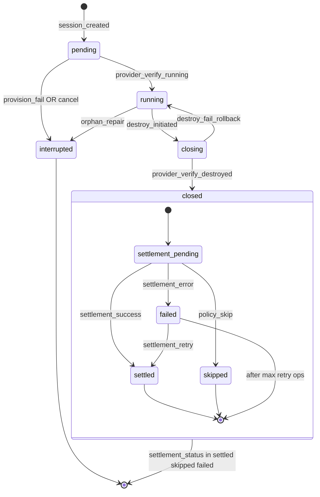

## Allowed Transitions

| From | To | Trigger | Gate |
|------|-----|---------|------|
| `pending` | `running` | Provider Verify RUNNING | Instance ready |
| `pending` | `interrupted` | Provision fail / cancel | — |
| `running` | `closing` | Unified destroy start | Subscription active |
| `running` | `interrupted` | Orphan repair | No provider instance |
| `closing` | `running` | Destroy/verify fail rollback | Instance still running |
| `closing` | `closed` | Provider Verify DESTROYED | **Gate bắt buộc** |
| `closed` + pending | `settled` / `skipped` / `failed` | Settlement | Verify passed |

## Forbidden Transitions

| From | To | Lý do |
|------|-----|-------|
| `running` | `closed` | **Không** skip `closing` + verify |
| `closing` | `closed` | **Không** nếu Provider Verify chưa DESTROYED |
| `interrupted` | `running` | Tạo session mới |
| `closed` + `settled` | `running` | Terminal |
| Settlement khi `running` | — | INV-3 SCB |
| `pending` | `closed` | Không `started_at` → skip interrupted |

## Trigger Events

Start machine, status poll (verify running), destroy (user/auto/admin), provider verify, settlement, repair job.

## Recovery Rules

| Sự cố | Recovery |
|-------|----------|
| Stuck `closing` | Retry destroy + verify; reconciliation stale_closing |
| `closed` + `failed` settlement | Retry settlement idempotent |
| Orphan `running` no machine | → `interrupted`, settlement `skipped` |

## Failure States

| State | Failure |
|-------|---------|
| `interrupted` | Cancelled / orphan — by design no charge |
| `closed` + `failed` | Settlement failure — ops alert |
| Stuck `closing` | Destroy verify pending — KPI |

## Retry Strategy

| Case | Strategy |
|------|----------|
| Destroy + verify | Exponential backoff; max attempts → operator |
| Settlement | Idempotent by `session_id`; unlimited ops retry with alert |
| Verify running | Retry provision poll |

## Invariants

| ID | Invariant |
|----|-----------|
| SES-1 | Một user tối đa một session `running` (Principle 5) |
| SES-2 | `running` ⇒ `started_at` NOT NULL |
| SES-3 | `closed` ⇒ `ended_at` NOT NULL |
| SES-4 | Không billing write khi `running` |
| SES-5 | Settlement chỉ sau Provider Verify DESTROYED |
| SES-6 | Một session tối đa một `settled` |

## Related Principles

3, 4, 5, 8 (SCB), 13 (SCB order), 29, 20

---

# 5. Machine

## Purpose

Orchestration **ephemeral GPU** từ provision đến destroy (Nguyên tắc 4, 7). Machine **không** phải tài sản lâu dài.

## Source of Truth

| Concern | SoT |
|---------|-----|
| Lifecycle | `machines.status` |
| Provider link | `machines.instance_id` |
| Session link | `machines.gpu_session_id` |
| Idle policy | `idle_started_at`, `idle_warning_sent` |

## State List

| State | Mô tả | Terminal? |
|-------|-------|-----------|
| `creating` | Record inserted; Vast provisioning | Không |
| `starting` | Instance booting | Không |
| `running` | Instance live; session billable | Không |
| `closing` | Destroy pipeline active | Không |
| `destroyed` | Local lifecycle complete | **Có** |
| `error` | Provision/runtime error | **Có** |

## State Transition Diagram

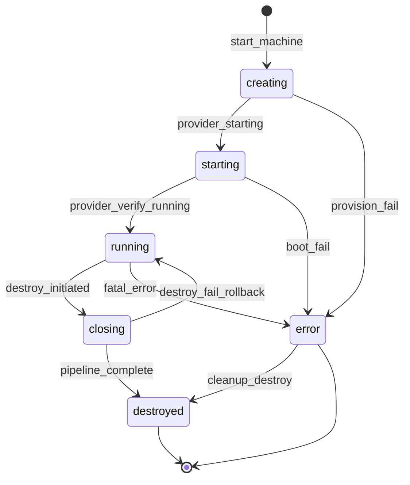

## Allowed Transitions

| From | To | Trigger | Điều kiện |
|------|-----|---------|-----------|
| `creating` | `starting` | Provider status | instance_id assigned |
| `creating` | `error` | Provision fail | — |
| `starting` | `running` | Provider Verify RUNNING | Session → running |
| `running` | `closing` | Destroy initiated | Unified pipeline |
| `closing` | `destroyed` | Pipeline complete | Verify + settlement path done |
| `closing` | `running` | Destroy/verify fail | Rollback |
| `error` | `destroyed` | Cleanup | skipBilling paths |

## Forbidden Transitions

| From | To | Lý do |
|------|-----|-------|
| `destroyed` | `running` | Tạo machine mới |
| `running` | `destroyed` | **Không** skip `closing` |
| `destroyed` | `closing` | Terminal |
| Machine `running` | Session `closed` | Cross-domain forbidden |
| Two `running` machines / user | — | Principle 5 |

## Trigger Events

`start-machine`, status poll, destroy (user/auto/admin), reconciliation repair.

## Recovery Rules

| Sự cố | Recovery |
|-------|----------|
| Stale `creating` > 15 min | Destroy + retry provision |
| `running` DB, provider 404 | Reconcile → destroy local |
| Stuck `closing` | Retry destroy pipeline |

## Failure States

`error`, stuck `closing`. Legacy: local `destroyed` but provider running — drift.

## Retry Strategy

Destroy pipeline idempotent. Provision stale → destroy + user retry start.

## Invariants

| ID | Invariant |
|----|-----------|
| MAC-1 | Session `running` ⇒ Machine `running` OR `closing` |
| MAC-2 | Machine `destroyed` ⇒ Session `closed` OR `interrupted` |
| MAC-3 | Một machine active (`creating`/`starting`/`running`/`closing`) per user |
| MAC-4 | Machine `running` ⇒ linked Session `running` |

## Related Principles

4, 5, 7, 13, 14, 29, 30

---

# 6. GPU Provider Instance

## Purpose

Trạng thái **thực tế** của instance trên GPU Provider (Vast, tương lai khác) — **chỉ tin sau Verify** (SCB §7). Adapter layer (Principle 30).

## Source of Truth

| Concern | SoT |
|---------|-----|
| Instance existence & status | **Provider API live query** |
| Cached reference | `machines.instance_id` — **không** thay live verify |

## State List

| State | Mô tả |
|-------|-------|
| `not_requested` | Chưa có instance |
| `provisioning` | Rent/create in progress |
| `running` | Instance live (provider confirmed) |
| `destroy_requested` | Destroy API sent |
| `destroyed` | Provider confirms terminated / 404 |
| `unknown` | API error — **không** suy luận |
| `drift` | Reconciliation flagged mismatch |

## State Transition Diagram

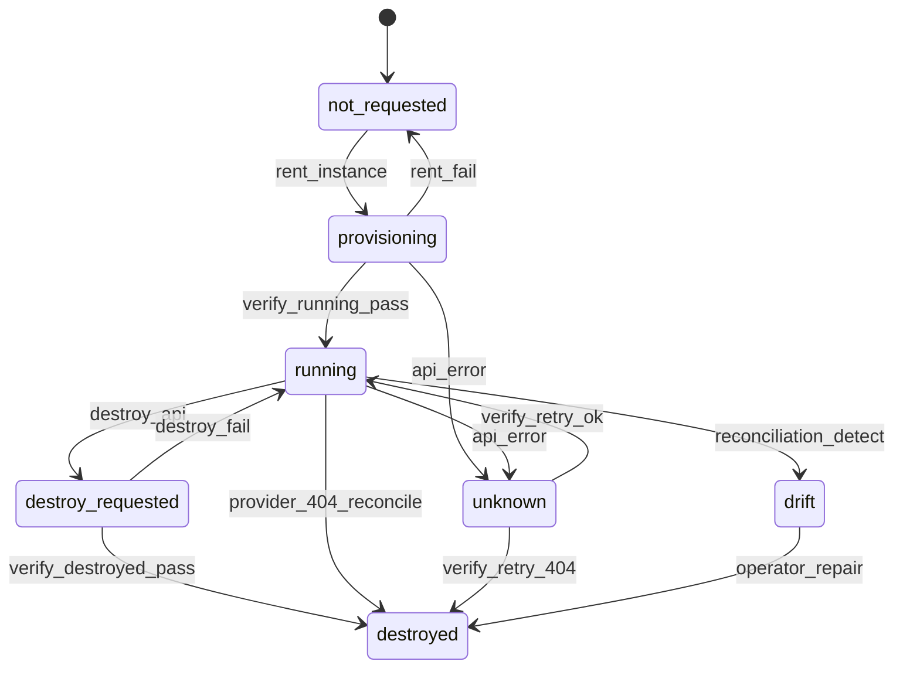

## Allowed Transitions

Live verify drives transitions — DB **follows** verified state, không ngược.

## Forbidden Transitions

| Transition | Lý do |
|------------|-------|
| Assume `destroyed` without verify | Operational Rule |
| Settlement on `destroy_requested` only | Gate DESTROYED required |
| Trust DB `destroyed` without verify | Drift risk |

## Trigger Events

Rent, poll status, destroy API, verify calls, reconciliation scan.

## Recovery Rules

| Sự cố | Recovery |
|-------|----------|
| `unknown` | Retry verify with backoff |
| `drift` | Infrastructure Reconciliation — **không** auto-settlement |
| Provider running, DB destroyed | Alert operator; repair provider |

## Failure States

`unknown`, `drift` — operational. Destroy fail → instance stays `running`.

## Retry Strategy

Verify: retry N times → operator. Reconciliation: cron + manual.

## Invariants

| ID | Invariant |
|----|-----------|
| PRV-1 | Session `running` ⇒ last Verify RUNNING passed |
| PRV-2 | Settlement ⇒ Verify DESTROYED passed |
| PRV-3 | Không tin DB alone cho provider existence |

## Related Principles

6, 7, 30, 32, 29

---

# 7. Settlement

## Purpose

**Một lần** commit entitlement cho session billable — gift → combo → hourly/wallet. Chạy **sau** Provider Verify Destroy (SCB §6).

## Source of Truth

| Concern | SoT |
|---------|-----|
| Settlement outcome | `gpu_sessions.settlement_status` |
| Billable duration | `ended_at − started_at` |
| Breakdown | Session settlement fields / wallet_transaction link |

## State List

| State | Mô tả | Terminal? |
|-------|-------|-----------|
| `not_applicable` | Session `interrupted` / chưa billable | **Có** |
| `awaiting_verify` | Session `closing`; chưa verify destroy | Không |
| `pending` | Verify OK; commit chưa chạy | Không |
| `in_progress` | Commit đang thực hiện | Không |
| `settled` | Success | **Có** |
| `skipped` | Policy waive / zero billable | **Có** |
| `failed` | Commit error | Không → retry |

## State Transition Diagram

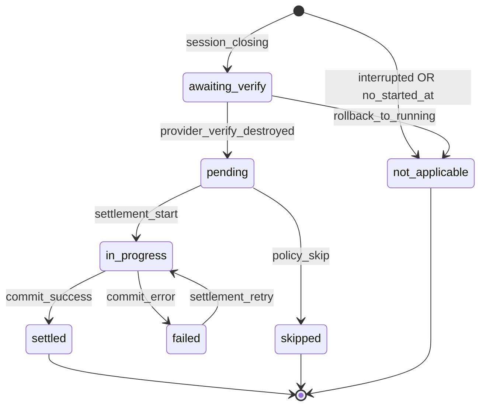

## Allowed Transitions

| From | To | Trigger | Gate |
|------|-----|---------|------|
| `awaiting_verify` | `pending` | Verify DESTROYED | **Bắt buộc** |
| `pending` | `in_progress` | Settlement start | Session `closed`, ended_at set |
| `in_progress` | `settled` | Commit OK | Idempotent session_id |
| `in_progress` | `failed` | Partial DB fail | — |
| `failed` | `in_progress` | Retry | Idempotent |
| `pending` | `skipped` | skipBilling / zero seconds | Audit reason |

## Forbidden Transitions

| From | To | Lý do |
|------|-----|-------|
| `awaiting_verify` | `settled` | **Không** skip verify |
| `settled` | `pending` | Double charge |
| Reconciliation | `settled` | **Cấm** |
| Session `running` | any commit state | No billing write |

## Trigger Events

Provider verify destroyed, unified destroy pipeline, admin retry settlement.

## Recovery Rules

| Sự cố | Recovery |
|-------|----------|
| `failed` after verify | Retry settlement only — **không** re-destroy |
| Partial wallet commit | Ops reconcile; retry idempotent |
| `settled` duplicate call | No-op idempotent |

## Failure States

`failed` — requires operator if retry exhausted.

## Retry Strategy

**Idempotent** by `session_id`. Infrastructure may retry many times; Settlement must be safe on duplicate.

## Invariants

| ID | Invariant |
|----|-----------|
| SET-1 | `settled` ⇒ Provider Verify DESTROYED passed |
| SET-2 | At most one `settled` per session |
| SET-3 | `settled` ⇒ Session `closed` |
| SET-4 | Không `deductPerMinute` / heartbeat |

## Related Principles

8 (SCB), 9, 29, 13 (SCB), 24

---

# 8. Backup

## Purpose

Sao lưu dữ liệu user trên instance **trước destroy** — độc lập billing (Principle 12). Failure **không** block destroy (policy hiện tại).

## Source of Truth

| Concern | SoT |
|---------|-----|
| Backup run | `backup_logs.status` |
| Archives | R2 object keys in log metadata |

## State List

| State | Mô tả | Terminal? |
|-------|-------|-----------|
| `not_started` | Chưa chạy backup cho destroy | Không |
| `in_progress` | SSH/tar/upload đang chạy | Không |
| `completed` | Upload OK | **Có** |
| `failed` | Backup lỗi | **Có** |
| `skipped` | Policy skip (not running, no reason) | **Có** |

## State Transition Diagram

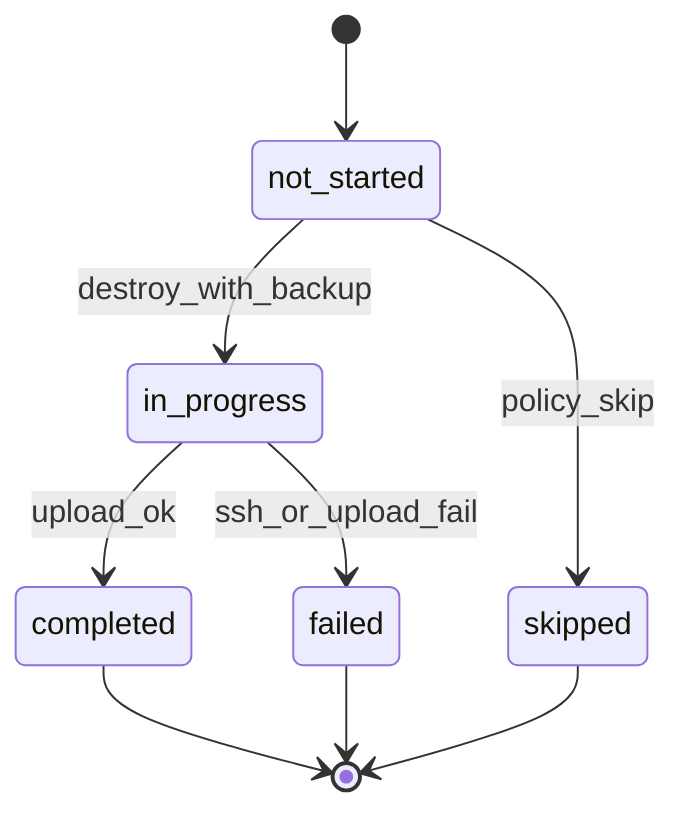

## Allowed Transitions

| From | To | Trigger |
|------|-----|---------|
| `not_started` | `in_progress` | Destroy pipeline step 1 |
| `in_progress` | `completed` | R2 upload success |
| `in_progress` | `failed` | Error / timeout |
| `not_started` | `skipped` | Machine not running / skipBackup |

## Forbidden Transitions

| Transition | Lý do |
|------------|-------|
| Backup `failed` → block Provider destroy | Policy: destroy continues |
| Backup state → Settlement | Domains separate |
| `completed` → `in_progress` | No re-backup same destroy without new run |

## Trigger Events

Unified destroy, admin destroy, auto-stop destroy.

## Recovery Rules

| Sự cố | Recovery |
|-------|----------|
| `failed` | Notify user; destroy continues; optional manual backup |
| Timeout | Retry once (TARGET_ARCHITECTURE) then `failed` |

## Failure States

`failed` — user data may be lost; notify (Principle 22).

## Retry Strategy

One retry in destroy pipeline; no infinite loop.

## Invariants

| ID | Invariant |
|----|-----------|
| BAK-1 | Backup **không** ghi Settlement |
| BAK-2 | Backup failure **không** block Verify Destroy (current policy) |
| BAK-3 | Backup **không** mutate Remaining Time |

## Related Principles

12, 13, 22, 30, 31

---

# 9. Notification

## Purpose

Truyền đạt sự kiện cross-cutting (Principle 21) — **không** phải lõi nghiệp vụ. Core **không** phụ thuộc delivery success.

## Source of Truth

| Concern | SoT |
|---------|-----|
| In-app | `notifications` row + `read_at` |
| External (future) | `notification_outbox.status` |

## State List — In-app

| State | Mô tả | Terminal? |
|-------|-------|-----------|
| `pending` | Created, chưa hiển thị/deliver | Không |
| `delivered` | Visible in-app | Không |
| `read` | User opened | **Có** |
| `failed` | Create failed (rare) | **Có** |

## State List — Outbox (future)

| State | Mô tả |
|-------|-------|
| `queued` | Chờ worker |
| `sent` | Channel OK |
| `failed` | Send fail |
| `dead` | Max retry |

## State Transition Diagram

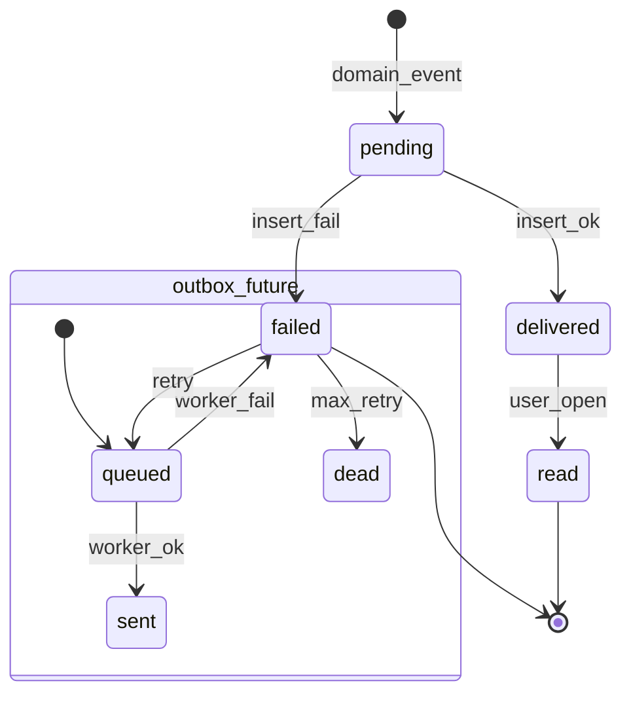

## Allowed Transitions

Event-driven one-way; read only from `delivered`.

## Forbidden Transitions

| Transition | Lý do |
|------------|-------|
| Notification fail → block Settlement | Principle 21 |
| Notification fail → block Destroy | Principle 21 |
| `read` → `pending` | — |

## Trigger Events

Payment success, idle warn, auto-stop, backup fail, renew reminder, admin grant.

## Recovery Rules

Best-effort insert; failed create logged — **không** retry business flow.

## Failure States

`failed`, outbox `dead` — ops visibility only.

## Retry Strategy

Outbox: worker retry with backoff. In-app: no retry required.

## Invariants

| ID | Invariant |
|----|-----------|
| NTF-1 | Core domain success **không** phụ thuộc notification |
| NTF-2 | Notification **không** mutate Session/Settlement |

## Related Principles

21, 14, 24, 30

---

# 10. Admin Operation

## Purpose

Thao tác operator: duyệt thanh toán, grant giờ, reject đơn, machine control, pricing edit — first-class manual path (Principle 23).

## Source of Truth

| Concern | SoT |
|---------|-----|
| Pending request | Entity-specific + admin queue aggregate |
| Admin action audit | `hour_grant_logs`, approve/reject records |

## State List — Generic Admin Request

| State | Mô tả | Terminal? |
|-------|-------|-----------|
| `pending` | Chờ operator | Không |
| `approved` | Đã duyệt | **Có** |
| `rejected` | Từ chối | **Có** |
| `cancelled` | User hủy trước duyệt | **Có** |
| `expired` | Quá hạn | **Có** |

## State List — Hour Grant (extends)

| State | Mô tả |
|-------|-------|
| `active` | Grant còn hiệu lực (post-approve) |
| `revoked` | Admin revoke |
| `depleted` | `hours_used` = granted |

## State Transition Diagram

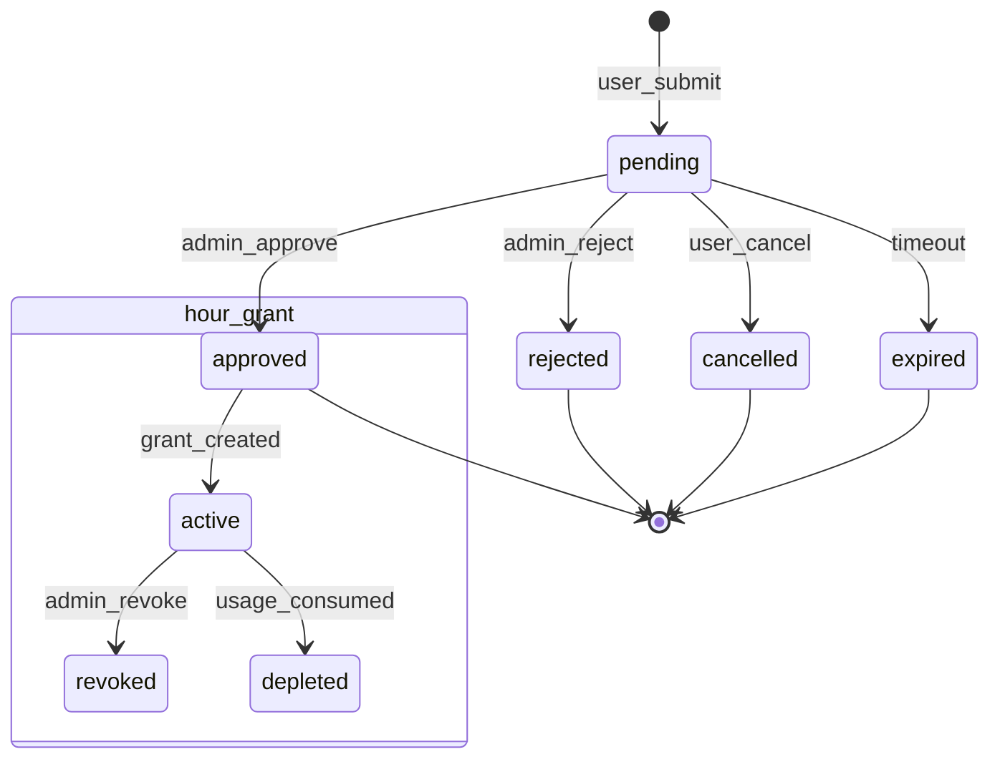

## Allowed Transitions

Admin approve → triggers Payment/Order/Subscription transitions. Reject → terminal.

## Forbidden Transitions

| Transition | Lý do |
|------------|-------|
| `approved` → `pending` | Audit integrity |
| Admin approve → direct Settlement | Phải qua destroy pipeline |
| Admin approve without audit reason (grant) | Policy — hour_grant_logs |

## Trigger Events

Admin UI action, API with admin auth.

## Recovery Rules

Duplicate approve → idempotent downstream.

## Failure States

Stuck `pending` — operator backlog KPI.

## Retry Strategy

Operator manual retry. No auto-approve (early stage).

## Invariants

| ID | Invariant |
|----|-----------|
| ADM-1 | Admin approve CK ⇒ Payment `completed` ⇒ Order `paid` |
| ADM-2 | Admin grant ⇒ Entitlement tăng; **không** auto-settle session |
| ADM-3 | Mọi approve/reject grant có audit log |

## Related Principles

15, 23, 24, 27, 29

---

# Cross-Domain State Relationships

Bảng **bất biến vận hành** — nếu vi phạm ⇒ drift hoặc bug kiến trúc.

## Session ↔ Machine ↔ Provider

| Condition | Required State |
|-----------|----------------|
| Session `running` | Machine `running` |
| Session `running` | Provider Verify RUNNING passed (cached) |
| Machine `running` | Session `running` (linked) |
| Session `closing` | Machine `closing` |
| Machine `destroyed` | Provider Verify DESTROYED passed |
| Machine `destroyed` | Session `closed` OR `interrupted` |
| Session `closed` + `settled` | Settlement `settled` |
| Provider `running` (verified) | **Không** Session `closed` + `settled` |

## Subscription ↔ Session

| Condition | Required State |
|-----------|----------------|
| Session `running` | Subscription `active` |
| Subscription `pending_payment` | **Không** Session `running` |
| Subscription `expired` | **Không** Session `running` (sau reconcile) |
| `server_status=online` | Session `running` OR Machine in pipeline |

## Order ↔ Payment ↔ Subscription

| Condition | Required State |
|-----------|----------------|
| Subscription `active` (new purchase) | Order `fulfilled` |
| Order `fulfilled` | Payment `completed` |
| Payment `completed` | Order ≥ `paid` |

## Settlement ↔ Provider ↔ Session

| Condition | Required State |
|-----------|----------------|
| Settlement `settled` | Session `closed` |
| Settlement `settled` | Provider Verify DESTROYED passed |
| Settlement `settled` | Session `settlement_status=settled` |
| Provider chưa DESTROYED | Settlement ≤ `awaiting_verify` |

## Backup ↔ Destroy

| Condition | Required State |
|-----------|----------------|
| Backup `in_progress` | Machine `closing` OR `running` |
| Backup `completed`/`failed`/`skipped` | Destroy pipeline may continue |
| Backup state | **Không** ảnh hưởng Settlement gate |

## Infrastructure Reconciliation (cross-cutting)

| Drift Type | Session | Machine | Provider | Settlement |
|------------|---------|---------|----------|------------|
| Zombie local | repair→`interrupted` | `error`/`destroyed` | `destroyed`/none | `skipped` |
| Orphan provider | — | — | `drift` | **Không auto** |
| Stale closing | `closing` | `closing` | `destroy_requested` | `awaiting_verify` |
| Destroyed mismatch | varies | `destroyed`? | `running` | **Không** until repair |

## Auto Stop (policy cross-reference)

Auto Stop **không có state machine riêng** — là trigger trên Machine/Session:

| Auto Stop Signal | Action |
|------------------|--------|
| Remaining ≤ 0 | → Destroy pipeline → Session `closing` |
| Idle ≥ threshold | → Destroy pipeline |
| Read-only | **Không** Settlement / Payment write |

---

# Operational Rules

Các quy tắc **bắt buộc** — Backend, Frontend, Admin phải tuân thủ.

| # | Rule |
|---|------|
| **OP-1** | **Không Settlement** nếu Provider chưa **Verify Destroy** (`destroyed` / 404 equivalent). |
| **OP-2** | **Không Session `running`** nếu Subscription **không `active`**. |
| **OP-3** | **Không Machine `running`** khi Session **`closed`**. |
| **OP-4** | **Một Session chỉ Settlement đúng một lần** (`settlement_status=settled` at most once). |
| **OP-5** | **Một Machine chỉ gắn một Active Session** (`running`/`closing`). |
| **OP-6** | **Không bao giờ tin trạng thái Provider** nếu chưa **Verify** (live API). |
| **OP-7** | **Infrastructure Reconciliation** có thể retry nhiều lần; **Settlement phải Idempotent**. |
| **OP-8** | **Remaining Time** — một công thức duy nhất (SCB §3) cho Dashboard, Auto Stop, Renew, Admin. |
| **OP-9** | **Không billing write** khi Session `running` (no tick, no heartbeat). |
| **OP-10** | **Reconciliation không gọi Settlement** trực tiếp. |
| **OP-11** | **Notification failure không rollback** Destroy, Settlement, Payment. |
| **OP-12** | **Backup failure không block** Provider Destroy (current product policy). |
| **OP-13** | **Frontend/localStorage không phải SoT** cho Remaining hoặc session time. |
| **OP-14** | Mọi destroy (user, idle, out_of_credit, admin, error cleanup) → **Unified Destroy Pipeline**. |
| **OP-15** | **Payment/Entitlement grant không phụ thuộc** session settlement timing. |

---

# Operational KPIs

Chỉ số vận hành cho **một operator** (Principle 24). Định nghĩa — không mô tả cách thu thập.

| KPI | Định nghĩa | Ngưỡng cảnh báo (gợi ý) |
|-----|------------|-------------------------|
| **Active Sessions** | Count Session `status=running` | > peak capacity plan |
| **Pending Settlements** | Count Session `closed` AND `settlement_status` IN (`pending`, `failed`) | > 0 sustained 1h |
| **Destroy Verification Pending** | Count Session OR Machine `closing` AND Provider NOT `destroyed` | > 5 OR any > 30 min |
| **Provider Drift Count** | Count reconciliation drift items open | > 0 |
| **Failed Settlement Count** | Count `settlement_status=failed` (rolling 24h) | ≥ 1 |
| **Average Destroy Verification Time** | Avg(`verified_destroyed_at` − `closing_started_at`) | > 5 min |
| **Retry Queue Size** | Count jobs: destroy retry + settlement retry + stale closing | > 10 |
| **Pending Admin Operations** | Count admin requests `pending` | > 20 (TECH_DEBT trigger) |
| **Orphan Sessions** | Count Session `running` without valid Machine/Provider | > 0 |
| **Remaining Formula Divergence** | Count users where admin vs API Remaining differ | **Must be 0** |

### KPI relationships

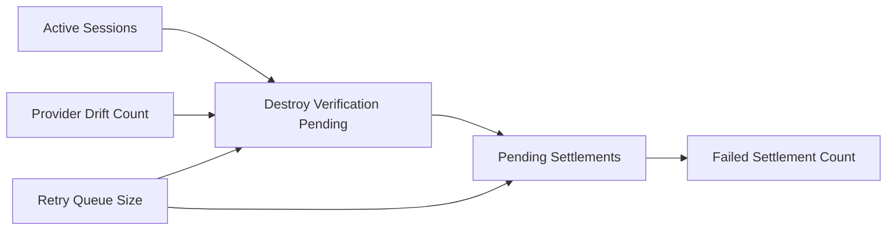

---

# Overall Operational Lifecycle

Sơ đồ tổng thể từ mua gói đến audit — **happy path** theo SCB.

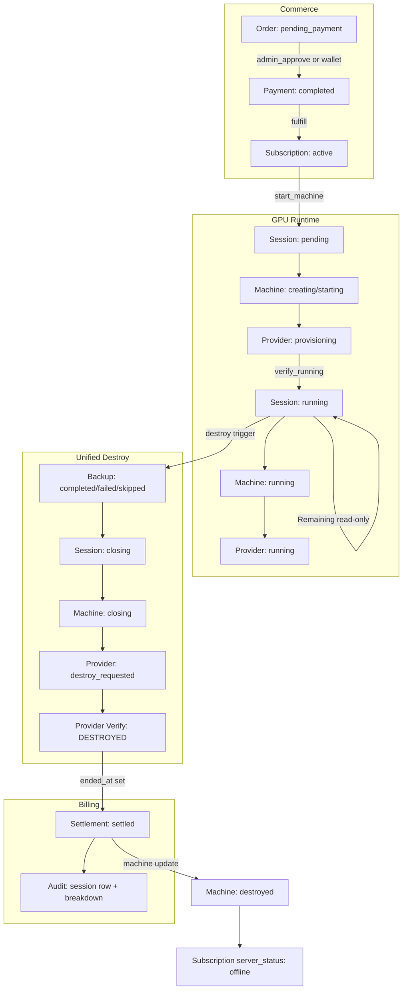

## Lifecycle stages (text)

| Stage | Domains | Billing write? |
|-------|---------|----------------|
| **1. Order** | Order `pending_payment` | No |
| **2. Payment** | Payment `completed` | No |
| **3. Subscription** | Subscription `active` | No |
| **4. Session** | Session `pending` → `running` | No |
| **5. Machine** | Machine `creating` → `running` | No |
| **6. Provider** | Verify RUNNING | No |
| **7. Active use** | Remaining computed read-only | No |
| **8. Destroy trigger** | Auto Stop / user / admin | No |
| **9. Backup** | Backup domain | No |
| **10. Destroy Verification** | Provider Verify DESTROYED | No |
| **11. Settlement** | Settlement `settled` | **Yes — only here** |
| **12. Audit** | Session record + admin visibility | Read |

## Legacy divergence note

Code hiện tại (`BILLING_LOGIC_REVIEW.md`) có thể:

- Gọi `stopBilling` **trước** provider destroy — **vi phạm OP-1** so với SCB.
- Dùng `deductPerMinute` — **vi phạm OP-9**.
- Ghi `server_status=stopping` chỉ ở frontend — **drift risk**.

Tài liệu này là **chuẩn mục tiêu** sau migration SCB (`SESSION_CENTRIC_BILLING_ARCHITECTURE.md` §12).

---

## Phụ lục A — State index (quick reference)

| Domain | States |
|--------|--------|
| **Order** | draft, pending_payment, payment_processing, paid, fulfilled, cancelled, rejected, expired |
| **Payment** | initiated, pending_confirmation, processing, completed, failed, rejected, refunded |
| **Subscription** | pending_payment, active, expired, cancelled, rejected |
| **Session** | pending, running, closing, closed, interrupted + settlement_status |
| **Machine** | creating, starting, running, closing, destroyed, error |
| **Provider Instance** | not_requested, provisioning, running, destroy_requested, destroyed, unknown, drift |
| **Settlement** | not_applicable, awaiting_verify, pending, in_progress, settled, skipped, failed |
| **Backup** | not_started, in_progress, completed, failed, skipped |
| **Notification** | pending, delivered, read, failed (+ outbox future) |
| **Admin Operation** | pending, approved, rejected, cancelled, expired |

---

## Phụ lục B — Tài liệu tham chiếu

| Tài liệu | Vai trò |
|----------|---------|
| `SESSION_CENTRIC_BILLING_ARCHITECTURE.md` | Billing states, Settlement gate, Remaining |
| `ARCHITECTURE_PRINCIPLES.md` | Nguyên tắc 1–32 |
| `BILLING_SAFETY.md` | Legacy race / idempotency baseline |
| `TECH_DEBT.md` | Order fragmentation, monitoring gaps |
| `EXTENSION_POINTS.md` | Provider/Payment adapters |
| `TARGET_ARCHITECTURE_DRAFT.md` | Legacy per-minute note — superseded by SCB for billing |

---

*GPUVietnam Operational State Machine v1.0 — Official Architecture. Không viết code. Không đề xuất implementation.*
