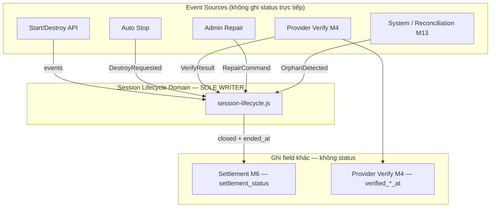
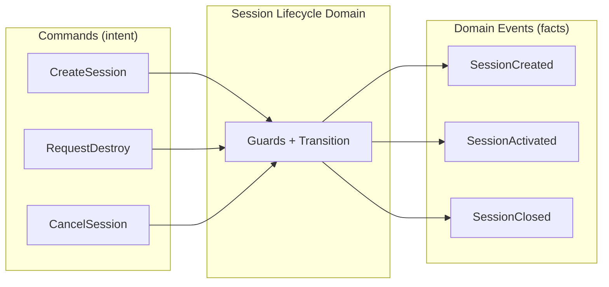
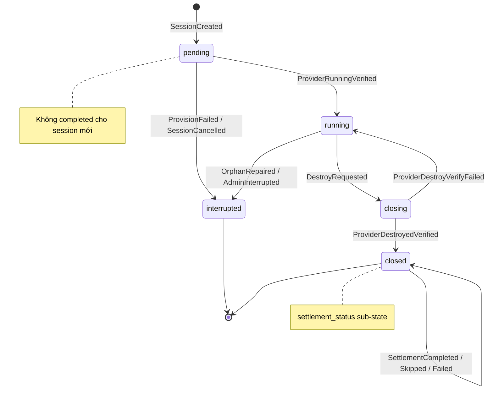

# SESSION_DOMAIN_DESIGN

**Session Domain Design — M3A (Design Only)**

| | |
|---|---|
| **Phiên bản** | 1.1 |
| **Ngày** | 2026-07-03 |
| **Trạng thái** | Domain Design — **không** implementation |
| **Milestone** | M3A (trước M3B implementation) |
| **Architecture** | 2.0 — Session-Centric Billing (SCB) |

**Liên quan:** [SESSION_CENTRIC_BILLING_ARCHITECTURE.md](./SESSION_CENTRIC_BILLING_ARCHITECTURE.md) · [OPERATIONAL_STATE_MACHINE.md](./OPERATIONAL_STATE_MACHINE.md) §4 · [IMPLEMENTATION_PLAN_SCB.md](./IMPLEMENTATION_PLAN_SCB.md) M3 · [CODING_RULES.md](./CODING_RULES.md) · [ARCHITECTURE_DECISIONS.md](./ARCHITECTURE_DECISIONS.md)

**Phạm vi M3A:**
- Thiết kế Session Domain hoàn chỉnh.
- **Không** sửa code, API, billing, frontend, destroy pipeline implementation.
- **Không** M4 trở đi.
- **v1.1:** Phân loại Commands / Domain Events; cột Guard; Illegal Transition Policy — **không** đổi state machine.

---

## 1. Executive Summary

**Session** (`gpu_sessions`) là **đơn vị nghiệp vụ trung tâm** của billing GPU (SCB, ADR-001, ADR-009). Session Domain quản lý **lifecycle** và **timestamp billable** — không trừ entitlement (Settlement Domain, M6).

### 1.1 Trạng thái chính thức (SCB)

| State | Terminal? | Session mới |
|-------|-------------|-------------|
| `pending` | Không | ✓ |
| `running` | Không | ✓ |
| `closing` | Không | ✓ |
| `closed` | **Có** | ✓ |
| `interrupted` | **Có** | ✓ |

### 1.2 Legacy (không dùng cho session mới)

| State | Ghi chú |
|-------|---------|
| `completed` | **LEGACY ONLY** — rows pre-SCB. **DO NOT CREATE NEW ROWS.** Hiển thị tương đương `closed` (M12). Không thuộc lifecycle SCB. |

### 1.3 Nguyên tắc ownership (bắt buộc M3B)

> **Chỉ Session Lifecycle Domain** được phép ghi `gpu_sessions.status`, `started_at`, `ended_at`.

Mọi actor khác (API, Auto Stop, Provider Verify, Settlement, Admin) **không** UPDATE trực tiếp — chỉ **phát event** hoặc **gọi API domain** do Session Lifecycle expose.

---

## 2. Domain Boundaries

| Concern | Owner | SoT Column | Ghi bởi |
|---------|-------|------------|---------|
| Session lifecycle | **Session Lifecycle Domain** | `status` | Session Lifecycle only |
| Billable start | **Session Lifecycle Domain** | `started_at` | Set once: `pending` → `running` |
| Billable end | **Session Lifecycle Domain** | `ended_at` | Set once: `closing` → `closed` |
| Destroy reason metadata | **Session Lifecycle Domain** (via pipeline) | `destroy_reason` | On enter `closing` |
| Settlement outcome | **Settlement Domain** (M6) | `settlement_status`, `settlement_at`, `settlement_breakdown` | Settlement engine |
| Provider verify timestamps | **Provider Verify** (M4) | `verified_running_at`, `verified_destroyed_at` | Verify module |
| Machine link | **Session Lifecycle** + Machine orchestration | `machine_id`, `machines.gpu_session_id` | Start pipeline |
| Remaining Time | **Remaining Domain** (M2) | Derived — không column | Read-only |
| Legacy display duration | Deprecated | `duration_seconds` | **Không** dùng SCB |

### 2.1 Ai **không** được đổi `status`

| Layer | Cấm |
|-------|-----|
| API handlers | Direct `UPDATE gpu_sessions SET status` |
| `billing.js` | Direct status write (delegate Session Lifecycle M3B) |
| `machines.js` | Direct session status write |
| Auto Stop | Direct status write — chỉ trigger Destroy Pipeline |
| Frontend | Mọi ghi session |
| Admin SQL ad-hoc | Trừ emergency ops có audit |
| Infrastructure Reconciliation | **Không** settlement; repair qua Session Lifecycle API |
| Settlement | **Không** đổi `status` — chỉ `settlement_status` |

---

## 3. State Definitions

### 3.1 `pending`

| Aspect | Mô tả |
|--------|-------|
| **Purpose** | Session row đã tạo; gắn user/machine/subscription metadata; **chưa billable**. Remaining **không** tính elapsed cho session này. |
| **Entry condition** | `SessionCreated` — start machine pipeline tạo row sau provision bắt đầu. |
| **Exit condition** | Provider Verify RUNNING pass → `running`; hoặc provision fail / cancel → `interrupted`. |
| **Allowed transitions** | → `running`, → `interrupted` |
| **Forbidden transitions** | → `closing`, → `closed`, → `pending` (self) |
| **Owner** | Session Lifecycle Domain |
| **Source of Truth** | `gpu_sessions.status = 'pending'` |
| **Recovery strategy** | Stuck `pending` + machine error → `ProvisionFailed` → `interrupted`. Stuck + machine creating → retry poll / timeout → `interrupted`. |
| **Failure states** | Kẹt `pending` > 15 min (KPI) — operator via reconciliation |

**Field rules:** `started_at` **chưa** final billable (có thể có placeholder từ insert — M3B quyết định; billable clock **chỉ** start tại `running`). `ended_at` NULL. `settlement_status` NULL hoặc `not_applicable`.

---

### 3.2 `running`

| Aspect | Mô tả |
|--------|-------|
| **Purpose** | Phiên billable active. Remaining tính `CurrentSessionElapsed` từ `started_at`. **Không** billing write (OP-9). |
| **Entry condition** | `ProviderRunningVerified` + subscription `active` (OP-2) + tối đa một running/user (SES-1). |
| **Exit condition** | Destroy initiated → `closing`; orphan repair → `interrupted`. |
| **Allowed transitions** | → `closing`, → `interrupted` |
| **Forbidden transitions** | → `closed` (skip closing), → `pending`, → `running` (re-enter) |
| **Owner** | Session Lifecycle Domain |
| **Source of Truth** | `gpu_sessions.status = 'running'` |
| **Recovery strategy** | Orphan (no machine / provider 404) → `OrphanRepaired` → `interrupted`. Verify destroy fail rollback → từ `closing` back → `running`. |
| **Failure states** | Multiple `running` per user — **invariant violation** (Remaining M2 → `INVALID_STATE`). |

**Field rules:** `started_at` NOT NULL, **immutable** sau khi set. `ended_at` NULL. `verified_running_at` set bởi Provider Verify (M4). Session **phải** link `machine_id` với machine `running` (MAC-4).

---

### 3.3 `closing`

| Aspect | Mô tả |
|--------|-------|
| **Purpose** | Destroy pipeline active; instance chưa verify destroyed; **chưa** final `ended_at`; **chưa** settlement. Remaining vẫn có thể tăng elapsed nếu rollback về `running`. |
| **Entry condition** | `DestroyRequested` — unified destroy pipeline (user / idle / out_of_credit / admin). |
| **Exit condition** | Provider Verify DESTROYED → `closed` + `ended_at`; verify/destroy fail → `running` (rollback); catastrophic cancel → `interrupted` (hiếm, policy). |
| **Allowed transitions** | → `closed`, → `running` (rollback), → `interrupted` (policy/admin only) |
| **Forbidden transitions** | → `closed` **without** Provider Verify DESTROYED (OP-1), → `pending` |
| **Owner** | Session Lifecycle Domain (triggered by Destroy Pipeline orchestrator) |
| **Source of Truth** | `gpu_sessions.status = 'closing'` |
| **Recovery strategy** | Stuck `closing` → retry destroy + verify (M7). Reconciliation `stale_closing` alert. Max retries → operator. |
| **Failure states** | Stuck `closing` > 30 min (KPI). Provider still running after destroy request. |

**Field rules:** `destroy_reason` set at entry. `settlement_status` may be `awaiting_verify` (composite). `ended_at` **chưa** set until verify pass.

---

### 3.4 `closed`

| Aspect | Mô tả |
|--------|-------|
| **Purpose** | Phiên kết thúc; billable window `[started_at, ended_at]` fixed. Settlement chạy hoặc đã chạy. **Terminal** — không reopen. |
| **Entry condition** | `ProviderDestroyedVerified` — verify DESTROYED pass; `ended_at` set. |
| **Exit condition** | Không — terminal. Chỉ `settlement_status` sub-state thay đổi. |
| **Allowed transitions** | `settlement_status`: `pending`/`in_progress` → `settled`/`skipped`/`failed` |
| **Forbidden transitions** | → any `status` (→ `running`, etc.) |
| **Owner** | Session Lifecycle Domain (status); Settlement Domain (`settlement_status`) |
| **Source of Truth** | `status = 'closed'` + `settlement_status` + `ended_at` |
| **Recovery strategy** | `settlement_status = failed` → retry settlement (M6), idempotent. `pending` steady → alert (invalid steady state). |
| **Failure states** | `closed` + `failed` settlement; `closed` + NULL `settlement_status` (CHECK rejects — M1). |

**Field rules:** `ended_at` NOT NULL, **immutable** after set. `started_at` immutable. `settlement_status` NOT NULL (M1 CHECK).

---

### 3.5 `interrupted`

| Aspect | Mô tả |
|--------|-------|
| **Purpose** | Phiên không billable / không charge: provision fail, cancel, orphan repair, admin interrupt. **Terminal**. |
| **Entry condition** | `ProvisionFailed`, `SessionCancelled`, `OrphanRepaired`, `AdminInterrupted`. |
| **Exit condition** | Không — terminal. User phải **start session mới**. |
| **Allowed transitions** | None (terminal) |
| **Forbidden transitions** | → `running`, → `closed`, → `pending` |
| **Owner** | Session Lifecycle Domain |
| **Source of Truth** | `gpu_sessions.status = 'interrupted'` |
| **Recovery strategy** | N/A — no reopen. Audit `destroy_reason` / repair log. |
| **Failure states** | N/A — by design terminal without charge. |

**Field rules:** `settlement_status` = `skipped` hoặc `not_applicable`. `ended_at` set nếu đã từng `running` (M3B policy: set on interrupt for audit); NULL nếu never billable.

---

## 4. Composite: `settlement_status`

Khi `status = 'closed'`, settlement sub-state (OSM §7) do **Settlement Domain** quản lý:

| Value | Meaning |
|-------|---------|
| `awaiting_verify` | Deprecated at `closed` — only valid during `closing` |
| `pending` | Verify done; commit chưa chạy — **transient** |
| `in_progress` | Commit đang chạy |
| `settled` | Entitlement committed — **terminal** |
| `skipped` | No charge — **terminal** |
| `failed` | Commit error — retry allowed |
| `not_applicable` | For `interrupted` / never billable |

Session Lifecycle **không** ghi `settled`/`failed` — Settlement Domain (M6) only.

---

## 5. Session Events

### 5.0 Phân loại: Commands vs Domain Events

| Loại | Định nghĩa | Hướng | Có thể bị từ chối? |
|------|------------|-------|---------------------|
| **Command** | **Ý định** thực hiện — actor yêu cầu domain làm gì | Actor → Domain | **Có** — guard fail → Domain Error / Ignore |
| **Domain Event** | **Sự kiện đã xảy ra** — fact immutable trong domain | Producer → Consumer(s) | Không — đã xảy ra; consumer idempotent |

**Quy ước M3B:**
- API / Pipeline gửi **Command** tới Session Lifecycle (hoặc orchestrator).
- Session Lifecycle **phát Domain Event** sau khi transition thành công (hoặc Provider Verify / Settlement phát event riêng domain).
- **Không** nhầm Command với Event — retry idempotent xử lý **Event** trùng; Command trùng có thể **Ignore**.

---

### 5.1 Commands

| Command | Purpose | Producer | Consumer |
|---------|---------|----------|----------|
| **`CreateSession`** | Yêu cầu tạo session row `pending` khi start machine được chấp nhận | Start Machine API · Machine orchestrator | Session Lifecycle Domain |
| **`CancelSession`** | Hủy session trước khi billable (`pending`) | User API · Admin | Session Lifecycle Domain |
| **`RequestDestroy`** | Yêu cầu kết thúc phiên qua unified destroy pipeline | User API · Auto Stop · Admin API | Destroy Pipeline orchestrator → Session Lifecycle (`enterClosing`) |
| **`RequestInterrupt`** | Buộc session về `interrupted` (orphan repair, admin) | Admin API · System repair job · Reconciliation (M13) | Session Lifecycle Domain |
| **`RetryDestroyVerify`** | Yêu cầu retry provider verify trong `closing` | Destroy Pipeline · Cron · Reconciliation alert handler | Provider Verify (M4) → Session Lifecycle (on result) |
| **`RetrySettlement`** | Yêu cầu retry commit sau `settlement_status = failed` | Settlement engine · Admin | Settlement Domain (M6) |

---

### 5.2 Domain Events

| Domain Event | Purpose | Producer | Consumer |
|--------------|---------|----------|----------|
| **`SessionCreated`** | Session row `pending` đã được persist | Session Lifecycle Domain | Machine orchestration (link `machine_id`); metrics |
| **`ProviderRunningVerified`** | Provider Adapter xác nhận instance RUNNING | Provider Verify (M4) | Session Lifecycle → `pending` → `running` |
| **`ProviderRunningVerifyFailed`** | Verify RUNNING thất bại hoặc timeout | Provider Verify (M4) | Session Lifecycle (retry `pending` hoặc → `interrupted`) |
| **`SessionActivated`** | Session vào `running`; `started_at` set | Session Lifecycle Domain | Remaining (M2) read; Machine sync; metrics |
| **`ProvisionFailed`** | Machine provision thất bại — session không billable | Machine orchestrator · Start pipeline | Session Lifecycle → `interrupted` |
| **`SessionCancelled`** | Session bị hủy trước billable | Session Lifecycle Domain (sau `CancelSession`) | Notification (cross-cutting); audit |
| **`DestroyInitiated`** | Session vào `closing`; destroy pipeline active | Session Lifecycle Domain (sau `RequestDestroy`) | Machine → `closing`; Backup module; metrics |
| **`BackupStarted`** | Backup phase bắt đầu (destroy context) | Backup module | Logging; admin visibility — **không** đổi session status |
| **`BackupCompleted`** | Backup hoàn tất (success hoặc partial) | Backup module | Destroy Pipeline tiếp tục; notification |
| **`BackupFailed`** | Backup thất bại | Backup module | Destroy Pipeline tiếp tục (OP-12); notification |
| **`ProviderDestroyRequested`** | Lệnh destroy đã gửi tới Provider Adapter | Destroy Pipeline | Provider Verify (M4) — chờ verify |
| **`ProviderDestroyedVerified`** | Provider xác nhận instance DESTROYED | Provider Verify (M4) | Session Lifecycle → `closed`; trigger Settlement |
| **`ProviderDestroyVerifyFailed`** | Instance vẫn RUNNING sau destroy request | Provider Verify (M4) | Session Lifecycle rollback → `running` |
| **`DestroyVerifyTimeout`** | Verify trả `unknown` / timeout | Provider Verify (M4) | Destroy Pipeline retry; Reconciliation KPI |
| **`SessionClosed`** | Session terminal `closed`; `ended_at` immutable | Session Lifecycle Domain | Settlement (M6); Remaining settled sum; history UI |
| **`SessionInterrupted`** | Session terminal `interrupted` — no charge path | Session Lifecycle Domain | Audit; Remaining (exclude from running); history UI |
| **`SettlementStarted`** | Commit entitlement bắt đầu | Settlement Domain (M6) | Admin KPI; idempotency guard |
| **`SettlementCompleted`** | Entitlement committed; `settlement_status = settled` | Settlement Domain (M6) | Remaining; audit; wallet/inventory readers |
| **`SettlementSkipped`** | Không charge theo policy | Settlement Domain (M6) | Audit; history |
| **`SettlementFailed`** | Commit lỗi sau verify | Settlement Domain (M6) | Admin alert; `RetrySettlement` command path |
| **`SettlementRetried`** | Retry attempt recorded (idempotent) | Settlement Domain (M6) | Audit |
| **`OrphanDetected`** | Session `running` không có machine/provider hợp lệ | Reconciliation (M13) · repair job | System → `RequestInterrupt`; operator alert |
| **`OrphanRepaired`** | Orphan đã được đóng → `interrupted` | Session Lifecycle Domain | Reconciliation close drift item; audit |
| **`StaleClosingDetected`** | Session `closing` vượt ngưỡng thời gian | Reconciliation (M13) · KPI job | Operator alert; `RetryDestroyVerify` path |

---

### 5.3 Command → Domain Event mapping (tham chiếu)

| Command | Domain Event(s) phát sinh khi thành công |
|---------|------------------------------------------|
| `CreateSession` | `SessionCreated` |
| `CancelSession` | `SessionCancelled` → `SessionInterrupted` |
| `RequestDestroy` | `DestroyInitiated` → … → `SessionClosed` (happy path) |
| `RequestInterrupt` | `SessionInterrupted` |
| `RetryDestroyVerify` | `ProviderDestroyedVerified` hoặc `ProviderDestroyVerifyFailed` / `DestroyVerifyTimeout` |
| `RetrySettlement` | `SettlementRetried` → `SettlementCompleted` hoặc `SettlementFailed` |

---

### 5.4 Catalog tóm tắt (legacy §5 — tham chiếu nhanh)

| Event ID | Loại | Session transition |
|----------|------|-------------------|
| `SessionCreated` | Domain Event | → `pending` |
| `ProviderRunningVerified` | Domain Event | `pending` → `running` |
| `ProviderRunningVerifyFailed` | Domain Event | Stay `pending` or → `interrupted` |
| `ProvisionFailed` | Domain Event | `pending` → `interrupted` |
| `SessionCancelled` | Domain Event | `pending` → `interrupted` |
| `DestroyRequested` | Command | `running` → `closing` |
| `DestroyInitiated` | Domain Event | (same transition) |
| `BackupStarted/Completed/Failed` | Domain Event | No status change |
| `ProviderDestroyRequested` | Domain Event | Stay `closing` |
| `ProviderDestroyedVerified` | Domain Event | `closing` → `closed` |
| `ProviderDestroyVerifyFailed` | Domain Event | `closing` → `running` |
| `DestroyVerifyTimeout` | Domain Event | Stay `closing` |
| `SettlementStarted/Completed/Skipped/Failed/Retried` | Domain Event | `settlement_status` sub-state |
| `OrphanDetected` | Domain Event | — (trước repair) |
| `OrphanRepaired` | Domain Event | `running` → `interrupted` |
| `AdminInterrupted` | Command → Event | → `interrupted` |
| `StaleClosingDetected` | Domain Event | Alert only |

---

## 6. State Transition Authority

| Actor | Được phép | **Không** được phép |
|-------|-----------|---------------------|
| **Session Lifecycle Domain** | Mọi transition `status`; set `started_at`/`ended_at`/`destroy_reason` | Settlement commit; provider HTTP |
| **Destroy Pipeline** (orchestrator) | Emit events; gọi Session Lifecycle API | Direct SQL status update |
| **Provider Verify** (M4) | Ghi `verified_*_at`; return verify result | Direct `status` update |
| **Settlement** (M6) | Ghi `settlement_status`, breakdown | Direct `status` update; chạy khi not `closed` |
| **Auto Stop** | Trigger `DestroyRequested` | Direct session write |
| **Start Machine API** | Trigger `SessionCreated` chain | Direct `running` without verify |
| **Admin** | Gọi repair/interrupt API → Session Lifecycle | Direct SQL |
| **System / Reconciliation** | Trigger `OrphanRepaired`; alerts | Direct settlement; direct `closed` |
| **Frontend** | Read-only | Mọi write |
| **Billing (legacy)** | **Không** (M3B remove tick writes) | `status`, `duration_seconds` SoT |

---

## 7. Design Invariants

| ID | Invariant | Enforcement |
|----|-----------|-------------|
| **SD-1** | Tối đa **một** session `running` per user | DB + Session Lifecycle guard; Remaining `INVALID_STATE` if violated |
| **SD-2** | Session `running` ⇒ `started_at` NOT NULL | Session Lifecycle on transition |
| **SD-3** | Session `closed` ⇒ `ended_at` NOT NULL | Session Lifecycle on transition |
| **SD-4** | Session `closed` ⇒ `settlement_status` NOT NULL | DB CHECK (M1) |
| **SD-5** | `started_at` **immutable** after set | Session Lifecycle — no UPDATE |
| **SD-6** | `ended_at` **write-once** when entering `closed` | Session Lifecycle — no UPDATE after set |
| **SD-7** | `closing` **always** before `closed` | Forbidden: `running` → `closed` |
| **SD-8** | Session `closed` **never** reopen | Terminal |
| **SD-9** | Settlement **at most once** committed (`settled`) per session | Settlement idempotency (OP-4) |
| **SD-10** | No billing entitlement write while `running` | OP-9 |
| **SD-11** | Settlement only after Provider Verify DESTROYED | OP-1, ADR-003 |
| **SD-12** | Session `running` ⇒ linked machine exists in `running`/`closing` | MAC-4, cross-domain |
| **SD-13** | Session `running` ⇒ subscription `active` | OP-2 |
| **SD-14** | New sessions **never** use `completed` | M3 checklist |
| **SD-15** | Billable duration = `ended_at − started_at` only | INV-9; no `duration_seconds` SoT |
| **SD-16** | Only Session Lifecycle writes `gpu_sessions.status` | CODING_RULES Rule 14 |
| **SD-17** | `interrupted` terminal — no → `running` | OSM forbidden |
| **SD-18** | `destroy_reason` set when entering `closing` from `running` | Audit |

---

## 8. Transition Table

Bảng đầy đủ: **Current State → Event → Next State → Guard → Condition → Owner → Side Effects**

**Phân biệt Guard vs Condition:**

| Khái niệm | Ý nghĩa |
|-----------|---------|
| **Guard** | Ràng buộc **cấu trúc / invariant** phải đúng **trước** khi transition được phép — vi phạm = illegal transition |
| **Condition** | **Ngữ cảnh tình huống** cụ thể của lần chuyển này — retry, policy, actor intent |

| Current State | Event | Next State | Guard | Condition | Owner | Side Effects |
|---------------|-------|------------|-------|-----------|-------|--------------|
| — | `SessionCreated` | `pending` | SES-1 (no other `running`); OP-2 (subscription `active`); SD-14 (not `completed`) | Start machine accepted | Session Lifecycle | Insert row; link `machine_id` |
| `pending` | `ProviderRunningVerified` | `running` | `status = pending`; SES-1; OP-2; machine exists | Verify RUNNING pass | Session Lifecycle | Set `started_at`; `verified_running_at` |
| `pending` | `ProviderRunningVerifyFailed` | `pending` | `status = pending`; retries remaining | Transient fail | Session Lifecycle | None |
| `pending` | `ProviderRunningVerifyFailed` | `interrupted` | `status = pending` | Max retries / fatal | Session Lifecycle | `settlement_status = skipped` |
| `pending` | `ProvisionFailed` | `interrupted` | `status = pending` | Machine `error` / no instance | Session Lifecycle | `settlement_status = not_applicable` |
| `pending` | `SessionCancelled` | `interrupted` | `status = pending` | User/admin cancel | Session Lifecycle | `settlement_status = skipped` |
| `running` | `DestroyRequested` | `closing` | `status = running`; SD-2 (`started_at` set); MAC-4 (machine linked) | Unified destroy initiated | Session Lifecycle | `destroy_reason`; machine → `closing`; `awaiting_verify` |
| `running` | `OrphanRepaired` | `interrupted` | `status = running` | No valid machine/provider | Session Lifecycle | `settlement_status = skipped`; optional `ended_at` |
| `running` | `AdminInterrupted` | `interrupted` | `status = running` | Admin authorized | Session Lifecycle | Audit log |
| `closing` | `ProviderDestroyedVerified` | `closed` | `status = closing`; OP-1 (verify DESTROYED); SD-7 | Verify pass | Session Lifecycle | Set `ended_at`; `verified_destroyed_at`; trigger Settlement |
| `closing` | `ProviderDestroyVerifyFailed` | `running` | `status = closing` | Instance still running | Session Lifecycle | Rollback machine; clear `awaiting_verify`; no settlement |
| `closing` | `DestroyVerifyTimeout` | `closing` | `status = closing` | Unknown — retry allowed | Session Lifecycle | Schedule retry |
| `closing` | `AdminInterrupted` | `interrupted` | `status = closing`; emergency policy | Audit required | Session Lifecycle | Rare — operator policy |
| `closed` | `SettlementStarted` | `closed` | `status = closed`; SD-3 (`ended_at` set); SD-4 | Commit not yet started | Settlement (M6) | `settlement_status = in_progress` |
| `closed` | `SettlementCompleted` | `closed` | `status = closed`; SD-9 (not already `settled`) | Commit OK | Settlement (M6) | `settlement_status = settled`; entitlement write |
| `closed` | `SettlementSkipped` | `closed` | `status = closed`; SD-9 | Zero billable / policy | Settlement (M6) | `settlement_status = skipped` |
| `closed` | `SettlementFailed` | `closed` | `status = closed` | Commit error | Settlement (M6) | `settlement_status = failed`; alert |
| `closed` | `SettlementRetried` | `closed` | `status = closed`; prior `failed`; SD-9 | Idempotent retry | Settlement (M6) | Retry commit |
| `interrupted` | — | — | SD-17 (terminal) | — | — | None |
| `completed` (legacy) | — | — | SD-14 (read-only) | — | — | No new transitions |

### 8.1 Forbidden transitions (explicit)

| From | To | Reason | Illegal policy (§8.2) |
|------|-----|--------|-------------------------|
| `running` | `closed` | SD-7 — skip `closing` + verify | **Return Domain Error** |
| `closing` | `closed` | Without `ProviderDestroyedVerified` | **Return Domain Error** |
| `pending` | `closed` | No billable window | **Return Domain Error** |
| `pending` | `closing` | Never started | **Return Domain Error** |
| `interrupted` | `running` | SD-17 — new session required | **Return Domain Error** |
| `closed` | `running` | SD-8 — terminal | **Return Domain Error** |
| `*` | `completed` | SD-14 — legacy only | **Return Domain Error** |
| Any | `settled` status while `running` | OP-9 | **Return Domain Error** |
| Duplicate `CreateSession` while `running` exists | — | SES-1 | **Return Domain Error** |
| Retry command on terminal `interrupted` | — | SD-17 | **Ignore** (idempotent) |
| `SettlementCompleted` when already `settled` | — | SD-9 | **Ignore** (idempotent) |
| Legacy read touching `completed` row | — | SD-14 | **Ignore** / read-only |
| Multiple `running` detected (data drift) | — | SD-1 | **Raise Invariant Violation** |
| Direct SQL status change attempt | — | SD-16 | **Raise Invariant Violation** |

---

## 8.2 Illegal Transition Policy

Khi Session Lifecycle nhận **Command** hoặc **Domain Event** dẫn tới transition **không** nằm trong Transition Table (§8) hoặc **Guard** fail, hành vi **phải** thuộc một trong bốn nhóm dưới đây. **Không** có hành vi ad-hoc khác.

### 8.2.1 Bốn nhóm xử lý

| Nhóm | Hành vi | Khi nào dùng |
|------|---------|--------------|
| **Ignore** | Không đổi state; không throw; return success/no-op | Idempotent retry — transition **đã** ở trạng thái đích; duplicate command an toàn |
| **Return Domain Error** | Từ chối command; return structured error cho caller; **không** ghi DB | Transition **không hợp lệ** theo state machine; guard fail do caller sai thời điểm |
| **Log Warning** | Không transition; ghi structured log; có thể return error nhẹ | Tình huống biên — không corrupt data nhưng cần ops visibility; không phải invariant |
| **Raise Invariant Violation** | Throw / alert critical; **không** auto-heal silently | Vi phạm SD-* invariant; data corruption; nhiều `running`; bypass Session Lifecycle writer |

### 8.2.2 Tiêu chí chọn nhóm

**Ignore** — dùng khi:
- Gọi lại cùng command/event và session **đã** ở trạng thái mục tiêu (idempotency).
- Ví dụ: `SettlementCompleted` khi `settlement_status = settled`; `CreateSession` khi pending row đã tồn tại cho cùng machine start idempotency key.
- **Không** dùng Ignore để che transition forbidden — chỉ duplicate **hợp lệ**.

**Return Domain Error** — dùng khi:
- Command gửi **sai state** (ví dụ `RequestDestroy` khi `pending`).
- Guard fail do **logic nghiệp vụ** có thể giải thích cho API caller.
- Ví dụ: `running` → `closed` trực tiếp; settlement khi chưa `closed`; subscription không `active` (OP-2).
- Caller **có thể** sửa request — không phải data corruption.

**Log Warning** — dùng khi:
- Event đến **out of order** nhưng không gây corrupt (ví dụ `BackupCompleted` sau session đã `closed` — log, bỏ qua).
- Reconciliation phát hiện drift **nhẹ** chưa đủ mức invariant (ví dụ `server_status` lệch UI flag).
- Stale poll event sau terminal state — **Ignore** hoặc **Log Warning** tùy mức độ; ưu tiên Ignore nếu idempotent.

**Raise Invariant Violation** — dùng khi:
- Vi phạm **SD-1** (nhiều session `running` / user).
- Phát hiện ghi `status` **ngoài** Session Lifecycle Domain (SD-16).
- DB state **không thể** reconcile tự động an toàn — cần operator.
- Remaining M2 trả `INVALID_STATE` — correlate với invariant violation workflow.
- **Không** dùng cho user error thông thường — đó là Domain Error.

### 8.2.3 Ma trận ví dụ (Forbidden → Policy)

| Tình huống | Policy |
|------------|--------|
| `RequestDestroy` khi `status = pending` | Return Domain Error |
| `RequestDestroy` khi `status = closing` (duplicate) | Ignore |
| `ProviderDestroyedVerified` khi `status = running` | Return Domain Error |
| `ActivateSession` khi SES-1 violated (2 running in DB) | Raise Invariant Violation |
| Settlement write khi `status != closed` | Return Domain Error |
| `RetrySettlement` khi `settlement_status = settled` | Ignore |
| Handler cố `UPDATE status` trực tiếp | Raise Invariant Violation (process + audit) |
| `StaleClosingDetected` | Log Warning + alert (no status change by itself) |
| `OrphanDetected` | Log Warning → trigger `RequestInterrupt` command path |
| API gọi transition trên legacy `completed` row | Ignore (read-only) / Return Domain Error nếu write |

### 8.2.4 Nguyên tắc

1. **Fail closed** cho billing-critical transitions (`closing` → `closed`, settlement) — không Ignore.
2. **Idempotent** cho retry destroy/settlement — Ignore khi đã terminal success.
3. **Invariant Violation** luôn **visible** (log + KPI + operator) — không nuốt lỗi.
4. Illegal transition **không** tự ý sửa state sang trạng thái “gần đúng” — reject hoặc alert.

---

## 9. Lifecycle Diagram

---

## 10. Cross-Domain Relationships

| Session state | Machine state | Subscription | Settlement |
|---------------|---------------|--------------|------------|
| `pending` | `creating`/`starting` | `active` | — |
| `running` | `running` | `active` | — |
| `closing` | `closing` | `active` | `awaiting_verify` |
| `closed` | `destroyed` (post-pipeline) | offline sync | `pending`→`settled`/`skipped`/`failed` |
| `interrupted` | `destroyed`/`error`/none | any | `skipped`/`not_applicable` |

---

## 11. Recovery Matrix

| Symptom | Detection | Recovery | Owner |
|---------|-----------|----------|-------|
| Stuck `pending` | Timeout / machine error | → `interrupted` | Session Lifecycle |
| Stuck `closing` | KPI > 30 min | Retry destroy + verify | Destroy Pipeline + M13 alert |
| `closed` + `failed` settlement | KPI | Retry settlement idempotent | Settlement M6 |
| Orphan `running` | No machine | → `interrupted` | Session Lifecycle repair |
| Multiple `running` | Remaining INVALID_STATE / query | Operator repair — interrupt extras | Admin + Session Lifecycle |
| Legacy `completed` rows | Migration display | Read-only; map to `closed` in UI | M12 — no lifecycle |

---

## 12. M3B Implementation Checklist (Reference — Not M3A)

Module: `src/lib/gpu/session-lifecycle.js`

| API (planned) | Event equivalent |
|---------------|------------------|
| `createPendingSession()` | `SessionCreated` |
| `activateBillableSession()` | `ProviderRunningVerified` |
| `enterClosingSession()` | `DestroyRequested` |
| `closeVerifiedSession()` | `ProviderDestroyedVerified` |
| `rollbackClosingToRunning()` | `ProviderDestroyVerifyFailed` |
| `interruptSession()` | `OrphanRepaired` / `ProvisionFailed` / `AdminInterrupted` |

**Out of scope M3A:** code, tests, billing refactor, API wiring (M9).

---

## 13. Compliance

| Document | Alignment |
|----------|-----------|
| SCB §4 Session Lifecycle | ✓ |
| OPERATIONAL_STATE_MACHINE §4 | ✓ |
| ADR-003 Verify before settle | ✓ |
| ADR-009 Session central | ✓ |
| ADR-014 State machine | ✓ |
| CODING_RULES Rule 11, 14 | ✓ |
| IMPLEMENTATION_PLAN M3 checklist | ✓ (`completed` ban) |
| M1 schema CHECK `closed` + settlement | ✓ |

**Không cần ADR mới** — design khớp Architecture 2.0.

---

## 14. Ready For M3B

| Item | Status |
|------|--------|
| States defined (5 + legacy) | ✓ |
| Events catalog (Commands + Domain Events) | ✓ |
| Transition table + Guard column | ✓ |
| Illegal Transition Policy | ✓ |
| Ownership / single writer | ✓ |
| Invariants | ✓ |
| Recovery strategies | ✓ |
| Forbidden transitions | ✓ |

**Verdict:** Session Domain Design **complete** — sẵn sàng **M3B implementation** (`session-lifecycle.js`).

**Không triển khai M3B trong M3A.**

---

*GPUVietnam Session Domain Design v1.1 — M3A — Design Only — 2026-07-03*

**Changelog v1.1:** Commands vs Domain Events (§5); Guard column (§8); Illegal Transition Policy (§8.2).
