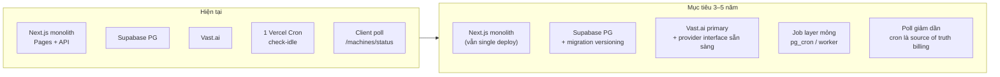
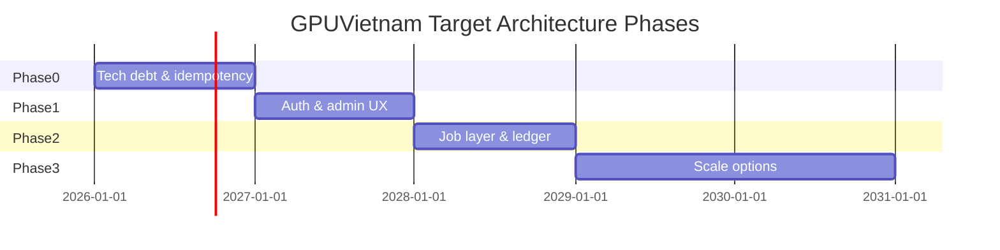

# GPUVietnam — Target Architecture Draft (3–5 năm)

> Thiết kế kiến trúc mục tiêu, dựa trên [ARCHITECTURE_REVIEW.md](./ARCHITECTURE_REVIEW.md).  
> Phạm vi: đề xuất có thể triển khai **dần từng bước**, không thay đổi triết lý sản phẩm.

**Ngày:** 2026-06-28  
**Horizon:** 3–5 năm | **Vận hành:** 1 người (single operator)

---

## Table of Contents

1. [Triết lý cố định (Non-Negotiables)](#1-triết-lý-cố-định-non-negotiables)
2. [Tầm nhìn kiến trúc mục tiêu](#2-tầm-nhìn-kiến-trúc-mục-tiêu)
3. [Mốc quy mô người dùng](#3-mốc-quy-mô-người-dùng)
4. [Đánh giá theo module](#4-đánh-giá-theo-module)
5. [Đề xuất xuyên suốt (Cross-Cutting)](#5-đề-xuất-xuyên-suốt-cross-cutting)
6. [Roadmap tổng hợp](#6-roadmap-tổng-hợp)
7. [Những gì không nên thay đổi](#7-những-gì-không-nên-thay-đổi)

---

## 1. Triết lý cố định (Non-Negotiables)

Các nguyên tắc sau **giữ nguyên** trong toàn bộ horizon 3–5 năm:

| Nguyên tắc | Hiện trạng | File tham chiếu |
|---|---|---|
| Restart-only Workspace | Đổi env → cần stop + start; `machines.template` vs `subscriptions.env_name` | `workstation-env.js`, `change-environment.js` |
| Một phiên = một Workspace | Container env set lúc boot; không hot-swap | `start-machine.js`, `buildWorkstationContainerEnv()` |
| GPU Provider abstraction | `GPUProvider` + `GPUService` + `VastProvider` | `gpu-provider.interface.ts`, `gpu/index.js` |
| Billing theo phút | `deductPerMinute()`, `MINUTE_BILLING_SECONDS=60` | `billing.js` |
| Một người vận hành | Admin duyệt CK, pending queue, không multi-tenant ops team | `admin-pending-requests.js`, admin APIs |

Target architecture **không** đề xuất: multi-workspace đồng thời, billing theo giây/real-time stream, bỏ admin duyệt CK hoàn toàn ở giai đoạn sớm, hoặc thay Supabase bằng stack khác chỉ vì scale nhỏ.

---

## 2. Tầm nhìn kiến trúc mục tiêu

### 2.1 Hiện tại → Mục tiêu (high level)



**Định hướng:** vẫn **monolith Next.js + Supabase** (phù hợp 1 operator), bổ sung **job layer**, **audit/order clarity**, **observability** — không tách microservices trừ khi >2000 user active đồng thời và có thêm nhân sự.

### 2.2 Kiến trúc mục tiêu theo lớp

```text
┌─────────────────────────────────────────────────────────────┐
│  Client: Dashboard / Checkout / Admin (React, không đổi stack) │
├─────────────────────────────────────────────────────────────┤
│  API: pages/api/*  +  lib/* domain modules (giữ pattern)      │
├─────────────────────────────────────────────────────────────┤
│  Jobs: cron billing, idle, expire, auto-renew, backup retry   │
│        (tách logic khỏi request poll — incremental)          │
├─────────────────────────────────────────────────────────────┤
│  Data: Supabase (users, subscriptions, machines, sessions,   │
│        wallet, pending requests, optional orders/ledger)      │
├─────────────────────────────────────────────────────────────┤
│  External: Vast, R2, SpeedSMS, (future: email/Zalo webhook)   │
└─────────────────────────────────────────────────────────────┘
```

---

## 3. Mốc quy mô người dùng

| Mốc | Ý nghĩa vận hành | Trọng tâm kiến trúc |
|---|---|---|
| **Now** | MVP / early adopters, admin duyệt tay ổn | Sửa nợ kỹ thuật, idempotency, migration SQL |
| **~100 users** | ~10–20 máy running peak, admin vẫn 1 người | Auth middleware, machine lock, audit log |
| **~500 users** | Admin bottleneck CK, billing phụ thuộc poll | Job layer billing/idle, pending queue, notification outbox |
| **~2000 users** | Rủi ro tài chính & GPU capacity | Billing ledger, backup lifecycle, optional payment gateway read-only |

---

## 4. Đánh giá theo module

Mỗi đề xuất gồm: **Current → Target → Benefits → Migration → When**, kèm bảng đánh giá.

**Chú thích cột đánh giá:**

- **Priority:** P0 (sớm) → P3 (muộn / tùy chọn)
- **Difficulty:** Low / Medium / High
- **Risk:** Low / Medium / High
- **Breaking:** Có phá API/contract hiện tại không
- **DB / FE / API:** Yêu cầu thay đổi

---

### 4.1 Order

**Hiện trạng:** Không có entity `orders` riêng. “Đơn hàng” phân tán:

- Mua gói → `subscriptions` (`pending_payment`) — `gpu-subscription-purchase.js`
- Gia hạn → `plan_renew_requests` — `plan-renew-request.js`
- Storage → `storage_upgrades` — `storage-upgrades.sql`
- Nạp ví → `wallet_transactions` (pending) — `wallet-deposit.js`

Admin gom pending qua `admin-pending-requests.js`.

#### Kết luận module

**No change recommended** cho bảng `orders` thống nhất ở giai đoạn Now → 500 users. Mô hình hiện tại phù hợp single operator + duyệt tay.

#### Đề xuất duy nhất (nhẹ): Chuẩn hóa mã tham chiếu đơn

| | |
|---|---|
| **Current Design** | `transfer_note` text tự do trên subscription / renew / deposit |
| **Target Design** | Format `GV-{type}-{uuid8}` sinh tập trung; hiển thị thống nhất admin + user |
| **Benefits** | Admin đối soát CK nhanh hơn; giảm nhầm đơn khi scale |
| **Migration Plan** | (1) Helper `buildOrderReference()` trong `lib/` (2) Dùng cho đơn mới; đơn cũ giữ nguyên (3) Admin UI hiển thị cột reference |
| **When** | **100 users** |

| Priority | Difficulty | Risk | Breaking | DB migration | Frontend | API |
|---|---|---|---|---|---|---|
| P2 | Low | Low | Không | Không (chỉ format text) | Có (hiển thị) | Có (response thêm field optional) |

---

### 4.2 Payment

**Hiện trạng:** Chuyển khoản + admin approve; ví nội bộ instant; renew/storage tương tự — xem `ARCHITECTURE_REVIEW.md` §6.

#### 4.2.1 Wallet — Idempotency & atomicity

| | |
|---|---|
| **Current Design** | `purchaseGpuPlanWithWallet()` update balance + insert subscription tuần tự — `gpu-subscription-purchase.js` |
| **Target Design** | DB transaction (RPC Supabase) hoặc `idempotency_key` trên `wallet_transactions`; retry-safe |
| **Benefits** | Tránh double-charge khi user double-click / network retry |
| **Migration Plan** | (1) SQL function `wallet_pay_for_plan(user_id, plan, idempotency_key)` (2) API nhận optional `Idempotency-Key` header (3) Fallback code path cũ 1 release |
| **When** | **Now** |

| Priority | Difficulty | Risk | Breaking | DB migration | Frontend | API |
|---|---|---|---|---|---|---|
| P0 | Medium | Medium | Không (additive) | Có (RPC) | Không bắt buộc | Có (optional header) |

#### 4.2.2 Chuyển khoản — Giữ admin duyệt

| | |
|---|---|
| **Current Design** | Admin duyệt qua `admin/subscriptions/approve.js` |
| **Target Design** | **Giữ nguyên** flow; bổ sung admin “match transfer_note” search |
| **Benefits** | Phù hợp 1 operator; không cần tích hợp ngân hàng sớm |
| **Migration Plan** | Chỉ cải thiện admin UI filter — không đổi API contract |
| **When** | **100 users** |

**No change recommended** cho auto-approve CK ở Now–500 users.

#### 4.2.3 Payment gateway (tùy chọn muộn)

| | |
|---|---|
| **Current Design** | Không có gateway; CK + ví |
| **Target Design** | Adapter `PaymentProvider` (VNPay/MoMo) **chỉ cho nạp ví**, không thay CK gói ngay |
| **Benefits** | Giảm admin duyệt nạp ví khi volume cao |
| **Migration Plan** | (1) Interface mỏng `src/lib/payment-provider.js` (2) Webhook → credit wallet (3) Admin vẫn override manual |
| **When** | **2000 users** (chỉ nếu nạp ví > ~50 đơn/ngày) |

| Priority | Difficulty | Risk | Breaking | DB migration | Frontend | API |
|---|---|---|---|---|---|---|
| P3 | High | High | Không nếu additive | Có (webhook log table) | Có | Có (webhook routes) |

**Nếu không đạt volume trên:** **No change recommended.**

---

### 4.3 Subscription

**Hiện trạng:** `subscriptions` + `user_plan_inventory` + `server_status` tách biệt — `machines.js`, `user-plan-inventory.js`.

#### 4.3.1 Formalize status trong DB

| | |
|---|---|
| **Current Design** | `subscriptions.status` không CHECK constraint; giá trị rải rác trong code |
| **Target Design** | CHECK constraint + document enum; `server_status` giữ riêng |
| **Benefits** | Giảm invalid state; dễ query admin |
| **Migration Plan** | (1) Audit giá trị hiện có (2) ALTER TABLE ADD CONSTRAINT (3) Code chỉ dùng constants file |
| **When** | **100 users** |

| Priority | Difficulty | Risk | Breaking | DB migration | Frontend | API |
|---|---|---|---|---|---|---|
| P1 | Low | Medium | Không nếu data sạch | Có | Không | Không |

#### 4.3.2 Job expire subscription

| | |
|---|---|
| **Current Design** | `expired` đọc trong `dashboard/me.js`; trigger expire: **Unknown** |
| **Target Design** | Cron job `expire-subscriptions`: `expires_at < now()` → `status=expired`, notify user |
| **Benefits** | Lifecycle rõ; auto-stop out_of_credit nhất quán |
| **Migration Plan** | (1) `pages/api/cron/expire-subscriptions.js` (2) `vercel.json` daily cron (3) `notifyExpiring` helpers |
| **When** | **500 users** |

| Priority | Difficulty | Risk | Breaking | DB migration | Frontend | API |
|---|---|---|---|---|---|---|
| P1 | Low | Low | Không | Không | Không | Có (cron route) |

#### 4.3.3 Multi-plan inventory

| | |
|---|---|
| **Current Design** | `user_plan_inventory` + `fetchUserActivePlans()` đã hỗ trợ |
| **Target Design** | **Giữ nguyên** |
| **Benefits** | — |
| **Migration Plan** | — |
| **When** | — |

**No change recommended** cho mô hình subscription/inventory core.

---

### 4.4 Workspace

**Hiện trạng:** Static `WORKSTATIONS` — `workstations.ts`; restart-only — `workstation-env.js`.

#### Kết luận module

**No change recommended** cho restart-only và one-workspace-per-session.

#### Đề xuất tùy chọn: Catalog có thể cấu hình (không đổi triết lý)

| | |
|---|---|
| **Current Design** | 6 workstation hardcode TS; deploy mới để đổi mô tả |
| **Target Design** | Bảng `workstation_catalog` (read-only API); TS fallback nếu DB trống; **vẫn** restart-only, **vẫn** 1 Comfy slug/machine |
| **Benefits** | Admin đổi copy/icon không cần deploy; vẫn 1 operator |
| **Migration Plan** | (1) Seed từ `WORKSTATIONS` (2) API GET public catalog (3) `change-environment.js` validate từ DB (4) Giữ `GPU_COMFY_WORKSTATION_IDS` logic |
| **When** | **500 users** (chỉ khi marketing đổi workstation thường xuyên) |

| Priority | Difficulty | Risk | Breaking | DB migration | Frontend | API |
|---|---|---|---|---|---|---|
| P3 | Medium | Low | Không nếu fallback TS | Có | Có (fetch catalog) | Có (GET catalog) |

**Nếu catalog ổn định:** **No change recommended.**

---

### 4.5 Machine

**Hiện trạng:** Lifecycle Vast + unified destroy — `machines.js`, `machine-destroy.js`; poll-heavy — `machines/status.js`.

#### 4.5.1 Chuẩn hóa destroy reasons & fix tech debt

| | |
|---|---|
| **Current Design** | `retry_provision`, `provision_failed` ngoài `DESTROY_REASONS`; import bug `support/end.js` |
| **Target Design** | Mở rộng enum có document; fix import; single `getGpuService()` |
| **Benefits** | Log/notify đúng; debug dễ hơn |
| **Migration Plan** | (1) Thêm reasons vào `machine-destroy.js` (2) Fix `support/end.js` import `admin-auth.js` (3) `auto-stop.js` dùng `getGpuService` từ `gpu/index.js` |
| **When** | **Now** |

| Priority | Difficulty | Risk | Breaking | DB migration | Frontend | API |
|---|---|---|---|---|---|---|
| P0 | Low | Low | Không | Không | Không | Không |

#### 4.5.2 Idempotency start machine

| | |
|---|---|
| **Current Design** | Double POST có thể race provision — `start-machine.js` |
| **Target Design** | Advisory lock: 1 active machine/user; hoặc `machines` partial unique index `(user_id) WHERE status IN (...)` |
| **Benefits** | Tránh 2 instance Vast / double billing |
| **Migration Plan** | (1) DB constraint (2) API return `alreadyOnline` nhất quán (3) Test race |
| **When** | **100 users** |

| Priority | Difficulty | Risk | Breaking | DB migration | Frontend | API |
|---|---|---|---|---|---|---|
| P0 | Medium | Medium | Không | Có (index/constraint) | Không | Có (error code rõ) |

#### 4.5.3 Tách billing tick khỏi status poll

| | |
|---|---|
| **Current Design** | `/machines/status` gọi `deductPerMinute`, `checkAutoStop`, `startBilling` |
| **Target Design** | Cron (1 phút) là **primary** billing tick; status poll chỉ read + sync idle UI |
| **Benefits** | Billing đúng khi user đóng tab; giảm side-effect GET |
| **Migration Plan** | (1) `cron/billing-tick.js` duyệt `machines running` (2) Status poll giữ fallback 1 giai đoạn (3) Monitor diff |
| **When** | **500 users** |

| Priority | Difficulty | Risk | Breaking | DB migration | Frontend | API |
|---|---|---|---|---|---|---|
| P1 | Medium | Medium | Không | Không | Không | Có (cron mới) |

#### 4.5.4 Machine state machine document + admin visibility

| | |
|---|---|
| **Current Design** | State trong code rải rác |
| **Target Design** | `docs/MACHINE_STATE.md` + admin hiển thị `destroy reason`, `backup_logs` link |
| **Benefits** | 1 operator troubleshoot nhanh |
| **Migration Plan** | Docs + admin panel field (read-only) |
| **When** | **100 users** |

| Priority | Difficulty | Risk | Breaking | DB migration | Frontend | API |
|---|---|---|---|---|---|---|
| P2 | Low | Low | Không | Không | Có (admin) | Không |

**No change recommended** cho: hot-swap workspace, giữ instance lâu dài (persistent VM), multi-machine per user.

---

### 4.6 GPU Provider

**Hiện trạng:** `GPUProvider` interface + `VastProvider` production — `gpu/index.js`, `vast-provider.js`, `vast-client.js`.

#### Kết luận module

**No change recommended** cho abstraction layer — đã đúng hướng dài hạn.

#### 4.6.1 Config & observability Vast

| | |
|---|---|
| **Current Design** | Filters/scoring trong `gpu-config.js`; `findBestGPU()` — `vast-client.js` |
| **Target Design** | Admin-readable last rent decision log (region, score, fallback level) → `admin_machine_logs` hoặc structured log |
| **Benefits** | 1 operator debug “hết GPU” / region fallback |
| **Migration Plan** | (1) Log JSON on provision (2) Admin infra panel hiển thị |
| **When** | **100 users** |

| Priority | Difficulty | Risk | Breaking | DB migration | Frontend | API |
|---|---|---|---|---|---|---|
| P2 | Low | Low | Không | Có (optional log column) | Có (admin) | Không |

#### 4.6.2 Provider thứ hai (standby)

| | |
|---|---|
| **Current Design** | Chỉ Vast |
| **Target Design** | `createGpuServiceWithProvider()` + env `GPU_PROVIDER=vast`; second impl **chưa** bật production |
| **Benefits** | Giảm single-vendor risk khi Vast outage |
| **Migration Plan** | (1) Stub provider implements interface (2) Feature flag (3) Chỉ DR manual |
| **When** | **2000 users** (hoặc khi outage >2 lần/năm) |

| Priority | Difficulty | Risk | Breaking | DB migration | Frontend | API |
|---|---|---|---|---|---|---|
| P3 | High | High | Không nếu flag off | Không | Không | Không |

**Nếu Vast ổn định:** defer — **No change recommended** đến 2000 users.

---

### 4.7 Billing

**Hiện trạng:** Per-minute via `deductPerMinute()` — `billing.js`; ~2000 LOC; tick từ poll + cron idle.

#### 4.7.1 Per-minute billing core

**No change recommended** — đúng triết lý sản phẩm.

#### 4.7.2 Billing ledger (audit)

| | |
|---|---|
| **Current Design** | Trừ giờ trực tiếp `hours_used` / inventory; `gpu_sessions` lưu session |
| **Target Design** | Bảng `billing_ledger` append-only: `{user_id, machine_id, minutes, hours_delta, inventory_id, idempotency_key}` |
| **Benefits** | Đối soát tranh chấp; admin refund/adjust có trail |
| **Migration Plan** | (1) Insert ledger trong `deductPerMinute` (dual-write) (2) Backfill không bắt buộc (3) Admin read-only view |
| **When** | **500 users** |

| Priority | Difficulty | Risk | Breaking | DB migration | Frontend | API |
|---|---|---|---|---|---|---|
| P1 | Medium | Low | Không | Có | Có (admin) | Có (admin read) |

#### 4.7.3 Auto-renew on cron

| | |
|---|---|
| **Current Design** | `auto-renew.js`; trigger **Unknown** |
| **Target Design** | Cron daily/hourly gọi `executeAutoRenewCheck()` |
| **Benefits** | Không phụ thuộc user mở dashboard |
| **Migration Plan** | `cron/auto-renew.js` + vercel schedule |
| **When** | **500 users** |

| Priority | Difficulty | Risk | Breaking | DB migration | Frontend | API |
|---|---|---|---|---|---|---|
| P2 | Low | Medium | Không | Không | Không | Có (cron) |

#### 4.7.4 repairUserBillingState

| | |
|---|---|
| **Current Design** | Gọi ad-hoc từ `start-machine`, `dashboard/me` |
| **Target Design** | **Giữ** + cron weekly repair sweep |
| **Benefits** | Giảm orphan sessions tích lũy |
| **Migration Plan** | Cron gọi `repairUserBillingState` per active users batch |
| **When** | **500 users** |

| Priority | Difficulty | Risk | Breaking | DB migration | Frontend | API |
|---|---|---|---|---|---|---|
| P2 | Low | Low | Không | Không | Không | Có (cron) |

---

### 4.8 Backup

**Hiện trạng:** SSH + tar + R2 — `machine-backup.js`, `r2-client.js`, `backup_logs` — `backup-logs.sql`.

#### 4.8.1 Backup flow core

**No change recommended** cho SSH+R2 trước destroy — phù hợp ephemeral Vast instance.

#### 4.8.2 Retry & timeout policy

| | |
|---|---|
| **Current Design** | Backup sync trong destroy; fail → `backupSuccess=false` vẫn destroy |
| **Target Design** | Config timeout; 1 retry; log rõ `backup_logs.status=failed` |
| **Benefits** | Giảm mất data do network blip |
| **Migration Plan** | (1) Wrap `backupBeforeStop` retry (2) Không block destroy > N phút (operator policy) |
| **When** | **100 users** |

| Priority | Difficulty | Risk | Breaking | DB migration | Frontend | API |
|---|---|---|---|---|---|---|
| P1 | Low | Low | Không | Không | Không | Không |

#### 4.8.3 R2 lifecycle & quota

| | |
|---|---|
| **Current Design** | Upload không lifecycle trong code |
| **Target Design** | R2 lifecycle rules (90/180 ngày); admin alert bucket size |
| **Benefits** | Kiểm soát chi phí storage khi user tăng |
| **Migration Plan** | Cloudflare dashboard rules + optional `users.backup_plan_gb` enforce |
| **When** | **2000 users** |

| Priority | Difficulty | Risk | Breaking | DB migration | Frontend | API |
|---|---|---|---|---|---|---|
| P2 | Low | Low | Không | Không | Có (warning UI) | Không |

---

### 4.9 Notification

**Hiện trạng:** In-app `notifications` table — `user-notifications.js`; settings có `zalo_enabled`, `email_enabled` — `user-settings.sql`.

#### 4.9.1 In-app notifications

**No change recommended** cho bảng và UI bell — đủ cho 1 operator + user self-serve.

#### 4.9.2 Notification outbox (email / Zalo)

| | |
|---|---|
| **Current Design** | Insert in-app; external channels **Unknown** implementation |
| **Target Design** | Bảng `notification_outbox` (pending/sent/failed) + cron worker; template per `type` |
| **Benefits** | Idle warning, payment success, backup full — user không cần mở dashboard |
| **Migration Plan** | (1) Dual-write in-app + outbox (2) Worker gửi Zalo OA / email SMTP (3) Respect `user_notification_settings` |
| **When** | **500 users** |

| Priority | Difficulty | Risk | Breaking | DB migration | Frontend | API |
|---|---|---|---|---|---|---|
| P2 | Medium | Medium | Không | Có | Không | Không |

**Nếu user chủ yếu dùng dashboard:** defer outbox — **No change recommended** đến 500 users.

---

### 4.10 Admin

**Hiện trạng:** Panels rải rác — `src/components/admin/*`; pending aggregate — `admin-pending-requests.js`; auth JWT + `ADMIN_SECRET`.

#### 4.10.1 Unified pending inbox

| | |
|---|---|
| **Current Design** | `admin-pending-requests.js` aggregate subscriptions, wallet, renew, storage |
| **Target Design** | Một queue sorted + filter + SLA badge (optional); deep link từng loại |
| **Benefits** | 1 operator xử lý nhanh hơn khi volume tăng |
| **Migration Plan** | (1) Mở rộng aggregate API (2) Admin UI single inbox (3) Không đổi approve endpoints |
| **When** | **100 users** |

| Priority | Difficulty | Risk | Breaking | DB migration | Frontend | API |
|---|---|---|---|---|---|---|
| P1 | Low | Low | Không | Không | Có | Có (extend response) |

#### 4.10.2 Audit trail consolidation

| | |
|---|---|
| **Current Design** | `hour_grant_logs`, `admin_machine_logs`, wallet status — rải rác |
| **Target Design** | View `admin_audit_log` (union) hoặc bảng append-only `admin_actions` |
| **Benefits** | Truy vết “ai duyệt gì khi nào” |
| **Migration Plan** | (1) Insert hook trong approve/reject/toggle (2) Admin read-only page |
| **When** | **500 users** |

| Priority | Difficulty | Risk | Breaking | DB migration | Frontend | API |
|---|---|---|---|---|---|---|
| P2 | Medium | Low | Không | Có | Có (admin) | Có (admin read) |

#### 4.10.3 Multi-admin RBAC

| | |
|---|---|
| **Current Design** | `users.role = admin` binary |
| **Target Design** | **Không triển khai** trong horizon trừ khi có nhân sự thứ 2 |
| **Benefits** | — |
| **Migration Plan** | — |
| **When** | — |

**No change recommended** cho multi-admin RBAC — mâu thuẫn “một người vận hành”.

---

### 4.11 AI Assistant

**Hiện trạng:** Không có module AI Assistant trong codebase (không thấy chatbot/LLM integration trong `src/`).

#### Kết luận module

**No change recommended** ở Now → 500 users.

#### Đề xuất tùy chọn (chỉ khi có nhu cầu sản phẩm rõ)

| | |
|---|---|
| **Current Design** | Không có |
| **Target Design** | Read-only assistant: FAQ + link docs + trạng thái máy (gọi `/api/dashboard/me`); **không** tự start/stop/billing |
| **Benefits** | Giảm support Zalo cho câu hỏi lặp |
| **Migration Plan** | (1) Widget dashboard (2) API `/api/assistant/query` proxy LLM (3) Guardrails: no write ops |
| **When** | **2000 users** hoặc khi support >10 ticket/ngày |

| Priority | Difficulty | Risk | Breaking | DB migration | Frontend | API |
|---|---|---|---|---|---|---|
| P3 | Medium | Medium | Không | Có (conversation log optional) | Có | Có |

**Nếu không có pain support:** **No change recommended** trong 3–5 năm.

---

## 5. Đề xuất xuyên suốt (Cross-Cutting)

### 5.1 SQL migration versioning

| | |
|---|---|
| **Current Design** | 32 file SQL rải; không runner trong repo |
| **Target Design** | `supabase/migrations/YYYYMMDDHHMM_name.sql` + script apply documented |
| **Benefits** | Deploy DB nhất quán dev/staging/prod |
| **Migration Plan** | Baseline từ hiện trạng; file mới theo convention |
| **When** | **Now** |

| Priority | Difficulty | Risk | Breaking | DB | FE | API |
|---|---|---|---|---|---|---|
| P0 | Low | Low | Không | Quy trình | Không | Không |

### 5.2 Middleware auth (dashboard)

| | |
|---|---|
| **Current Design** | Cookie `gpuvietnam-auth=1` boolean — `middleware.ts` |
| **Target Design** | Validate Supabase session cookie hoặc redirect; giữ UX hiện tại |
| **Benefits** | Không bypass dashboard bằng cookie giả |
| **Migration Plan** | Edge middleware gọi Supabase getSession (hoặc signed cookie server-set) |
| **When** | **100 users** |

| Priority | Difficulty | Risk | Breaking | DB | FE | API |
|---|---|---|---|---|---|---|
| P1 | Medium | Medium | Có thể (login flow) | Không | Có nhẹ | Không |

### 5.3 Observability

| | |
|---|---|
| **Current Design** | `console.log` CHECKPOINT — `machines/status.js` |
| **Target Design** | Structured logs `{event, userId, machineId, durationMs}`; optional Sentry |
| **Benefits** | 1 operator debug production |
| **Migration Plan** | Logger wrapper; remove debug checkpoint |
| **When** | **100 users** |

| Priority | Difficulty | Risk | Breaking | DB | FE | API |
|---|---|---|---|---|---|---|
| P1 | Low | Low | Không | Không | Không | Không |

### 5.4 Job layer tổng hợp

Mục tiêu 500 users — gom cron:

| Job | Schedule | Function hiện có |
|---|---|---|
| `check-idle` | */5 min | `checkAutoStop()` — đã có |
| `billing-tick` | */1 min | `deductPerMinute()` — tách từ status poll |
| `expire-subscriptions` | daily | mới |
| `auto-renew` | hourly | `executeAutoRenewCheck()` |
| `notification-outbox` | */5 min | mới |
| `billing-repair` | weekly | `repairUserBillingState()` batch |

Triển khai: Vercel Cron (đủ đến ~500 users) hoặc Supabase `pg_cron` nếu Vercel limit.

| Priority | Difficulty | Risk | Breaking | DB | FE | API |
|---|---|---|---|---|---|---|
| P1 | Medium | Medium | Không | Không | Không | Có (cron routes) |

**When:** billing-tick + expire → **500 users**; còn lại theo bảng trên.

---

## 6. Roadmap tổng hợp

### Phase 0 — Now (0–100 users)

| # | Hạng mục | Module |
|---|---|---|
| 1 | SQL migration versioning | Cross-cutting |
| 2 | Wallet idempotency RPC | Payment |
| 3 | Fix destroy reasons + singleton + support/end import | Machine |
| 4 | Machine start idempotency constraint | Machine |
| 5 | Backup retry/timeout | Backup |
| 6 | Structured logging | Cross-cutting |

### Phase 1 — ~100 users

| # | Hạng mục | Module |
|---|---|---|
| 1 | Middleware session validation | Cross-cutting |
| 2 | Subscription status CHECK constraint | Subscription |
| 3 | Admin unified pending inbox | Admin |
| 4 | Vast provision decision logging | GPU Provider |
| 5 | Order reference format (transfer_note) | Order |
| 6 | Machine state admin visibility | Machine |

### Phase 2 — ~500 users

| # | Hạng mục | Module |
|---|---|---|
| 1 | Cron billing-tick (primary) | Machine / Billing |
| 2 | Cron expire subscriptions | Subscription |
| 3 | Billing ledger dual-write | Billing |
| 4 | Cron auto-renew + billing repair | Billing |
| 5 | Notification outbox (optional) | Notification |
| 6 | Admin audit consolidation | Admin |
| 7 | Workstation catalog DB (optional) | Workspace |

### Phase 3 — ~2000 users

| # | Hạng mục | Module |
|---|---|---|
| 1 | Payment gateway → wallet only (optional) | Payment |
| 2 | R2 lifecycle / quota enforcement | Backup |
| 3 | Second GPU provider stub + feature flag | GPU Provider |
| 4 | AI Assistant read-only (optional) | AI Assistant |



---

## 7. Những gì không nên thay đổi

| Hạng mục | Lý do |
|---|---|
| Restart-only Workspace | Container ComfyUI + workflow bundle gắn boot; đã document rõ |
| Một workspace / phiên | Đơn giản billing, backup, support cho 1 operator |
| `GPUProvider` abstraction | Sẵn sàng DR; không cần rewrite khi thêm vendor |
| Billing per-minute | Cam kết sản phẩm; ledger bổ sung audit, không thay model |
| Admin duyệt chuyển khoản (giai đoạn sớm) | Phù hợp VN + 1 operator; gateway chỉ bổ sung ví |
| Next.js monolith + Supabase | Chi phí vận hành thấp; tách service chỉ khi >2000 active + thêm nhân sự |
| Unified destroy + backup | `destroyUserMachine()` đã là điểm vào đúng |
| Static workstation TS (giai đoạn sớm) | Đủ 3 ComfyUI env; DB catalog chỉ khi cần marketing agility |

---

## Phụ lục: Ma trận module — tóm tắt

| Module | Khuyến nghị tổng | Thay đổi lớn nhất (nếu có) | When |
|---|---|---|---|
| **Order** | No change (core) | Reference format only | 100 users |
| **Payment** | Idempotency Now; gateway optional | Wallet RPC | Now / 2000 |
| **Subscription** | Giữ model; thêm expire job | Cron expire | 500 users |
| **Workspace** | **No change recommended** | Catalog DB optional | 500 users |
| **Machine** | Idempotency + cron billing | billing-tick cron | Now / 500 |
| **GPU Provider** | **No change recommended** (core) | Decision logging | 100 users |
| **Billing** | **No change recommended** (per-minute) | Ledger audit | 500 users |
| **Backup** | **No change recommended** (flow) | Retry + R2 lifecycle | 100 / 2000 |
| **Notification** | In-app đủ sớm | Outbox optional | 500 users |
| **Admin** | Cải thiện inbox + audit | Unified inbox | 100 / 500 |
| **AI Assistant** | **No change recommended** | Read-only bot optional | 2000 users |

---

*Tài liệu draft — tham chiếu hiện trạng: [ARCHITECTURE_REVIEW.md](./ARCHITECTURE_REVIEW.md). Mọi triển khai nên là PR nhỏ, có thể rollback, không big-bang rewrite.*
