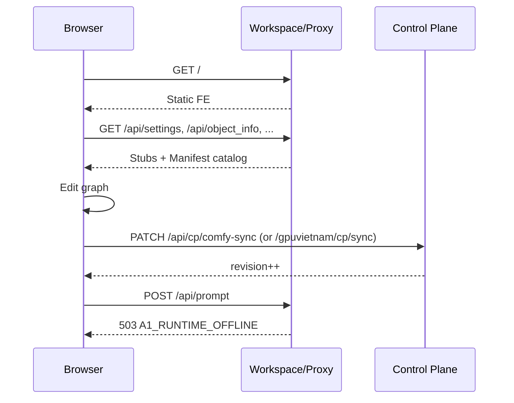
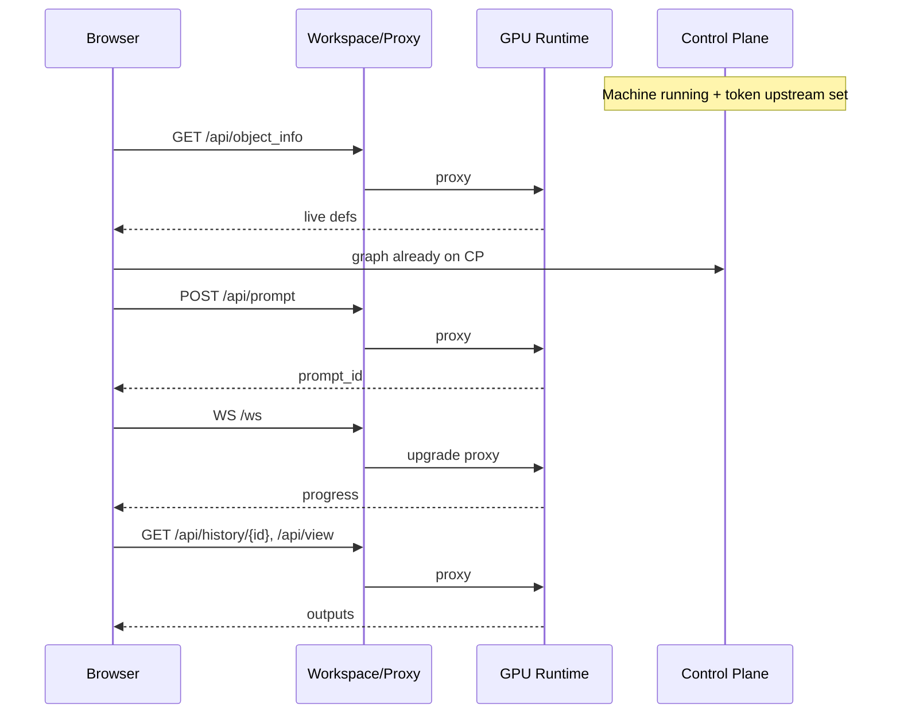

# A1 — Endpoint / Proxy Contract (Frontend Separation MVP)

| | |
|---|---|
| **Status** | Contract accepted · **M1 implemented** (local smoke PASS; CF deploy pending) |
| **Date** | 2026-07-22 |
| **Gate** | A0.5 **PASS WITH CONSTRAINTS** → A1 allowed |
| **Depends on** | A0 spike · A0.5 lab · B0 `cp_workflows` · Gate 1 Continuity · `COMFY_PROXY.md` · Image Spec / `official-nodes.lock` |
| **Out of scope** | Dual-run · Warm pool · Ticket C (rebind no-reload) · Replacing Comfy editor · Full custom-node universe offline |

---

## 1. Goal & invariants

**Goal:** One stable Workspace/brand origin hosts stock ComfyUI Editor. GPU Runtime is a replaceable compute backend.

```text
Browser ──same origin──► Workspace (brand host)
                           ├── Static FE (comfyui-frontend-package)
                           ├── CP SoT (cp_workflows / comfy-sync)
                           ├── Offline stubs + Supported Node Manifest catalog
                           └── Path-split proxy ──► Runtime (HTTP + WS)
```

| Invariant | Rule |
|-----------|------|
| **Same origin** | FE assets + `/api/*` + `/ws` share one brand host (path-split). No cross-origin ESM for core FE. |
| **Version lock** | FE package pin ↔ Comfy Runtime image pin (today: FE `1.45.21` · Comfy `0.28.0` · image `:v3.2` family). |
| **Supported catalog** | Offline nodes ⊆ Image Spec Supported Node Manifest — not “any custom node on the internet”. |
| **Generate needs Runtime** | A1 DoD: with Runtime healthy, Queue/Generate must succeed for a graph composed offline. |
| **Graph SoT = CP** | Reuse B0/A0.5 `cp_workflows` + `/api/cp/comfy-sync`. |
| **No Ticket C in A1** | Changing Runtime may reload Workspace URL / remint cookie; graph must still restore from CP. |
| **ADR-005** | CP orchestration does not speak Comfy dialect except via Adapter/Proxy edge. |

### Proposed Workspace URL (A1 MVP)

| Option | URL | Notes |
|--------|-----|-------|
| **A (recommended)** | `https://work.gpuvietnam.com/` | Evolve existing Worker: serve static FE when offline; proxy when Runtime bound |
| B | `https://studio.gpuvietnam.com/` | New host — more DNS/ops; only if product wants split from `work` |

A1 MVP assumes **Option A** unless product picks B before Milestone 1.

---

## 2. Mode matrix

| Mode | Condition | Editor | Catalog | Generate | WS |
|------|-----------|--------|---------|----------|-----|
| **Offline** | No healthy Runtime bound to session | Open + edit | Manifest snapshot | **Blocked** (clear UX + HTTP 503) | Soft shim or closed |
| **Online** | Session has upstream + Comfy healthy | Open + edit | Prefer **live** `object_info` from Runtime (parity with image) | **Allowed** | Proxy → Runtime |
| **Degraded** | Bound but 502 / pulling | Open + edit | Keep last good / offline snapshot | Blocked | Soft fail |

---

## 3. Auth / token flow

| Step | Owner | Behavior |
|------|-------|----------|
| 1. Dashboard “Vào phòng” / Workspace open | Control Plane | Existing `POST /api/session/comfy-access` mints `gvc.*` → `workUrl` |
| 2. `GET /enter/{token}` | Proxy (Worker) | Set HttpOnly cookie; redirect `/#gvn_cp=…` (workflow bootstrap) |
| 3. Subsequent `/`, `/api/*`, `/ws` | Proxy | Cookie → resolve token → upstream **or** offline edge handlers |
| 4. CP sync | Control Plane | `PATCH/GET /api/cp/comfy-sync` via Bearer `gvc.*` **or** Supabase JWT; Worker path `/gpuvietnam/cp/sync` remains for extension |
| 5. Offline Workspace (no GPU yet) | Control Plane + Proxy | Need **session without upstream**: either (a) mint “editor-only” token bound to `userId`+`workflowId` with `upstream=null`, or (b) open Workspace with dashboard JWT cookie / short-lived editor cookie. **A1 must pick one in M1.** |
| 6. Runtime becomes ready | Control Plane | Bind upstream on token/session; Proxy switches Offline→Online without changing FE origin |
| 7. Stop / destroy | Control Plane | Revoke tokens (existing) |

### Auth decision for A1 (required before code)

| Proposal | Pros | Cons |
|----------|------|------|
| **P1 — Editor-only `gvc` token** (`upstream` nullable) | Same Worker cookie path as today | Needs schema/resolve change |
| **P2 — Separate `/studio` cookie from dashboard JWT** | Clear offline path | Two auth systems on same origin |

**Recommendation:** **P1** — extend comfy-access token: allow mint when no machine; Proxy serves FE+stubs; when machine ready, patch token upstream (or remint same cookie name).

| Endpoint | Owner | Offline | Online | A1 Required |
|----------|-------|---------|--------|-------------|
| `POST /api/session/comfy-access` | Control Plane | Mint editor session (upstream null OK) | Mint/refresh with upstream | **Yes** |
| `GET /enter/{token}` | Proxy | Cookie + redirect to FE | Same | **Yes** |
| `GET /api/internal/comfy-proxy-resolve` | Control Plane | Resolve editor or runtime binding | Resolve upstream URL | **Yes** |
| KV put token hash | Control Plane → CF | Same | Same | **Yes** (ops) |

---

## 4. Endpoint catalog

Legend — **Owner:** Control Plane (CP) · Runtime (RT) · Proxy (PX) · Static FE host (FE).  
Paths listed with `/api` prefix (Comfy also accepts some without; Proxy should accept both or normalize).

### 4.1 Static FE (Workspace)

| Endpoint | Owner | Offline behavior | Runtime-online behavior | A1 Required |
|----------|-------|------------------|-------------------------|-------------|
| `GET /` | FE/PX | Serve `index.html` from pinned `comfyui-frontend-package` | Same static (not from GPU) | **Yes** |
| `GET /assets/*` | FE/PX | Serve package assets | Same | **Yes** |
| `GET /extensions/core/**` (bundled) | FE/PX | From FE package | Same | **Yes** |
| `GET /materialdesignicons.min.css`, fonts, etc. | FE/PX | From FE package | Same | **Yes** |
| `GET /user.css` | PX | 404 soft | 404 or userdata | No |
| `GET /templates/**`, `/templates/*.webp` | FE/PX or stub | Serve from package if present; else 404 soft | Same or RT | Soft Yes |
| `GET /assets/sorted-custom-node-map.json` | FE/PX | From package if present | Same | Soft Yes |

### 4.2 Boot / settings / users (offline-capable)

| Endpoint | Owner | Offline behavior | Runtime-online behavior | A1 Required |
|----------|-------|------------------|-------------------------|-------------|
| `GET /api/settings` | CP/PX stub | **200** minimal map (InstalledVersion, TutorialCompleted, …). Hard-fail if missing (#001) | Prefer stub CP (avoid userdata race on ephemeral GPU) **or** proxy RT | **Yes** |
| `POST /api/settings/{id}` | CP/PX stub | 200 ack; persist optional in CP user settings | Stub or proxy | **Yes** |
| `GET /api/users` | CP/PX stub | 200 bootstrap JSON | Stub or proxy | **Yes** |
| `GET /api/i18n` | CP/PX stub | `{}` | Stub or proxy | **Yes** (soft) |
| `GET /api/userdata*` | CP/PX | 404→`[]` or CP-backed list | Soft proxy / still CP | Soft Yes |
| `GET /api/system_stats` | PX | Stub `{ a05/a1: { runtimeOnline: false } }` | **Proxy RT** (real devices) | **Yes** |
| `GET /api/features` | PX stub | `{}` / safe defaults | Stub or proxy | Soft Yes |
| `GET /api/global_subgraphs*` | PX stub | `[]` / empty | Proxy RT if needed | Soft Yes |
| `GET /api/node_replacements` | PX stub | `{}` / `[]` | Proxy or stub | Soft Yes |
| `GET /api/jobs*` | PX stub | `[]` | Proxy RT | Soft Yes |
| `GET /api/workflow_templates` | FE/PX | From package or `[]` | Same | Soft Yes |

### 4.3 Extensions & catalog

| Endpoint | Owner | Offline behavior | Runtime-online behavior | A1 Required |
|----------|-------|------------------|-------------------------|-------------|
| `GET /api/extensions` | CP/PX | List = **core-only** (+ optional offline subset of Supported Pack JS paths that FE host can serve). Default MVP: `[]` + bundled core (A0.5 proven) | **Proxy RT** (full pack list from image) | **Yes** |
| `GET /extensions/<pack>/**` | FE or RT | Serve only if packaged on Workspace for Supported Pack subset; else 404 | **Proxy RT** | **Yes** (online); Soft offline |
| `GET /api/object_info` | CP catalog / RT | **Supported Node Manifest snapshot** (built-ins + pin packs’ defs captured from Official Image) | **Proxy RT** (authoritative live defs + model COMBO) | **Yes** |
| `GET /api/object_info/{node}` | CP / RT | From snapshot | Proxy RT | Soft Yes |
| `GET /api/experiment/models` | PX | `[]` or stock manifest folders | **Proxy RT** | Soft Yes → **Yes** if model browser in DoD |

### 4.4 Execution (Runtime-only)

| Endpoint | Owner | Offline behavior | Runtime-online behavior | A1 Required |
|----------|-------|------------------|-------------------------|-------------|
| `POST /api/prompt` (and `/prompt`) | RT via PX | **503** `{ code: A1_RUNTIME_OFFLINE, error: "Runtime chưa sẵn sàng" }` + UI disable Queue | **Proxy RT** — DoD Generate | **Yes** |
| `GET /api/queue` | RT via PX | Empty `{ queue_running:[], queue_pending:[] }` | **Proxy RT** | **Yes** |
| `POST /api/interrupt` | RT via PX | 503 offline | **Proxy RT** | **Yes** |
| `POST /api/free` | RT via PX | 503 offline | **Proxy RT** | Soft Yes |
| `GET /api/history` | RT via PX | `{}` | **Proxy RT** | **Yes** |
| `GET /api/history/{id}` | RT via PX | 404/`{}` | **Proxy RT** | **Yes** |
| `GET /api/view` | RT via PX | 503/404 | **Proxy RT** | **Yes** |
| `POST /api/upload/image` (and upload variants) | RT via PX | 503 offline | **Proxy RT** | **Yes** |
| `GET /api/embeddings`, `/api/models*` | RT via PX | `[]` | **Proxy RT** | Soft Yes |

### 4.5 WebSocket

| Endpoint | Owner | Offline behavior | Runtime-online behavior | A1 Required |
|----------|-------|------------------|-------------------------|-------------|
| `WS /ws` | PX → RT | Soft shim: status `queue_remaining:0` + optional “Runtime offline” notification **or** refuse upgrade with reconnect backoff (must not white-screen editor — A0.5 shim OK) | **Proxy RT** (progress, preview, status) | **Yes** |

### 4.6 Control Plane / GPUVietnam

| Endpoint | Owner | Offline behavior | Runtime-online behavior | A1 Required |
|----------|-------|------------------|-------------------------|-------------|
| `GET/PATCH /api/cp/comfy-sync` | CP | Full SoT read/write | Same | **Yes** |
| `GET/PATCH /api/cp/workflows*` | CP | List/edit metadata | Same | Soft Yes |
| `Worker /gpuvietnam/cp/sync` | PX → CP | Forward with Bearer gvc | Same | **Yes** (compat with `gpuvietnam_cp_sync`) |
| `/gpuvietnam/backup/flush` | RT | N/A offline | Proxy RT only | No (not editor DoD) |
| Dashboard `/api/user/start-machine` etc. | CP | Unchanged | Unchanged | No (outside editor shell) |

### 4.7 Explicitly stub / do not proxy (A1)

| Endpoint | Owner | Offline | Online | A1 Required |
|----------|-------|---------|--------|-------------|
| External `https://api.comfy.org/**` | External | Browser may call; ignore for A1 | Same | **No** — do not block boot |
| Comfy Manager install APIs | RT | Unavailable offline | May exist on RT; **not** A1 DoD | **No** |
| Arbitrary userdata as SoT | — | Prefer CP | Prefer CP | Graph SoT stays CP |

---

## 5. Supported Node Manifest

Source of truth chain:

```text
GPUVietnam Supported Image (:v3.2 / profile v3|v4)
        ↓
image/official-nodes.lock + runtime-image-spec.js
        ↓
Supported Node Manifest (A1 artifact)
        ↓
Offline Editor Catalog (object_info snapshot + optional extension JS subset)
        ↓
Runtime Image Parity (live object_info must ⊇ manifest)
```

| Layer | Content | Offline editor |
|-------|---------|----------------|
| **Core** | Built-in Comfy nodes (KSampler, CheckpointLoaderSimple, …) | **Required** |
| **Official Pack (pinned)** | Dirs in `official-nodes.lock` for profile | Catalog defs **Yes** for A1 MVP target; custom **JS** optional subset |
| **GPUVietnam extensions** | `gpuvietnam_cp_sync`, branding, backup | cp_sync on RT; A1 may move sync to FE-on-CP (B') later |
| **Unsupported / user-installed** | Anything else | **Not claimed** offline or online beyond image |

**A1 MVP policy (product):**

- Offline: core + snapshot defs for pinned packs (even if pack JS missing → nodes may lack fancy widgets but graph JSON still editable where defs exist).
- Online: live Runtime `object_info` + extensions from image.
- **Never** claim “all Civitai/custom nodes work offline”.

Build step (A1 implementation, not this contract): CI job extracts `object_info` from Official Image → `fixtures/supported-object_info.v3.json` (or similar).

---

## 6. Version compatibility

| Component | Pin (current evidence) | A1 rule |
|-----------|------------------------|---------|
| `comfyui-frontend-package` | `1.45.21` | Ship same pin on Workspace static |
| ComfyUI Runtime | `0.28.0` | Image must match |
| Docker | `dieuhaukieuhanh/gpuvietnam-comfyui:v3.2` | Document in Image Spec |
| Worker / CP | Existing proxy secret + KV | Keep |

Mismatch FE↔RT ⇒ **block Online Generate** (show version error); Offline edit may still work with snapshot.

---

## 7. Offline vs Online behavior (summary)

### Offline

1. User opens stable Workspace URL (cookie / editor token).  
2. Static FE loads; stubs satisfy boot.  
3. `object_info` = Supported Manifest snapshot.  
4. User edits graph; autosave/manual sync → `cp_workflows`.  
5. Queue/Generate disabled; `POST /prompt` → 503 clear code.  
6. WS shim does not claim execution.

### Online (Runtime ready) — **A1 DoD**

1. CP binds upstream to session/token.  
2. Proxy routes execution paths + `/ws` + live `object_info`/`extensions` to Runtime.  
3. FE may refresh node defs (full reload of Workspace **allowed** in A1; Ticket C = no reload).  
4. User Queue → `/prompt` succeeds; history/view work.  
5. Graph identity remains CP document (not GPU-local only).

### Runtime replace (A1 — weaker than Ticket C)

1. Runtime A dies / stop.  
2. Graph already on CP.  
3. Provision Runtime B; remint or rebind token upstream.  
4. User re-opens or refreshes Workspace on **same origin** → load graph from CP → Generate on B.  
5. **Not required:** seamless WS reconnect without refresh.

---

## 8. Request flow diagrams

### 8.1 Offline edit + CP save



### 8.2 Online Generate (DoD)



### 8.3 Path-split on one origin

```text
work.gpuvietnam.com
├── GET /,/assets/*, FE static          → FE package (PX/edge or origin static)
├── GET /api/settings,/users,/i18n…     → Stub (PX) when offline; optional stub always
├── GET /api/object_info,/extensions    → Snapshot (offline) | RT (online)
├── POST /api/prompt,/upload,/view…     → 503 (offline) | RT (online)
├── WS /ws                              → Shim (offline) | RT (online)
├── /gpuvietnam/cp/sync                 → CP
└── /enter/:token                       → Cookie mint
```

---

## 9. Files likely to change (when coding starts)

| Area | Paths |
|------|-------|
| Worker routing | `workers/comfy-proxy/src/index.js`, `wrangler.toml` |
| Token / access | `src/lib/comfy-proxy/**`, `src/pages/api/session/comfy-access.js`, resolve internal API |
| Image / catalog | `src/lib/cp-runtime/runtime-image-spec.js`, new `supported-node-manifest` + snapshot assets under `labs/` or `public/comfy-catalog/` |
| FE static publish | New script to vendor/copy `comfyui-frontend-package` → deployable static; CI pin check |
| CP sync UX | `comfyui-extensions/gpuvietnam_cp_sync/**` and/or FE-side sync (B' can follow) |
| Docs | This contract · `COMFY_PROXY.md` · Image Spec |
| Tests | Worker route tests · offline stub contract tests · e2e smoke “offline edit → online generate” |
| Dashboard | Minimal: open Workspace URL even when `opening` / no machine (**product optional in A1**; contract allows editor-only token) |

**Not in A1:** dual-run, Ticket C no-reload rebind, dashboard redesign, custom editor.

---

## 10. Blockers

| ID | Item | Architecture blocker? | Resolution |
|----|------|----------------------|------------|
| B1 | Editor session **without** upstream today (`comfy-access` assumes machine) | **Product/impl** — not fundamental | P1 nullable upstream (M1) |
| B2 | Worker currently proxies **all** `/*` to upstream — cannot serve offline FE | **Impl** | Path-split handlers before `proxyToUpstream` |
| B3 | Supported catalog artifact not in CI yet | **Impl** | Snapshot pipeline from Official Image |
| B4 | Custom pack **JS** offline incomplete | **Accepted constraint** (A0.5) | Online proxy; offline core-first |
| B5 | CF KV / origin resolve ops fragility | **Ops** | Existing runbook; not A1 architecture fail |
| B6 | Ticket C no-reload | **Out of scope** | Separate ticket |
| B7 | Stock FE hard-depends on `/api/settings` | **Solved pattern** (A0.5 stub) | Keep stub |

**Contract conclusion:** **No architectural blocker** that forbids A1. Proceed to milestones after product confirms Workspace URL option (A vs B) and auth proposal **P1**.

---

## 11. Effort estimate

| Slice | Effort | Notes |
|-------|--------|-------|
| M0 Contract + pins locked | done (this doc) | |
| M1 Auth editor-only + Worker path-split skeleton | **2–3 days** | Offline FE on `work.*` |
| M2 Stubs + Manifest catalog wired | **2–3 days** | Boot offline |
| M3 CP sync from Workspace (reuse B0) | **1–2 days** | Save/load graph |
| M4 Online proxy execution + Generate DoD | **3–4 days** | prompt/ws/history/view/upload |
| M5 E2E smoke + docs/runbook | **1–2 days** | Offline→start GPU→Generate |
| **A1 MVP total** | **~2 weeks** | Matches A0 estimate |

---

## 12. Commit / testable milestones

### M1 — Workspace shell on brand origin (offline FE)

- [ ] Vendor/pin FE static to deploy path  
- [ ] Worker: serve static for `/` + `/assets/*` when mode offline **or** always serve FE from edge/origin static  
- [ ] Editor-only token (upstream null) **or** agreed P2  
- [ ] **Test:** open `work.*` without GPU → Comfy shell loads (no white screen)

### M2 — Boot stubs + Supported catalog

- [ ] Stub settings/users/i18n/userdata soft  
- [ ] Ship Manifest `object_info` snapshot  
- [ ] `extensions` policy documented (core / `[]`)  
- [ ] **Test:** add/connect nodes offline (A0.5 parity)

### M3 — CP graph SoT

- [ ] Sync path works from Workspace (extension and/or bridge)  
- [ ] Reload Workspace → graph from CP  
- [ ] **Test:** PATCH comfy-sync roundtrip + browser reload

### M4 — Runtime online Generate (DoD)

- [ ] Bind upstream; proxy prompt/queue/history/view/upload/ws  
- [ ] Offline prompt still 503 with clear code  
- [ ] Live object_info when online  
- [ ] **Test:** compose offline → start machine → Generate → image in history/view  

### M5 — Harden + docs

- [ ] Version pin check in CI  
- [ ] Update `COMFY_PROXY.md` + smoke checklist  
- [ ] Explicit non-goals: Ticket C, dual-run, full offline custom JS  

**Exit A1 MVP:** All M1–M4 tests green; M5 docs landed.

---

## 13. A1 DoD checklist (product)

| DoD | Milestone |
|-----|-----------|
| One stable Workspace URL | M1 |
| No GPU: open + edit graph | M2 |
| Graph saved to CP | M3 |
| GPU can be provisioned later | M1/M4 (bind) |
| Editor connects Runtime and Generates composed graph | **M4** |
| Replace Runtime without losing graph (CP restore; reload OK) | M3+M4 |
| No per-GPU Comfy URL for customers | M1 (brand origin) |

---

## 14. Decision log (fill before first A1 PR)

| Decision | Options | Chosen | Date |
|----------|---------|--------|------|
| Workspace host | A `work.*` / B `studio.*` | **A `work.gpuvietnam.com`** | 2026-07-22 |
| Offline auth | P1 editor `gvc` / P2 dashboard cookie | **P1 editor `gvc` upstream=null** | 2026-07-22 |
| FE static hosting | Worker assets / Next public / R2 | **Worker Assets** (`workers/comfy-proxy/public`, vendored) | 2026-07-22 |
| Online `object_info` | Always RT / RT with snapshot fallback | **RT when online** (M4) | 2026-07-22 |
| Offline extensions | `[]` + core / pack JS subset | **`[]` + core bundled** | 2026-07-22 |

---

## 15. Sign-off

| Role | Statement |
|------|-----------|
| Architecture | **No hard blocker** — A1 MVP is implementable under constraints. |
| Next step | Product confirms §14 decisions → start **M1 code**. |
| Explicitly deferred | Ticket **C** (rebind without UI reload), dual-run, Warm pool, unbounded custom nodes. |

*End of contract — do not implement A1 until §14 decisions are filled and this document is accepted.*
