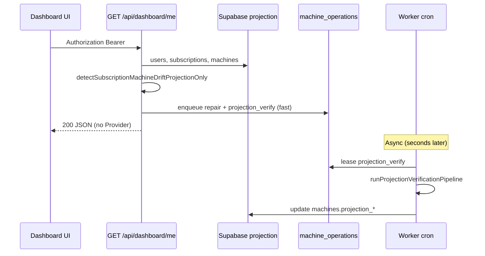

# Architecture Freeze v2 — SCB 2.1 Projection-first Read Path

| | |
|---|---|
| **Status** | **Approved — SCB Architecture complete** |
| **Operating mode** | [SCB Maintenance Mode](./SCB-MAINTENANCE-MODE.md) |
| **Effective** | 2026-07-05 |
| **Supersedes** | [ARCHITECTURE-FREEZE-v1.md](./ARCHITECTURE-FREEZE-v1.md) |
| **ADR** | [ADR-003-projection-first-read-path.md](./ADR-003-projection-first-read-path.md) |
| **Prior ADRs** | ADR-001, ADR-002 |

---

## Executive Summary

Architecture Freeze **v2** adds **Projection-first Read Path** as the **default production read architecture**:

- HTTP read APIs use **DB projection only** (no Provider latency).
- Provider verify runs in **Verification Pipeline** via Queue Worker (`projection_verify`).
- **Default:** Projection-first ON when `SCB_READ_PROJECTION_FIRST` is unset or `1`.
- **Rollback only:** `SCB_READ_PROJECTION_FIRST=0` → Legacy ADR-001 read path.

Architecture Freeze v2 is **operationally complete** only when runtime defaults to Projection-first (not Legacy).

v1 frozen components remain frozen. v2 **extends** read-path policy; does not refactor Queue/Core/Billing.

---

## Read Path Flag (production default)

| `SCB_READ_PROJECTION_FIRST` | Runtime mode |
|-----------------------------|--------------|
| **unset** | **Projection-first (default)** |
| `1` | Projection-first |
| `0` | Legacy ADR-001 rollback only |

Startup log (once per Node process):

```
[scb-architecture] Architecture Freeze Version: v2
[scb-architecture] Read Path Mode: Projection-first (SCB_READ_PROJECTION_FIRST=unset)
```

Profiler header: `ReadPath = Projection` or `ReadPath = Legacy`.

---

## Call Graph (v2 — read path, flag ON)

```
HTTP GET dashboard/me | machines/status
        │
        ▼
  isScbReadProjectionFirst() ?
        │
        ├── YES ──► runReadPathProjectionFirst()
        │              ├── detectSubscriptionMachineDriftProjectionOnly (DB only)
        │              ├── enqueue drift repair (Queue, no Provider)
        │              └── scheduleProjectionVerification (Queue)
        │              │
        │              ▼
        │           resolveProjectionMachineStatus(machine, subscription)
        │              │
        │              ▼
        │           JSON response (no Vast, no Comfy HTTP)
        │
        └── NO ──► ADR-001 path (runReadPathDriftDetectAndEnqueue + Provider detect)
```

---

## Verification Pipeline (async)

```
Cron Worker (process-machine-operations)
        │
        ▼
  operation = projection_verify
        │
        ▼
  runProjectionVerificationPipeline()
        ├── resolveLiveMachineStatus (Provider)
        ├── syncMachineFromLiveStatus + projection_verified_at
        ├── detectSubscriptionMachineDrift (full, with Provider)
        ├── enqueueSubscriptionMachineDriftRepair
        └── openBillableSession / updateSubscriptionServerStatus (when running)
```

Provider access on v2 is **only** via: Provisioning, Worker (drift + verify), Verification Pipeline, Scheduler (enqueue only).

---

## Sequence — Dashboard load (v2)



---

## Frozen Components (v1 + v2)

All v1 frozen components remain. **Added frozen surface:**

| Component | Path |
|-----------|------|
| Projection read resolver | `src/lib/scb-read-path.js` |
| Projection-only detect | `src/lib/machines-drift-projection.js` |
| Verification Pipeline | `src/lib/infrastructure/projection-verification-pipeline.js` |
| Status projection handler | `src/lib/machines-status-projection.js` |

**Not frozen for product iteration:** UI presentation of stale projection, verify interval tuning.

---

## Frozen Invariants (v2 additions)

| # | Invariant |
|---|-----------|
| v2-1 | When `SCB_READ_PROJECTION_FIRST=1`, read handlers MUST NOT call Provider or Comfy HTTP |
| v2-2 | Provider truth convergence happens only in Verification Pipeline / Worker / Provisioning |
| v2-3 | `projection_verified_at` updated only by Verification Pipeline (or legacy path when flag off) |
| v2-4 | Billing SoT remains `gpu_sessions` — projection fields are not billing anchors |

All v1 invariants (1–18) remain in [ARCHITECTURE-FREEZE-v1.md](./ARCHITECTURE-FREEZE-v1.md).

---

## Extension Points (v2)

| Point | Use |
|-------|-----|
| `scheduleProjectionVerification` | Trigger async verify after read (deduped) |
| `resolveProjectionMachineStatus` | Map DB → UI status without Provider |
| `runReadPathProjectionFirst` | Dashboard/status sync entry |
| `projection_verify` queue op | Worker executes Verification Pipeline |
| `SCB_PROJECTION_VERIFY_STALE_MS` | Tune verify frequency (default 30s) |

---

## Approved ADRs

| ADR | Title |
|-----|-------|
| ADR-001 | Read Path Detect Only |
| ADR-002 | Provider Abstraction Layer |
| **ADR-003** | **Projection-first Read Path** |

---

## Allowed Changes

- Bug fixes on projection read path
- UI/UX consuming projection fields
- Tune stale verify interval (env)
- Performance (DB indexes on projection columns)

## Forbidden (without new ADR)

- Provider calls on HTTP read when flag ON
- Changing Verification Pipeline to block HTTP
- Refactoring Queue/Worker/Scheduler semantics
- Multi-provider routing (Phase 4+)

---

## Rollback

```bash
SCB_READ_PROJECTION_FIRST=0   # Legacy ADR-001 read path only
```

Unset or `1` keeps **Projection-first** (default). Migration 0032 columns are additive.

---

## Future Roadmap (unchanged from v1)

Product focus: UI/UX, Dashboard, Workspace, Provisioning UX, Billing Experience.

Deferred: Multi-provider Scheduler, Cost/Region optimization — require new ADR.

---

## Related Documents

- [PHASE-AF-V2-PROJECTION-READ-PATH-REVIEW.md](./PHASE-AF-V2-PROJECTION-READ-PATH-REVIEW.md) — benchmark & regression
- [ARCHITECTURE-FREEZE-v1.md](./ARCHITECTURE-FREEZE-v1.md) — pre-v2 milestone

---

*Architecture Freeze v2 — official milestone 2026-07-05*
