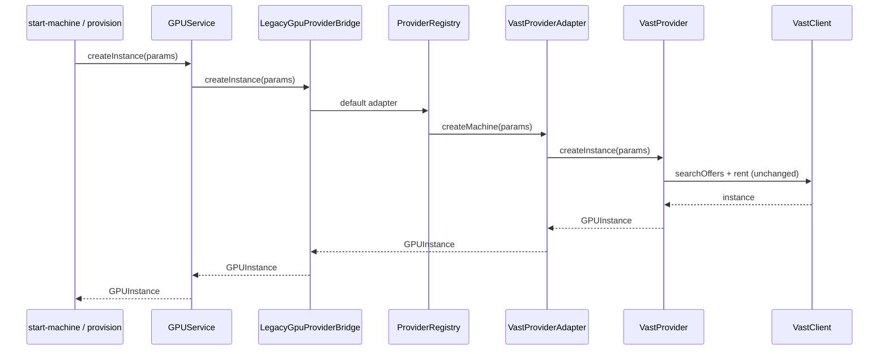

# Phase 3 — Provider Abstraction Layer — Architecture Review

| | |
|---|---|
| **Status** | Complete — awaiting approval before Phase 4 |
| **Date** | 2026-07-05 |
| **ADR** | [ADR-002-provider-abstraction-layer.md](./ADR-002-provider-abstraction-layer.md) |
| **Frozen** | [SCB-ARCHITECTURE-FROZEN.md](./SCB-ARCHITECTURE-FROZEN.md) |

---

## 1. Goal

Biến GPUVietnam từ hệ thống phụ thuộc Vast thành nền tảng có **Provider Abstraction Layer** — không đổi SCB lifecycle, business logic, Queue, Worker, Scheduler.

**Không triển khai:** multi-provider scheduling, failover, region/cost optimization.

---

## 2. Call Graph (mới)

```
HTTP / Cron / Worker (unchanged)
        │
        ▼
   getGpuService()
        │
        ▼
 createDefaultLegacyGpuProvider()
        │
        ├── bootstrapProviderRegistry()
        │         register vast + stubs
        │
        ├── getDefaultProviderAdapter()  ← env GPU_PROVIDER (default vast)
        │
        └── createLegacyGpuProviderBridge(adapter)
                  │
                  ▼
            GPUService (existing API)
                  │
                  ▼
         adapter.createMachine / getMachine / …
                  │
                  ▼
         VastProviderAdapter
                  │
                  ├── legacyProvider (VastProvider — unchanged logic)
                  └── client.searchOffers (VastClient — extracted searchOffers)
```

**Frozen paths không đổi:** `runDestroyPipeline` ← `destroyUserMachine` ← Worker ← Queue.

---

## 3. Sequence Diagram — Create Machine (via abstraction)



---

## 4. File Structure

```
src/lib/gpu/
├── provider-abstraction/
│   ├── index.js                    # bootstrap + exports
│   ├── provider-interface.js       # ProviderAdapter contract
│   ├── provider-capabilities.js    # capability model + registry constants
│   ├── provider-registry.js        # register / lookup / list
│   ├── legacy-gpu-provider-bridge.js
│   ├── provider-contract-runner.js
│   ├── provider-contract-mock.js
│   └── provider-contract.test.mjs
├── providers/
│   ├── vast/
│   │   ├── vast-provider.js        # unchanged logic (legacy GPUProvider)
│   │   ├── vast-provider-adapter.js # Phase 3 adapter
│   │   └── vast-client.js          # +searchOffers extraction only
│   └── stubs/
│       ├── stub-provider-base.js
│       ├── salad-provider-adapter.js
│       ├── tensordock-provider-adapter.js
│       ├── interdata-provider-adapter.js
│       └── gpuvietnam-internal-provider-adapter.js
├── gpu-service.js                  # getGpuService → registry bridge
└── providers/gpu-provider.interface.ts  # legacy interface (unchanged)

docs/scb/
├── ADR-002-provider-abstraction-layer.md
├── SCB-ARCHITECTURE-FROZEN.md
└── PHASE3-PROVIDER-ABSTRACTION-REVIEW.md (this file)
```

---

## 5. Dependency Graph

```
provider-abstraction/
  → providers/vast/vast-provider-adapter
  → providers/stubs/*

vast-provider-adapter
  → vast-provider (legacy)
  → vast-client
  → provider-verify (verifyRunning only)
  → provider-capabilities

gpu-service
  → provider-abstraction/index
  → (no direct VastProvider import)

FROZEN (no new deps):
  machine-operation-*
  machines-drift
  destroy-pipeline-run
```

---

## 6. Provider Registry

| ID | Name | Implemented | Capabilities |
|----|------|-------------|--------------|
| `vast` | Vast.ai | ✅ | spot, docker, rtx lines |
| `salad` | Salad | stub | spot, low latency |
| `tensordock` | TensorDock | stub | spot + reserved |
| `interdata` | InterData | stub | reserved |
| `gpuvietnam_internal` | GPUVietnam Internal | stub | internal session billing |

Lookup: `getProviderAdapter(id)` · Default: `GPU_PROVIDER` env (fallback `vast`).

---

## 7. ProviderAdapter Interface

| Method | Purpose |
|--------|---------|
| `createMachine` | Provision GPU |
| `destroyMachine` | Release GPU |
| `getMachine` | Instance status |
| `listOffers` | Ranked offers |
| `listRegions` | Supported regions |
| `health` | Platform or instance health |
| `verifyRunning` | Normalized running check |

Provider **không** biết Scheduler / Queue.

---

## 8. Contract Tests

`src/lib/gpu/provider-abstraction/provider-contract.test.mjs`

- Mock adapter — full contract
- Registry — 5 providers registered
- Vast adapter — mocked legacy + client (no network)
- Shared runner: `runProviderAdapterContract()`

---

## 9. Regression Risk

| Area | Risk | Mitigation |
|------|------|------------|
| GPUService behavior | Medium | Legacy bridge delegates 1:1; VastProvider untouched |
| Vast createInstance | Low | `searchOffers` extraction — same fetch path |
| Workflow (Comfy) | Low | `attachWorkflowDelegate(vast, vast.legacyProvider)` |
| Frozen queue/worker | None | No files modified |
| Circular imports | Low | Verified gpu-service → abstraction → vast only |

---

## 10. Migration Plan

| Step | Action |
|------|--------|
| 1 | Deploy code (no DB migration) |
| 2 | Verify `GPU_PROVIDER=vast` (default) — production unchanged |
| 3 | Run `npm test` — contract + full suite |
| 4 | Smoke: start-machine, status poll, stop-machine |
| 5 | Phase 4 (future): scheduler reads `getProviderCapabilities()` — **not in this phase** |

**Rollback:** revert `getGpuService()` to `new VastProvider()` one-line change (no schema).

---

## 11. Out of Scope (Phase 4+)

- Multi-provider scheduling / routing
- Provider failover
- Region or cost optimization
- Projection state machine
- Stub provider runtime implementation

---

## 12. Verification

- Full test suite pass
- Production build pass
- No changes to frozen components (queue, worker, scheduler, detect, destroy pipeline)
